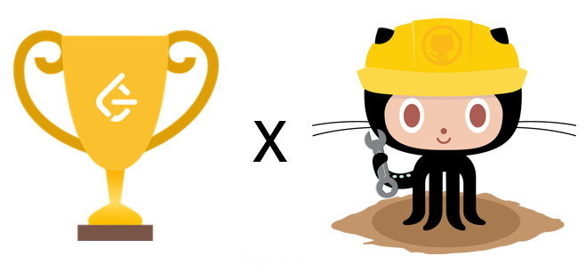
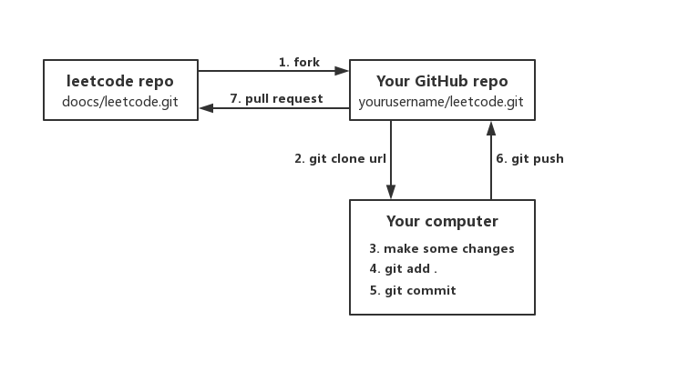

  

  
   
  
   
  
  
  
  

## 介绍

本项目包含 [LeetCode](https://leetcode-cn.com/problemset/all/)、[《剑指 Offer（第 2 版）》](https://leetcode-cn.com/problemset/lcof/)、[《程序员面试金典（第 6 版）》](https://leetcode-cn.com/problemset/lcci/)等题目的相关题解。所有题解均由多种编程语言实现，包括但不限于：Java、Python、C++、JavaScript、C#、Go，日常更新。欢迎 [Star](https://github.com/doocs/leetcode) 关注本项目，获取项目最新动态。

[English Version](/README_EN.md)

## 站点

- Netlify: https://lc.netlify.app
- Gitee Pages: https://doocs.gitee.io/leetcode
- GitHub Pages: https://doocs.github.io/leetcode

## 题解

- [LeetCode](/solution/README.md)
- [LeetCode 《剑指 Offer（第 2 版）》](/lcof/README.md)
- [LeetCode 《程序员面试金典（第 6 版）》](/lcci/README.md)

## 维护者

[Yang Libin](https://github.com/yanglbme): GitHub 技术社区 [@Doocs](https://github.com/doocs) 创建者；[@TheAlgorithms](https://github.com/TheAlgorithms) 组织成员。

## 加入我们

刷编程题的最大好处就是可以锻炼解决问题的思维能力。相信我，「如何去思考」​本身也是一项需要不断学习和练习的技能。非常感谢前微软工程师、现蚂蚁金服技术专家 [@kfstorm](https://github.com/kfstorm) 贡献了本项目的所有 [C# 题解](https://github.com/doocs/leetcode/pull/245)。

如果你对本项目感兴趣，并且希望加入我们刷题大军，欢迎随时提交 [PR](https://github.com/doocs/leetcode/pulls)。请参考如下步骤：

- 将[本项目](https://github.com/doocs/leetcode) <kbd>fork</kbd> 到你的个人 GitHub 帐户，然后 <kbd>clone</kbd> 到你的本地机器；
- 对项目做出一些变更，然后使用 git <kbd>add</kbd>、<kbd>commit</kbd>、<kbd>push</kbd> 等命令将你的变更提交到你的远程 GitHub 仓库；
- 将你的变更以 PR 的形式提交过来，项目的维护人员会在第一时间对你的变更进行 review！
- 你也可以参考 [GitHub 帮助文档](https://help.github.com/cn) 了解更多细节。

  

[Gitpod.io](https://www.gitpod.io) 是一个免费的在线开发环境，你也可以使用它参与本项目。

## 贡献者

非常感谢以下所有朋友对本项目的贡献，你们是最可爱的人！

## 赞助人

> You help the developer community practice for interviews, and there is nothing better we could ask for. -- [Alan Yessenbayev](https://opencollective.com/alan-yessenbayev)

## 赞助商

## 许可证

<a rel="license" href="http://creativecommons.org/licenses/by-sa/4.0/">知识共享 版权归属-相同方式共享 4.0 国际 公共许可证</a>

