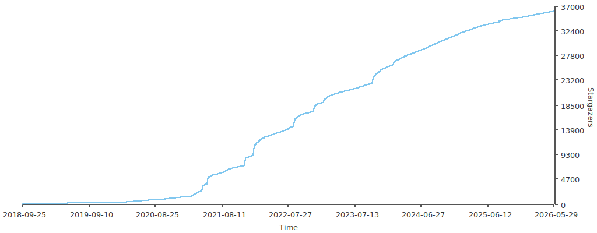

  

  
  
   
  
  
  

## 介绍

本项目包含 LeetCode、《剑指 Offer（第 2 版）》、《剑指 Offer（专项突击版）》、《程序员面试金典（第 6 版）》等题目的相关题解。所有题解均由多种编程语言实现，包括但不限于：Java、Python、C++、Go、TypeScript、Rust。我们正在全力更新，欢迎 Star 🌟 关注[本项目](https://github.com/doocs/leetcode)，获取项目最新动态。

[English Version](/README_EN.md)

## 站点

<https://leetcode.doocs.org>

## 算法全解

- [LeetCode](/solution/README.md)
- [往期竞赛合集](/solution/CONTEST_README.md)
- [剑指 Offer（第 2 版）](/lcof/README.md)
- [剑指 Offer（专项突击版）](/lcof2/README.md)
- [程序员面试金典（第 6 版）](/lcci/README.md)

## 专项突破

- [JavaScript 专项练习](/solution/JAVASCRIPT_README.md)
- [数据库专项练习](/solution/DATABASE_README.md)

## 算法提升专题

### 1. 基础算法

- [在排序数组中查找元素的第一个和最后一个位置](/solution/0000-0099/0034.Find%20First%20and%20Last%20Position%20of%20Element%20in%20Sorted%20Array/README.md) - `二分查找`
- [准时到达的列车最小时速](/solution/1800-1899/1870.Minimum%20Speed%20to%20Arrive%20on%20Time/README.md) - `二分查找`
- [可移除字符的最大数目](/solution/1800-1899/1898.Maximum%20Number%20of%20Removable%20Characters/README.md) - `二分查找`
- [排序数组](/solution/0900-0999/0912.Sort%20an%20Array/README.md) - `快速排序`、`归并排序`
- [字符串相加](/solution/0400-0499/0415.Add%20Strings/README.md) - `高精度加法`
- [字符串相乘](/solution/0000-0099/0043.Multiply%20Strings/README.md) - `高精度乘法`
- [区域和检索 - 数组不可变](/solution/0300-0399/0303.Range%20Sum%20Query%20-%20Immutable/README.md) - `前缀和`
- [二维区域和检索 - 矩阵不可变](/solution/0300-0399/0304.Range%20Sum%20Query%202D%20-%20Immutable/README.md) - `二维前缀和`
- [区间加法](/solution/0300-0399/0370.Range%20Addition/README.md) - `前缀和`、`差分`
- [用邮票贴满网格图](/solution/2100-2199/2132.Stamping%20the%20Grid/README.md) - `二维前缀和`、`二维差分`
- [无重复字符的最长子串](/solution/0000-0099/0003.Longest%20Substring%20Without%20Repeating%20Characters/README.md) - `双指针`、`哈希表`
- [乘积小于 K 的子数组](/solution/0700-0799/0713.Subarray%20Product%20Less%20Than%20K/README.md) - `双指针`
- [位 1 的个数](/solution/0100-0199/0191.Number%20of%201%20Bits/README.md) - `位运算`、`lowbit`
- [合并区间](/solution/0000-0099/0056.Merge%20Intervals/README.md) - `区间合并`
    <!-- 排序算法、待补充 -->

### 2. 数据结构

- [设计链表](/solution/0700-0799/0707.Design%20Linked%20List/README.md) - `单链表`、`指针引用`、`数组实现`
- [下一个更大元素 I](/solution/0400-0499/0496.Next%20Greater%20Element%20I/README.md) - `单调栈`
- [每日温度](/solution/0700-0799/0739.Daily%20Temperatures/README.md) - `单调栈`
- [子数组的最小值之和](/solution/0900-0999/0907.Sum%20of%20Subarray%20Minimums/README.md) - `单调栈`
- [最大宽度坡](/solution/0900-0999/0962.Maximum%20Width%20Ramp/README.md) - `单调栈`
- [最多能完成排序的块 II](/solution/0700-0799/0768.Max%20Chunks%20To%20Make%20Sorted%20II/README.md) - `单调栈`
- [子数组范围和](/solution/2100-2199/2104.Sum%20of%20Subarray%20Ranges/README.md) - `单调栈`
- [子数组最小乘积的最大值](/solution/1800-1899/1856.Maximum%20Subarray%20Min-Product/README.md) - `单调栈`
- [滑动窗口最大值](/solution/0200-0299/0239.Sliding%20Window%20Maximum/README.md) - `单调队列`
- [满足不等式的最大值](/solution/1400-1499/1499.Max%20Value%20of%20Equation/README.md) - `单调队列`
- [和至少为 K 的最短子数组](/solution/0800-0899/0862.Shortest%20Subarray%20with%20Sum%20at%20Least%20K/README.md) - `单调队列`
- [带限制的子序列和](/solution/1400-1499/1425.Constrained%20Subsequence%20Sum/README.md) - `动态规划`、`单调队列优化`
- [单词规律 II](/solution/0200-0299/0291.Word%20Pattern%20II/README.md) - `哈希表`、`回溯`
- [最短回文串](/solution/0200-0299/0214.Shortest%20Palindrome/README.md) - `字符串哈希`
- [回文对](/solution/0300-0399/0336.Palindrome%20Pairs/README.md) - `字符串哈希`
- [最长重复子串](/solution/1000-1099/1044.Longest%20Duplicate%20Substring/README.md) - `字符串哈希`、`二分查找`
- [不同的循环子字符串](/solution/1300-1399/1316.Distinct%20Echo%20Substrings/README.md) - `字符串哈希`

### 3. 搜索

- [图像渲染](/solution/0700-0799/0733.Flood%20Fill/README.md)- `BFS`、`DFS`、`Flood Fill 算法`、`连通性模型`
- [岛屿数量](/solution/0200-0299/0200.Number%20of%20Islands/README.md) - `BFS`、`Flood Fill 算法`
- [01 矩阵](/solution/0500-0599/0542.01%20Matrix/README.md) - `多源 BFS`
- [地图中的最高点](/solution/1700-1799/1765.Map%20of%20Highest%20Peak/README.md) - `多源 BFS`
- [进击的骑士](/solution/1100-1199/1197.Minimum%20Knight%20Moves/README.md) - `BFS`、`最短路模型`
- [二进制矩阵中的最短路径](/solution/1000-1099/1091.Shortest%20Path%20in%20Binary%20Matrix/README.md) - `BFS`、`最短路模型`
- [迷宫中离入口最近的出口](/solution/1900-1999/1926.Nearest%20Exit%20from%20Entrance%20in%20Maze/README.md) - `BFS`、`最短路模型`
- [网格中的最短路径](/solution/1200-1299/1293.Shortest%20Path%20in%20a%20Grid%20with%20Obstacles%20Elimination/README.md) - `BFS`、`最短路模型`
- [打开转盘锁](/solution/0700-0799/0752.Open%20the%20Lock/README.md) - `最小步数模型`、`双向 BFS`、`A* 算法`
- [单词接龙](/solution/0100-0199/0127.Word%20Ladder/README.md) - `最小步数模型`、`双向 BFS`
- [转化数字的最小运算数](/solution/2000-2099/2059.Minimum%20Operations%20to%20Convert%20Number/README.md) - `最小步数模型`、`双向 BFS`
- [滑动谜题](/solution/0700-0799/0773.Sliding%20Puzzle/README.md) - `BFS`、`最小步数模型`、`A* 算法`
- [访问所有节点的最短路径](/solution/0800-0899/0847.Shortest%20Path%20Visiting%20All%20Nodes/README.md) - `BFS`、`最小步数模型`、`A* 算法`
- [为高尔夫比赛砍树](/solution/0600-0699/0675.Cut%20Off%20Trees%20for%20Golf%20Event/README.md) - `BFS`、`A* 算法`
- [使网格图至少有一条有效路径的最小代价](/solution/1300-1399/1368.Minimum%20Cost%20to%20Make%20at%20Least%20One%20Valid%20Path%20in%20a%20Grid/README.md) - `双端队列 BFS`
- [到达角落需要移除障碍物的最小数目](/solution/2200-2299/2290.Minimum%20Obstacle%20Removal%20to%20Reach%20Corner/README.md) - `双端队列 BFS`
- [迷宫](/solution/0400-0499/0490.The%20Maze/README.md) - `DFS`、`连通性模型`、`Flood Fill 算法`
- [单词搜索](/solution/0000-0099/0079.Word%20Search/README.md) - `DFS`、`搜索顺序`、`回溯`
- [黄金矿工](/solution/1200-1299/1219.Path%20with%20Maximum%20Gold/README.md) - `DFS`、`搜索顺序`、`回溯`
- [火柴拼正方形](/solution/0400-0499/0473.Matchsticks%20to%20Square/README.md) - `DFS`、`回溯`、`剪枝`
- [划分为 k 个相等的子集](/solution/0600-0699/0698.Partition%20to%20K%20Equal%20Sum%20Subsets/README.md) - `DFS`、`回溯`、`剪枝`
- [完成所有工作的最短时间](/solution/1700-1799/1723.Find%20Minimum%20Time%20to%20Finish%20All%20Jobs/README.md) - `DFS`、`回溯`、`剪枝`
- [公平分发饼干](/solution/2300-2399/2305.Fair%20Distribution%20of%20Cookies/README.md) - `DFS`、`回溯`、`剪枝`
- [矩阵中的最长递增路径](/solution/0300-0399/0329.Longest%20Increasing%20Path%20in%20a%20Matrix/README.md) - `DFS`、`记忆化搜索`
- [网格图中递增路径的数目](/solution/2300-2399/2328.Number%20of%20Increasing%20Paths%20in%20a%20Grid/README.md) - `DFS`、`记忆化搜索`
- [翻转游戏 II](/solution/0200-0299/0294.Flip%20Game%20II/README.md) - `DFS`、`状态压缩`、`记忆化搜索`
- [统计所有可行路径](/solution/1500-1599/1575.Count%20All%20Possible%20Routes/README.md) - `DFS`、`记忆化搜索`
- [切披萨的方案数](/solution/1400-1499/1444.Number%20of%20Ways%20of%20Cutting%20a%20Pizza/README.md) - `DFS`、`记忆化搜索`

<!-- DFS 待补充 -->

### 4. 动态规划（DP）

- [杨辉三角](/solution/0100-0199/0118.Pascal's%20Triangle/README.md) - `线性 DP`、`数字三角形模型`
- [最小路径和](/solution/0000-0099/0064.Minimum%20Path%20Sum/README.md) - `线性 DP`、`数字三角形模型`
- [摘樱桃](/solution/0700-0799/0741.Cherry%20Pickup/README.md) - `线性 DP`、`数字三角形模型`
- [摘樱桃 II](/solution/1400-1499/1463.Cherry%20Pickup%20II/README.md) - `线性 DP`、`数字三角形模型`
- [最长递增子序列](/solution/0300-0399/0300.Longest%20Increasing%20Subsequence/README.md) - `线性 DP`、`最长上升子序列模型`
- [无重叠区间](/solution/0400-0499/0435.Non-overlapping%20Intervals/README.md) - `线性 DP`、`最长上升子序列模型`、`贪心优化`
- [删列造序 III](/solution/0900-0999/0960.Delete%20Columns%20to%20Make%20Sorted%20III/README.md) - `线性 DP`、`最长上升子序列模型`
- [俄罗斯套娃信封问题](/solution/0300-0399/0354.Russian%20Doll%20Envelopes/README.md) - `线性 DP`、`最长上升子序列模型`、`贪心优化`
- [堆叠长方体的最大高度](/solution/1600-1699/1691.Maximum%20Height%20by%20Stacking%20Cuboids/README.md) - `排序`、`线性 DP`、`最长上升子序列模型`
- [无矛盾的最佳球队](/solution/1600-1699/1626.Best%20Team%20With%20No%20Conflicts/README.md) - `排序`、`线性 DP`、`最长上升子序列模型`
- [最长公共子序列](/solution/1100-1199/1143.Longest%20Common%20Subsequence/README.md) - `线性 DP`、`最长公共子序列模型`
- [两个字符串的最小 ASCII 删除和](/solution/0700-0799/0712.Minimum%20ASCII%20Delete%20Sum%20for%20Two%20Strings/README.md) - `线性 DP`、`最长公共子序列模型`
- [两个字符串的删除操作](/solution/0500-0599/0583.Delete%20Operation%20for%20Two%20Strings/README.md) - `线性 DP`、`最长公共子序列模型`
- [目标和](/solution/0400-0499/0494.Target%20Sum/README.md) - `0-1 背包问题`
- [分割等和子集](/solution/0400-0499/0416.Partition%20Equal%20Subset%20Sum/README.md) - `0-1 背包问题`
- [最后一块石头的重量 II](/solution/1000-1099/1049.Last%20Stone%20Weight%20II/README.md) - `0-1 背包问题`
- [零钱兑换](/solution/0300-0399/0322.Coin%20Change/README.md) - `完全背包问题`
- [组合总和 Ⅳ](/solution/0300-0399/0377.Combination%20Sum%20IV/README.md) - `完全背包问题`
- [从栈中取出 K 个硬币的最大面值和](/solution/2200-2299/2218.Maximum%20Value%20of%20K%20Coins%20From%20Piles/README.md) - `分组背包问题`
- [数字 1 的个数](/solution/0200-0299/0233.Number%20of%20Digit%20One/README.md) - `数位 DP`、`记忆化搜索`
- [统计各位数字都不同的数字个数](/solution/0300-0399/0357.Count%20Numbers%20with%20Unique%20Digits/README.md) - `数位 DP`、`记忆化搜索`、`状态压缩`
- [不含连续 1 的非负整数](/solution/0600-0699/0600.Non-negative%20Integers%20without%20Consecutive%20Ones/README.md) - `数位 DP`、`记忆化搜索`
- [旋转数字](/solution/0700-0799/0788.Rotated%20Digits/README.md) - `数位 DP`、`记忆化搜索`
- [最大为 N 的数字组合](/solution/0900-0999/0902.Numbers%20At%20Most%20N%20Given%20Digit%20Set/README.md) - `数位 DP`、`记忆化搜索`
- [统计特殊整数](/solution/2300-2399/2376.Count%20Special%20Integers/README.md) - `数位 DP`、`记忆化搜索`

<!-- 背包问题、状态机模型、状压DP、区间DP、树形DP、数位DP 待补充 -->

### 5. 高级数据结构

- [二维网格图中探测环](/solution/1500-1599/1559.Detect%20Cycles%20in%202D%20Grid/README.md) - `并查集`、`检测环`
- [除法求值](/solution/0300-0399/0399.Evaluate%20Division/README.md) - `并查集`、`权值维护`
- [由斜杠划分区域](/solution/0900-0999/0959.Regions%20Cut%20By%20Slashes/README.md) - `并查集`、`连通分量个数`
- [水位上升的泳池中游泳](/solution/0700-0799/0778.Swim%20in%20Rising%20Water/README.md) - `并查集`
- [交换字符串中的元素](/solution/1200-1299/1202.Smallest%20String%20With%20Swaps/README.md) - `并查集`
- [打砖块](/solution/0800-0899/0803.Bricks%20Falling%20When%20Hit/README.md) - `并查集`、`逆向思维`
- [尽量减少恶意软件的传播 II](/solution/0900-0999/0928.Minimize%20Malware%20Spread%20II/README.md) - `并查集`、`逆向思维`
- [检查边长度限制的路径是否存在](/solution/1600-1699/1697.Checking%20Existence%20of%20Edge%20Length%20Limited%20Paths/README.md) - `并查集`、`离线思维`
- [保证图可完全遍历](/solution/1500-1599/1579.Remove%20Max%20Number%20of%20Edges%20to%20Keep%20Graph%20Fully%20Traversable/README.md) - `双并查集`
- [区域和检索 - 数组可修改](/solution/0300-0399/0307.Range%20Sum%20Query%20-%20Mutable/README.md) - `树状数组`、`线段树`
- [通过指令创建有序数组](/solution/1600-1699/1649.Create%20Sorted%20Array%20through%20Instructions/README.md) - `树状数组`、`线段树`
- [统计数组中好三元组数目](/solution/2100-2199/2179.Count%20Good%20Triplets%20in%20an%20Array/README.md) - `树状数组`、`线段树`
- [最多 K 次交换相邻数位后得到的最小整数](/solution/1500-1599/1505.Minimum%20Possible%20Integer%20After%20at%20Most%20K%20Adjacent%20Swaps%20On%20Digits/README.md) - `树状数组`
- [二维区域和检索 - 可变](/solution/0300-0399/0308.Range%20Sum%20Query%202D%20-%20Mutable/README.md) - `二维树状数组`、`线段树`
- [计算右侧小于当前元素的个数](/solution/0300-0399/0315.Count%20of%20Smaller%20Numbers%20After%20Self/README.md) - `离散化树状数组`、`线段树`
- [区间和的个数](/solution/0300-0399/0327.Count%20of%20Range%20Sum/README.md) - `离散化树状数组`、`线段树`
- [翻转对](/solution/0400-0499/0493.Reverse%20Pairs/README.md) - `离散化树状数组`、`分治归并`、`线段树`
- [最长递增子序列的个数](/solution/0600-0699/0673.Number%20of%20Longest%20Increasing%20Subsequence/README.md) - `离散化树状数组`、`区间最值问题`
- [奇妙序列](/solution/1600-1699/1622.Fancy%20Sequence/README.md) - `动态开点线段树`、`懒标记`
- [Range 模块](/solution/0700-0799/0715.Range%20Module/README.md) - `动态开点线段树`、`懒标记`
- [我的日程安排表 III](/solution/0700-0799/0732.My%20Calendar%20III/README.md) - `动态开点线段树`、`懒标记`
- [每天绘制的新区域数量](/solution/2100-2199/2158.Amount%20of%20New%20Area%20Painted%20Each%20Day/README.md) - `动态开点线段树`、`懒标记`、`区间染色模型`
- [由单个字符重复的最长子字符串](/solution/2200-2299/2213.Longest%20Substring%20of%20One%20Repeating%20Character/README.md) - `线段树`、`动态最大子段和模型`
- [矩形面积 II](/solution/0800-0899/0850.Rectangle%20Area%20II/README.md) - `线段树`、`离散化`、`扫描线`

### 6. 图论

- [网络延迟时间](/solution/0700-0799/0743.Network%20Delay%20Time/README.md) - `最短路`、`Dijkstra 算法`、`Bellman Ford 算法`、`SPFA 算法`
- [得到要求路径的最小带权子图](/solution/2200-2299/2203.Minimum%20Weighted%20Subgraph%20With%20the%20Required%20Paths/README.md) - `最短路`、`Dijkstra 算法`
- [连接所有点的最小费用](/solution/1500-1599/1584.Min%20Cost%20to%20Connect%20All%20Points/README.md) - `最小生成树`、`Prim 算法`、`Kruskal 算法`
- [最低成本联通所有城市](/solution/1100-1199/1135.Connecting%20Cities%20With%20Minimum%20Cost/README.md) - `最小生成树`、`Kruskal 算法`、`并查集`
- [水资源分配优化](/solution/1100-1199/1168.Optimize%20Water%20Distribution%20in%20a%20Village/README.md) - `最小生成树`、`Kruskal 算法`、`并查集`
- [找到最小生成树里的关键边和伪关键边](/solution/1400-1499/1489.Find%20Critical%20and%20Pseudo-Critical%20Edges%20in%20Minimum%20Spanning%20Tree/README.md) - `最小生成树`、`Kruskal 算法`、`并查集`
- [判断二分图](/solution/0700-0799/0785.Is%20Graph%20Bipartite/README.md) - `染色法判定二分图`、`并查集`

<!-- 待补充
### 7. 数学知识
 -->

## 加入我们

刷编程题的最大好处就是可以锻炼解决问题的思维能力。相信我，「如何去思考」​ 本身也是一项需要不断学习和练习的技能。非常感谢前微软工程师、现蚂蚁金服技术专家 [@kfstorm](https://github.com/kfstorm) 贡献了本项目的所有 [C# 题解](https://github.com/doocs/leetcode/pull/245)。

如果你对本项目感兴趣，并且希望加入我们刷题小分队，欢迎随时提交 [PR](https://github.com/doocs/leetcode/pulls)。请参考如下步骤：

1. 将本项目 fork 到你的个人 GitHub 帐户，然后 clone 到你的本地机器；
1. 进入 leetcode 目录，切换到一个新的分支；
1. 对项目做出一些变更，然后使用 git add、commit、push 等命令将你的本地变更提交到你的远程 GitHub 仓库；
1. 将你的变更以 PR 的形式提交过来，项目的维护人员会在第一时间对你的变更进行 review！
1. 你也可以参考帮助文档 <https://help.github.com/cn> 了解更多细节。

  

## Stars 趋势

<a href="https://next.ossinsight.io/widgets/official/analyze-repo-stars-map?repo_id=149001365&activity=stars" target="_blank" style="display: block" align="center">
  <picture>
    <source media="(prefers-color-scheme: dark)" srcset="https://next.ossinsight.io/widgets/official/analyze-repo-stars-map/thumbnail.png?repo_id=149001365&activity=stars&image_size=auto&color_scheme=dark" width="721" height="auto">
    
  </picture>
</a>

## 贡献者

感谢以下所有朋友对本项目的贡献！

## 版权

本项目著作权归 [GitHub 开源社区 Doocs](https://github.com/doocs) 所有，商业转载请联系 @yanglbme 获得授权，非商业转载请注明出处。

## 联系我们 & 支持项目

欢迎各位小伙伴们添加 @yanglbme 的个人微信（微信号：YLB0109），备注 「**leetcode**」。后续我们会创建算法、技术相关的交流群，大家一起交流学习，分享经验，共同进步。

如果你觉得这个项目对你有帮助，也欢迎通过微信扫码赞赏我们 ☕️ ～

|  |  |
| -------------------------------------------------------------------------------------------------------------------------------- | ------------------------------------------------------------------------------------------------------------------------------------- |

## 许可证

<a rel="license" href="http://creativecommons.org/licenses/by-sa/4.0/">知识共享 版权归属-相同方式共享 4.0 国际 公共许可证</a>
Contribution by Ananya
