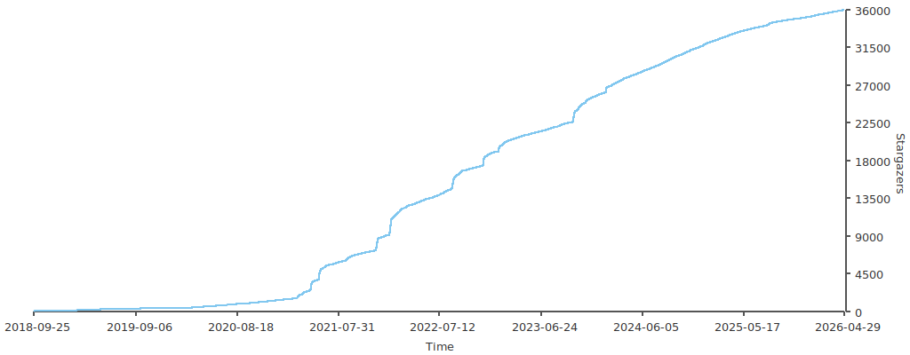

  

  
  
   
  
  
  
  

## Introduction

The Doocs LeetCode repository is a comprehensive collection of solutions to LeetCode questions in multiple programming languages. The repository contains solutions to LeetCode, LCOF, LCCI questions, and more in multiple programming languages.

The repository is maintained by the Doocs community, and please give us a [star](https://github.com/doocs/leetcode) 🌟 if you like it.

[中文文档](/README.md)

## Sites

-   Vercel: https://doocs-leetcode.vercel.app
-   GitHub Pages: https://doocs.github.io/leetcode

## Solutions

-   [LeetCode](/solution/README_EN.md)
-   [Past Contests](/solution/CONTEST_README_EN.md)
-   [LCOF: Coding Interviews, 2nd Edition](/lcof/README_EN.md)
-   [LCCI: Cracking the Coding Interview, 6th Edition](/lcci/README_EN.md)

## Topics

### 1. Basic Algorithms

-   [Find First and Last Position of Element in Sorted Array](/solution/0000-0099/0034.Find%20First%20and%20Last%20Position%20of%20Element%20in%20Sorted%20Array/README_EN.md) - `Binary search`
-   [Minimum Speed to Arrive on Time](/solution/1800-1899/1870.Minimum%20Speed%20to%20Arrive%20on%20Time/README_EN.md) - `Binary search`
-   [Find the Student that Will Replace the Chalk](/solution/1800-1899/1894.Find%20the%20Student%20that%20Will%20Replace%20the%20Chalk/README_EN.md) - `Binary search`
-   [Maximum Number of Removable Characters](/solution/1800-1899/1898.Maximum%20Number%20of%20Removable%20Characters/README_EN.md) - `Binary search`
-   [Sort an Array](/solution/0900-0999/0912.Sort%20an%20Array/README_EN.md) - `Quick Sort`, `Merge Sort`
-   [Add Strings](/solution/0400-0499/0415.Add%20Strings/README_EN.md) - `Addition of large numbers`
-   [Multiply Strings](/solution/0000-0099/0043.Multiply%20Strings/README_EN.md) - `Multiply large numbers`
-   [Range Sum Query - Immutable](/solution/0300-0399/0303.Range%20Sum%20Query%20-%20Immutable/README_EN.md) - `Prefix sum`
-   [Range Sum Query 2D - Immutable](/solution/0300-0399/0304.Range%20Sum%20Query%202D%20-%20Immutable/README_EN.md) - `Prefix sum`
-   [Range Addition](/solution/0300-0399/0370.Range%20Addition/README_EN.md) - `Prefix sum`, `Difference array`
-   [Stamping the Grid](/solution/2100-2199/2132.Stamping%20the%20Grid/README_EN.md) - `Prefix sum`, `Difference array`
-   [Longest Substring Without Repeating Characters](/solution/0000-0099/0003.Longest%20Substring%20Without%20Repeating%20Characters/README_EN.md) - `Two pointers`, `Hash table`
-   [Subarray Product Less Than K](/solution/0700-0799/0713.Subarray%20Product%20Less%20Than%20K/README_EN.md) - `Two pointers`
-   [Number of 1 Bits](/solution/0100-0199/0191.Number%20of%201%20Bits/README_EN.md) - `Bit manipulation`, `Lowbit`
-   [Merge Intervals](/solution/0000-0099/0056.Merge%20Intervals/README_EN.md) - `Merge intervals`

### 2. Data Structures

-   [Design Linked List](/solution/0700-0799/0707.Design%20Linked%20List/README_EN.md) - `Linked List`, `Pointer`, `Array`
-   [Next Greater Element I](/solution/0400-0499/0496.Next%20Greater%20Element%20I/README_EN.md) - `Monotonic Stack`
-   [Daily Temperatures](/solution/0700-0799/0739.Daily%20Temperatures/README_EN.md) - `Monotonic Stack`
-   [Max Chunks To Make Sorted II](/solution/0700-0799/0768.Max%20Chunks%20To%20Make%20Sorted%20II/README_EN.md) - `Monotonic Stack`
-   [Sum of Subarray Minimums](/solution/0900-0999/0907.Sum%20of%20Subarray%20Minimums/README_EN.md) - `Monotonic Stack`
-   [Maximum Width Ramp](/solution/0900-0999/0962.Maximum%20Width%20Ramp/README_EN.md) - `Monotonic Stack`
-   [Sum of Subarray Ranges](/solution/2100-2199/2104.Sum%20of%20Subarray%20Ranges/README_EN.md) - `Monotonic Stack`
-   [Maximum Subarray Min-Product](/solution/1800-1899/1856.Maximum%20Subarray%20Min-Product/README_EN.md) - `Monotonic Stack`
-   [Sliding Window Maximum](/solution/0200-0299/0239.Sliding%20Window%20Maximum/README_EN.md) - `Monotonic Queue`
-   [Max Value of Equation](/solution/1400-1499/1499.Max%20Value%20of%20Equation/README_EN.md) - `Monotonic Queue`
-   [Shortest Subarray with Sum at Least K](/solution/0800-0899/0862.Shortest%20Subarray%20with%20Sum%20at%20Least%20K/README_EN.md) - `Monotonic Queue`
-   [Constrained Subsequence Sum](/solution/1400-1499/1425.Constrained%20Subsequence%20Sum/README_EN.md) - `Dynamic Programming`, `Monotonic Queue`
-   [Word Pattern II](/solution/0200-0299/0291.Word%20Pattern%20II/README_EN.md) - `Hash Table`、`Backtracking`
-   [Shortest Palindrome](/solution/0200-0299/0214.Shortest%20Palindrome/README_EN.md) - `Rabin-Karp`
-   [Palindrome Pairs](/solution/0300-0399/0336.Palindrome%20Pairs/README_EN.md) - `Rabin-Karp`
-   [Longest Duplicate Substring](/solution/1000-1099/1044.Longest%20Duplicate%20Substring/README_EN.md) - `Rabin-Karp`, `Binary search`
-   [Distinct Echo Substrings](/solution/1300-1399/1316.Distinct%20Echo%20Substrings/README_EN.md) - `Rabin-Karp`

### 3. Search

-   [Flood Fill](/solution/0700-0799/0733.Flood%20Fill/README_EN.md) - `BFS`, `DFS`, `Flood fill`
-   [Number of Islands](/solution/0200-0299/0200.Number%20of%20Islands/README_EN.md) - `BFS`, `Flood fill`
-   [01 Matrix](/solution/0500-0599/0542.01%20Matrix/README_EN.md) - `BFS with multiple sources`
-   [Map of Highest Peak](/solution/1700-1799/1765.Map%20of%20Highest%20Peak/README_EN.md) - `BFS with multiple sources`
-   [Minimum Knight Moves](/solution/1100-1199/1197.Minimum%20Knight%20Moves/README_EN.md) - `BFS`, `Shortest paths model`
-   [Shortest Path in Binary Matrix](/solution/1000-1099/1091.Shortest%20Path%20in%20Binary%20Matrix/README_EN.md) - `BFS`, `Shortest paths model`
-   [Nearest Exit from Entrance in Maze](/solution/1900-1999/1926.Nearest%20Exit%20from%20Entrance%20in%20Maze/README_EN.md) - `BFS`, `Shortest paths model`
-   [Shortest Path in a Grid with Obstacles Elimination](/solution/1200-1299/1293.Shortest%20Path%20in%20a%20Grid%20with%20Obstacles%20Elimination/README_EN.md) - `BFS`, `Shortest paths model`
-   [Open the Lock](/solution/0700-0799/0752.Open%20the%20Lock/README_EN.md) - `Minimum steps model`, `Two-end BFS`, `A* search`
-   [Word Ladder](/solution/0100-0199/0127.Word%20Ladder/README_EN.md) - `Minimum steps model`, `Two-end BFS`
-   [Minimum Operations to Convert Number](/solution/2000-2099/2059.Minimum%20Operations%20to%20Convert%20Number/README_EN.md) - `Minimum steps model`, `Two-end BFS`
-   [Sliding Puzzle](/solution/0700-0799/0773.Sliding%20Puzzle/README_EN.md) - BFS, `Minimum steps model`, `A* search`
-   [Shortest Path Visiting All Nodes](/solution/0800-0899/0847.Shortest%20Path%20Visiting%20All%20Nodes/README_EN.md) - `BFS`, `Minimum steps model`, `A* search`
-   [Cut Off Trees for Golf Event](/solution/0600-0699/0675.Cut%20Off%20Trees%20for%20Golf%20Event/README_EN.md) - `BFS`, `A* search`
-   [Minimum Cost to Make at Least One Valid Path in a Grid](/solution/1300-1399/1368.Minimum%20Cost%20to%20Make%20at%20Least%20One%20Valid%20Path%20in%20a%20Grid/README_EN.md) - `BFS using deque`
-   [Minimum Cost to Make at Least One Valid Path in a Grid](/solution/2200-2299/2290.Minimum%20Obstacle%20Removal%20to%20Reach%20Corner/README_EN.md) - `BFS using deque`
-   [The Maze](/solution/0400-0499/0490.The%20Maze/README_EN.md) - `DFS, Flood fill`
-   [Word Search](/solution/0000-0099/0079.Word%20Search/README_EN.md) - `DFS`, `Backtracking`
-   [Path with Maximum Gold](/solution/1200-1299/1219.Path%20with%20Maximum%20Gold/README_EN.md) - `DFS`, `Backtracking`
-   [Matchsticks to Square](/solution/0400-0499/0473.Matchsticks%20to%20Square/README_EN.md) - `DFS`, `Backtracking`
-   [Partition to K Equal Sum Subsets](/solution/0600-0699/0698.Partition%20to%20K%20Equal%20Sum%20Subsets/README_EN.md) - `DFS`, `Backtracking`
-   [Find Minimum Time to Finish All Jobs](/solution/1700-1799/1723.Find%20Minimum%20Time%20to%20Finish%20All%20Jobs/README_EN.md) - `DFS`, `Backtracking`
-   [Fair Distribution of Cookies](/solution/2300-2399/2305.Fair%20Distribution%20of%20Cookies/README_EN.md) - `DFS`, `Backtracking`
-   [Longest Increasing Path in a Matrix](/solution/0300-0399/0329.Longest%20Increasing%20Path%20in%20a%20Matrix/README_EN.md) - `DFS`、`Memoization`
-   [Number of Increasing Paths in a Grid](/solution/2300-2399/2328.Number%20of%20Increasing%20Paths%20in%20a%20Grid/README.md) - `DFS`、`Memoization`
-   [Flip Game II](/solution/0200-0299/0294.Flip%20Game%20II/README_EN.md) - `DFS`、`Bitmask`、`Memoization`
-   [Count All Possible Routes](/solution/1500-1599/1575.Count%20All%20Possible%20Routes/README_EN.md) - `DFS`、`Memoization`
-   [Number of Ways of Cutting a Pizza](/solution/1400-1499/1444.Number%20of%20Ways%20of%20Cutting%20a%20Pizza/README_EN.md) - `DFS`、`Memoization`

### 4. Dynamic Programming(DP)

-   [Pascal's Triangle](/solution/0100-0199/0118.Pascal's%20Triangle/README_EN.md) - `Linear problem`
-   [Minimum Path Sum](/solution/0000-0099/0064.Minimum%20Path%20Sum/README_EN.md) - `Linear problem`
-   [Cherry Pickup](/solution/0700-0799/0741.Cherry%20Pickup/README_EN.md) - `Linear problem`
-   [Cherry Pickup II](/solution/1400-1499/1463.Cherry%20Pickup%20II/README_EN.md) - `Linear problem`
-   [Longest Increasing Subsequence](/solution/0300-0399/0300.Longest%20Increasing%20Subsequence/README_EN.md) - `Linear problem`, `LIS`
-   [Non-overlapping Intervals](/solution/0400-0499/0435.Non-overlapping%20Intervals/README_EN.md) - `Linear problem`, `LIS`, `Greedy`
-   [Delete Columns to Make Sorted III](/solution/0900-0999/0960.Delete%20Columns%20to%20Make%20Sorted%20III/README_EN.md) - `Linear problem`, `LIS`
-   [Russian Doll Envelopes](/solution/0300-0399/0354.Russian%20Doll%20Envelopes/README_EN.md) - `Linear problem`, `LIS`
-   [Maximum Height by Stacking Cuboids](/solution/1600-1699/1691.Maximum%20Height%20by%20Stacking%20Cuboids/README_EN.md) - `Sort`, `Linear problem`, `LIS`
-   [Best Team With No Conflicts](/solution/1600-1699/1626.Best%20Team%20With%20No%20Conflicts/README_EN.md) - `Sort`, `Linear problem`, `LIS`
-   [Longest Common Subsequence](/solution/1100-1199/1143.Longest%20Common%20Subsequence/README_EN.md) - `Linear problem`, `LCS`
-   [Minimum ASCII Delete Sum for Two Strings](/solution/0700-0799/0712.Minimum%20ASCII%20Delete%20Sum%20for%20Two%20Strings/README_EN.md) - `Linear problem`, `LCS`
-   [Delete Operation for Two Strings](/solution/0500-0599/0583.Delete%20Operation%20for%20Two%20Strings/README_EN.md) - `Linear problem`, `LCS`
-   [Target Sum](/solution/0400-0499/0494.Target%20Sum/README_EN.md) - `0-1 Knapsack problem`
-   [Partition Equal Subset Sum](/solution/0400-0499/0416.Partition%20Equal%20Subset%20Sum/README_EN.md) - `0-1 Knapsack problem`
-   [Last Stone Weight II](/solution/1000-1099/1049.Last%20Stone%20Weight%20II/README_EN.md) - `0-1 Knapsack problem`
-   [Coin Change](/solution/0300-0399/0322.Coin%20Change/README_EN.md) - `Unbounded Knapsack problem`
-   [Combination Sum IV](/solution/0300-0399/0377.Combination%20Sum%20IV/README_EN.md) - `Unbounded Knapsack problem`
-   [Maximum Value of K Coins From Piles](/solution/2200-2299/2218.Maximum%20Value%20of%20K%20Coins%20From%20Piles/README_EN.md) - `Group Knapsack problem`
-   [Number of Digit One](/solution/0200-0299/0233.Number%20of%20Digit%20One/README_EN.md) - `Digit DP problem`, `Memoization`
-   [Count Numbers with Unique Digits](/solution/0300-0399/0357.Count%20Numbers%20with%20Unique%20Digits/README_EN.md) - `Digit DP problem`, `Memoization`
-   [Non-negative Integers without Consecutive Ones](/solution/0600-0699/0600.Non-negative%20Integers%20without%20Consecutive%20Ones/README_EN.md) - `Digit DP problem`, `Memoization`
-   [Rotated Digits](/solution/0700-0799/0788.Rotated%20Digits/README_EN.md) - `Digit DP problem`, `Memoization`
-   [Numbers At Most N Given Digit Set](/solution/0900-0999/0902.Numbers%20At%20Most%20N%20Given%20Digit%20Set/README_EN.md) - `Digit DP problem`, `Memoization`
-   [Count Special Integers](/solution/2300-2399/2376.Count%20Special%20Integers/README_EN.md) - `Digit DP problem`, `Memoization`

### 5. Advanced Data Structures

-   [Detect Cycles in 2D Grid](/solution/1500-1599/1559.Detect%20Cycles%20in%202D%20Grid/README_EN.md) - `Union find`, `Detect cycles`
-   [Evaluate Division](/solution/0300-0399/0399.Evaluate%20Division/README_EN.md) - `Union find`
-   [Regions Cut By Slashes](/solution/0900-0999/0959.Regions%20Cut%20By%20Slashes/README_EN.md) - `Union find`
-   [Swim in Rising Water](/solution/0700-0799/0778.Swim%20in%20Rising%20Water/README_EN.md) - `Union find`
-   [Smallest String With Swaps](/solution/1200-1299/1202.Smallest%20String%20With%20Swaps/README_EN.md) - `Union find`
-   [Bricks Falling When Hit](/solution/0800-0899/0803.Bricks%20Falling%20When%20Hit/README_EN.md) - `Union find`, `Reversed thinking`
-   [Minimize Malware Spread II](/solution/0900-0999/0928.Minimize%20Malware%20Spread%20II/README_EN.md) - `Union find`, `Reversed thinking`
-   [Checking Existence of Edge Length Limited Paths](/solution/1600-1699/1697.Checking%20Existence%20of%20Edge%20Length%20Limited%20Paths/README_EN.md) - `Union find`, `Offline algorithm`
-   [Remove Max Number of Edges to Keep Graph Fully Traversable](/solution/1500-1599/1579.Remove%20Max%20Number%20of%20Edges%20to%20Keep%20Graph%20Fully%20Traversable/README_EN.md) - `Two Union find`
-   [Range Sum Query - Mutable](/solution/0300-0399/0307.Range%20Sum%20Query%20-%20Mutable/README_EN.md) - `Binary Indexed Tree`, `Segment Tree`
-   [Create Sorted Array through Instructions](/solution/1600-1699/1649.Create%20Sorted%20Array%20through%20Instructions/README_EN.md) - `Binary Indexed Tree`, `Segment Tree`
-   [Count Good Triplets in an Array](/solution/2100-2199/2179.Count%20Good%20Triplets%20in%20an%20Array/README_EN.md) - `Binary Indexed Tree`, `Segment Tree`
-   [Minimum Possible Integer After at Most K Adjacent Swaps On Digits](/solution/1500-1599/1505.Minimum%20Possible%20Integer%20After%20at%20Most%20K%20Adjacent%20Swaps%20On%20Digits/README_EN.md) - `Binary Indexed Tree`
-   [Range Sum Query 2D - Mutable](/solution/0300-0399/0308.Range%20Sum%20Query%202D%20-%20Mutable/README_EN.md) - `Binary Indexed Tree 2D`, `Segment Tree`
-   [Count of Smaller Numbers After Self](/solution/0300-0399/0315.Count%20of%20Smaller%20Numbers%20After%20Self/README_EN.md) - `Binary Indexed Tree`, `Discretization`, `Segment Tree`
-   [Count of Range Sum](/solution/0300-0399/0327.Count%20of%20Range%20Sum/README_EN.md) - `Binary Indexed Tree`, `Discretization`, `Segment Tree`
-   [Reverse Pairs](/solution/0400-0499/0493.Reverse%20Pairs/README_EN.md) - `Binary Indexed Tree`, `Discretization`, `Divide and Conquer`, `Segment Tree`
-   [Number of Longest Increasing Subsequence](/solution/0600-0699/0673.Number%20of%20Longest%20Increasing%20Subsequence/README_EN.md) - `Binary Indexed Tree`, `Discretization`, `Interval maximum`
-   [Fancy Sequence](/solution/1600-1699/1622.Fancy%20Sequence/README_EN.md) - `Dynamic Segment Tree`, `Lazy Propogation`
-   [Range Module](/solution/0700-0799/0715.Range%20Module/README_EN.md) - `Dynamic Segment Tree`, `Lazy Propogation`
-   [My Calendar III](/solution/0700-0799/0732.My%20Calendar%20III/README_EN.md) - `Dynamic Segment Tree`, `Lazy Propogation`
-   [Amount of New Area Painted Each Day](/solution/2100-2199/2158.Amount%20of%20New%20Area%20Painted%20Each%20Day/README_EN.md) - `Dynamic Segment Tree`, `Lazy Propogation`
-   [Longest Substring of One Repeating Character](/solution/2200-2299/2213.Longest%20Substring%20of%20One%20Repeating%20Character/README_EN.md) - `Segment Tree`
-   [Rectangle Area II](/solution/0800-0899/0850.Rectangle%20Area%20II/README_EN.md) - `Segment Tree`, `Discretization`, `Line Sweep`

### 6. Graph Theory

-   [Network Delay Time](/solution/0700-0799/0743.Network%20Delay%20Time/README_EN.md) - `Shortest Path`, `Dijkstra's algorithm`, `Bellman Ford's algorithm`, `SPFA`
-   [Minimum Weighted Subgraph With the Required Paths](/solution/2200-2299/2203.Minimum%20Weighted%20Subgraph%20With%20the%20Required%20Paths/README_EN.md) - `Shortest Path`, `Dijkstra's algorithm`
-   [Min Cost to Connect All Points](/solution/1500-1599/1584.Min%20Cost%20to%20Connect%20All%20Points/README_EN.md) - `Minimum Spanning Tree`, `Prim's algorithm`, `Kruskal's algorithm`, `Union find`
-   [Connecting Cities With Minimum Cost](/solution/1100-1199/1135.Connecting%20Cities%20With%20Minimum%20Cost/README_EN.md) - `Minimum Spanning Tree`, `Kruskal's algorithm`
-   [Optimize Water Distribution in a Village](/solution/1100-1199/1168.Optimize%20Water%20Distribution%20in%20a%20Village/README_EN.md) - `Minimum Spanning Tree`, `Kruskal's algorithm`, `Union find`
-   [Find Critical and Pseudo-Critical Edges in Minimum Spanning Tree](/solution/1400-1499/1489.Find%20Critical%20and%20Pseudo-Critical%20Edges%20in%20Minimum%20Spanning%20Tree/README_EN.md) - `Minimum Spanning Tree`, `Kruskal's algorithm`, `Union find`
-   [Is Graph Bipartite?](/solution/0700-0799/0785.Is%20Graph%20Bipartite/README_EN.md) - `Graph coloring`, `Union find`

<!--
### 7. Mathematical Knowledge
 -->

## Contributions

I'm looking for long-term contributors/partners to this repo! Send me [PRs](https://github.com/doocs/leetcode/pulls) if you're interested! See the following:

1. Fork [this repository](https://github.com/doocs/leetcode) to your own GitHub account and then clone it to your local machine.
1. Checkout a new branch.
1. Make some changes to your leetcode repository, then push the changes to your remote GitHub repository.
1. Create a pull request with your changes!
1. See [CONTRIBUTING](https://github.com/doocs/.github/blob/main/CONTRIBUTING.md) or [GitHub Help](https://help.github.com/en) for more details.

  

You can also contribute to [doocs/leetcode](https://github.com/doocs/leetcode) using [Gitpod.io](https://www.gitpod.io), a free online dev environment with a single click.

## Stargazers over time

<!--  -->

<!--  -->

## Our Top Contributors

This project exists thanks to all the people who contribute.

## Backers & Sponsors

Thank you to all our backers and sponsors!

> "_You help the developer community practice for interviews, and there is nothing better we could ask for._" -- [Alan Yessenbayev](https://opencollective.com/alan-yessenbayev)

## License

This work is licensed under a <a rel="license" href="http://creativecommons.org/licenses/by-sa/4.0/">Creative Commons Attribution-ShareAlike 4.0 International License</a>.
