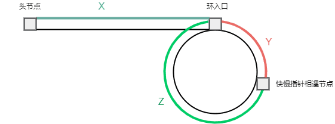

# [面试题 02.08. 环路检测](https://leetcode.cn/problems/linked-list-cycle-lcci)

[English Version](/lcci/02.08.Linked%20List%20Cycle/README_EN.md)

## 题目描述

<!-- 这里写题目描述 -->
<p>给定一个有环链表，实现一个算法返回环路的开头节点。<br>有环链表的定义：在链表中某个节点的next元素指向在它前面出现过的节点，则表明该链表存在环路。</p><br><p><strong>示例 1：</strong><pre><strong>输入：</strong>head = [3,2,0,-4], pos = 1<br><strong>输出：</strong>tail connects to node index 1<br><strong>解释：</strong>链表中有一个环，其尾部连接到第二个节点。</pre></p><br><p><strong>示例 2：</strong><pre><strong>输入：</strong>head = [1,2], pos = 0<br><strong>输出：</strong>tail connects to node index 0<br><strong>解释：</strong>链表中有一个环，其尾部连接到第一个节点。</pre></p><br><p><strong>示例 3：</strong><pre><strong>输入：</strong>head = [1], pos = -1<br><strong>输出：</strong>no cycle<br><strong>解释：</strong>链表中没有环。</pre></p><br><p><strong>进阶：</strong><br>你是否可以不用额外空间解决此题？</p>

## 解法

<!-- 这里可写通用的实现逻辑 -->

先利用快慢指针判断链表是否有环，没有环则直接返回 `null`。

若链表有环，我们分析快慢相遇时走过的距离。

对于慢指针（每次走 1 步），走过的距离为 `S=X+Y` ①；快指针（每次走 2 步）走过的距离为 `2S=X+Y+N(Y+Z)` ②。如下图所示，其中 `N` 表示快指针与慢指针相遇时在环中所走过的圈数，而我们要求的环入口，也即是 `X` 的距离：



我们根据式子 ①②，得出 `X+Y=N(Y+Z)` => `X=(N-1)(Y+Z)+Z`。

当 `N=1`(快指针在环中走了一圈与慢指针相遇) 时，`X=(1-1)(Y+Z)+Z`，即 `X=Z`。此时只要定义一个 `p` 指针指向头节点，然后慢指针与 `p` 开始同时走，当慢指针与 `p` 相遇时，也就到达了环入口，直接返回 `p` 即可。

当 `N>1`时，也是同样的，说明慢指针除了走 `Z` 步，还需要绕 `N-1` 圈才能与 `p` 相遇。

<!-- tabs:start -->

### **Python3**

<!-- 这里可写当前语言的特殊实现逻辑 -->

```python
# Definition for singly-linked list.
# class ListNode:
#     def __init__(self, x):
#         self.val = x
#         self.next = None


class Solution:
    def detectCycle(self, head: ListNode) -> ListNode:
        slow = fast = head
        has_cycle = False
        while not has_cycle and fast and fast.next:
            slow, fast = slow.next, fast.next.next
            has_cycle = slow == fast
        if not has_cycle:
            return None
        p = head
        while p != slow:
            p, slow = p.next, slow.next
        return p
```

### **Java**

<!-- 这里可写当前语言的特殊实现逻辑 -->

```java
/**
 * Definition for singly-linked list.
 * class ListNode {
 *     int val;
 *     ListNode next;
 *     ListNode(int x) {
 *         val = x;
 *         next = null;
 *     }
 * }
 */
public class Solution {
    public ListNode detectCycle(ListNode head) {
        ListNode slow = head, fast = head;
        boolean hasCycle = false;
        while (!hasCycle && fast != null && fast.next != null) {
            slow = slow.next;
            fast = fast.next.next;
            hasCycle = slow == fast;
        }
        if (!hasCycle) {
            return null;
        }
        ListNode p = head;
        while (p != slow) {
            p = p.next;
            slow = slow.next;
        }
        return p;
    }
}
```

### **C++**

```cpp
/**
 * Definition for singly-linked list.
 * struct ListNode {
 *     int val;
 *     ListNode *next;
 *     ListNode(int x) : val(x), next(NULL) {}
 * };
 */
class Solution {
public:
    ListNode* detectCycle(ListNode* head) {
        ListNode* slow = head;
        ListNode* fast = head;
        bool hasCycle = false;
        while (!hasCycle && fast && fast->next) {
            slow = slow->next;
            fast = fast->next->next;
            hasCycle = slow == fast;
        }
        if (!hasCycle) {
            return nullptr;
        }
        ListNode* p = head;
        while (p != slow) {
            p = p->next;
            slow = slow->next;
        }
        return p;
    }
};
```

### **JavaScript**

```js
/**
 * Definition for singly-linked list.
 * function ListNode(val) {
 *     this.val = val;
 *     this.next = null;
 * }
 */

/**
 * @param {ListNode} head
 * @return {ListNode}
 */
var detectCycle = function (head) {
    let slow = head;
    let fast = head;
    let hasCycle = false;
    while (!hasCycle && fast && fast.next) {
        slow = slow.next;
        fast = fast.next.next;
        hasCycle = slow == fast;
    }
    if (!hasCycle) {
        return null;
    }
    let p = head;
    while (p != slow) {
        p = p.next;
        slow = slow.next;
    }
    return p;
};
```

### **Go**

```go
/**
 * Definition for singly-linked list.
 * type ListNode struct {
 *     Val int
 *     Next *ListNode
 * }
 */
func detectCycle(head *ListNode) *ListNode {
	slow, fast := head, head
	hasCycle := false
	for !hasCycle && fast != nil && fast.Next != nil {
		slow, fast = slow.Next, fast.Next.Next
		hasCycle = slow == fast
	}
	if !hasCycle {
		return nil
	}
	p := head
	for p != slow {
		p, slow = p.Next, slow.Next
	}
	return p
}
```

### **...**

```

```

<!-- tabs:end -->
