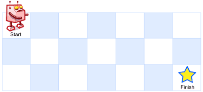

# [面试题 08.02. 迷路的机器人](https://leetcode.cn/problems/robot-in-a-grid-lcci)

[English Version](/lcci/08.02.Robot%20in%20a%20Grid/README_EN.md)

## 题目描述

<!-- 这里写题目描述 -->
<p>设想有个机器人坐在一个网格的左上角，网格 r 行 c 列。机器人只能向下或向右移动，但不能走到一些被禁止的网格（有障碍物）。设计一种算法，寻找机器人从左上角移动到右下角的路径。</p>

<p>网格中的障碍物和空位置分别用 <code>1</code> 和 <code>0</code> 来表示。</p>
<p>返回一条可行的路径，路径由经过的网格的行号和列号组成。左上角为 0 行 0 列。</p>
<p><strong>示例&nbsp;1:</strong></p>
<pre><strong>输入:
</strong>[
&nbsp; [<strong>0</strong>,<strong>0</strong>,<strong>0</strong>],
&nbsp; [0,1,<strong>0</strong>],
&nbsp; [0,0,<strong>0</strong>]
]
<strong>输出:</strong> [[0,0],[0,1],[0,2],[1,2],[2,2]]
<strong>解释: 
</strong>输入中标粗的位置即为输出表示的路径，即
0行0列（左上角） -&gt; 0行1列 -&gt; 0行2列 -&gt; 1行2列 -&gt; 2行2列（右下角）</pre>
<p><strong>说明：</strong><em>r</em>&nbsp;和 <em>c </em>的值均不超过 100。</p>

## 解法

<!-- 这里可写通用的实现逻辑 -->

**方法一：DFS**

我们可以使用深度优先搜索来解决本题。我们从左上角开始，向右或向下移动，直到到达右下角。如果在某一步，我们发现当前位置是障碍物，或者当前位置已经在路径中，那么我们就返回，否则我们将当前位置加入路径中，并且标记当前位置为已经访问过，然后继续向右或向下移动。

如果最终能够到达右下角，那么我们就找到了一条可行的路径，否则说明不存在可行的路径。

时间复杂度 $O(m \times n)$，空间复杂度 $O(m \times n)$。其中 $m$ 和 $n$ 分别是网格的行数和列数。

<!-- tabs:start -->

### **Python3**

<!-- 这里可写当前语言的特殊实现逻辑 -->

```python
class Solution:
    def pathWithObstacles(self, obstacleGrid: List[List[int]]) -> List[List[int]]:
        def dfs(i, j):
            if i >= m or j >= n or obstacleGrid[i][j] == 1:
                return False
            ans.append([i, j])
            obstacleGrid[i][j] = 1
            if (i == m - 1 and j == n - 1) or dfs(i + 1, j) or dfs(i, j + 1):
                return True
            ans.pop()
            return False

        m, n = len(obstacleGrid), len(obstacleGrid[0])
        ans = []
        return ans if dfs(0, 0) else []
```

### **Java**

<!-- 这里可写当前语言的特殊实现逻辑 -->

```java
class Solution {
    private List<List<Integer>> ans = new ArrayList<>();
    private int[][] g;
    private int m;
    private int n;

    public List<List<Integer>> pathWithObstacles(int[][] obstacleGrid) {
        g = obstacleGrid;
        m = g.length;
        n = g[0].length;
        return dfs(0, 0) ? ans : Collections.emptyList();
    }

    private boolean dfs(int i, int j) {
        if (i >= m || j >= n || g[i][j] == 1) {
            return false;
        }
        ans.add(List.of(i, j));
        g[i][j] = 1;
        if ((i == m - 1 && j == n - 1) || dfs(i + 1, j) || dfs(i, j + 1)) {
            return true;
        }
        ans.remove(ans.size() - 1);
        return false;
    }
}
```

### **C++**

```cpp
class Solution {
public:
    vector<vector<int>> pathWithObstacles(vector<vector<int>>& obstacleGrid) {
        int m = obstacleGrid.size();
        int n = obstacleGrid[0].size();
        vector<vector<int>> ans;
        function<bool(int, int)> dfs = [&](int i, int j) -> bool {
            if (i >= m || j >= n || obstacleGrid[i][j] == 1) {
                return false;
            }
            ans.push_back({i, j});
            obstacleGrid[i][j] = 1;
            if ((i == m - 1 && j == n - 1) || dfs(i + 1, j) || dfs(i, j + 1)) {
                return true;
            }
            ans.pop_back();
            return false;
        };
        return dfs(0, 0) ? ans : vector<vector<int>>();
    }
};
```

### **Go**

```go
func pathWithObstacles(obstacleGrid [][]int) [][]int {
	m, n := len(obstacleGrid), len(obstacleGrid[0])
	ans := [][]int{}
	var dfs func(i, j int) bool
	dfs = func(i, j int) bool {
		if i >= m || j >= n || obstacleGrid[i][j] == 1 {
			return false
		}
		ans = append(ans, []int{i, j})
		obstacleGrid[i][j] = 1
		if (i == m-1 && j == n-1) || dfs(i+1, j) || dfs(i, j+1) {
			return true
		}
		ans = ans[:len(ans)-1]
		return false
	}
	if dfs(0, 0) {
		return ans
	}
	return [][]int{}
}
```

### **TypeScript**

```ts
function pathWithObstacles(obstacleGrid: number[][]): number[][] {
    const m = obstacleGrid.length;
    const n = obstacleGrid[0].length;
    const res = [];
    const dfs = (i: number, j: number): boolean => {
        if (i === m || j === n || obstacleGrid[i][j] === 1) {
            return false;
        }
        res.push([i, j]);
        obstacleGrid[i][j] = 1;
        if ((i + 1 === m && j + 1 === n) || dfs(i + 1, j) || dfs(i, j + 1)) {
            return true;
        }
        res.pop();
        return false;
    };
    if (dfs(0, 0)) {
        return res;
    }
    return [];
}
```

### **Rust**

```rust
impl Solution {
    fn dfs(grid: &mut Vec<Vec<i32>>, path: &mut Vec<Vec<i32>>, i: usize, j: usize) -> bool {
        if i == grid.len() || j == grid[0].len() || grid[i][j] == 1 {
            return false;
        }
        path.push(vec![i as i32, j as i32]);
        grid[i as usize][j as usize] = 1;
        if (i + 1 == grid.len() && j + 1 == grid[0].len())
            || Self::dfs(grid, path, i + 1, j)
            || Self::dfs(grid, path, i, j + 1)
        {
            return true;
        }
        path.pop();
        false
    }

    pub fn path_with_obstacles(mut obstacle_grid: Vec<Vec<i32>>) -> Vec<Vec<i32>> {
        let mut res = vec![];
        if Self::dfs(&mut obstacle_grid, &mut res, 0, 0) {
            return res;
        }
        vec![]
    }
}
```

### **...**

```

```

<!-- tabs:end -->
