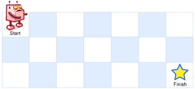

# [08.02. Robot in a Grid](https://leetcode.cn/problems/robot-in-a-grid-lcci)

[中文文档](/lcci/08.02.Robot%20in%20a%20Grid/README.md)

## Description

<p>Imagine a robot sitting on the upper left corner of grid with r rows and c columns. The robot can only move in two directions, right and down, but certain cells are &quot;off limits&quot; such that the robot cannot step on them. Design an algorithm to find a path for the robot from the top left to the bottom right.</p>



<p>&quot;off limits&quot; and empty grid are represented by&nbsp;<code>1</code> and&nbsp;<code>0</code>&nbsp;respectively.</p>

<p>Return a valid path, consisting of row number and column number of grids in the path.</p>

<p><strong>Example&nbsp;1:</strong></p>

<pre>


<strong>Input:


</strong>[


&nbsp; [<strong>0</strong>,<strong>0</strong>,<strong>0</strong>],


&nbsp; [0,1,<strong>0</strong>],


&nbsp; [0,0,<strong>0</strong>]


]


<strong>Output:</strong> [[0,0],[0,1],[0,2],[1,2],[2,2]]</pre>

<p><strong>Note: </strong></p>

<ul>
	<li><code>r,&nbsp;c &lt;= 100</code></li>
</ul>

## Solutions

<!-- tabs:start -->

### **Python3**

```python


```

### **Java**

```java


```

### **TypeScript**

```ts
function pathWithObstacles(obstacleGrid: number[][]): number[][] {
    const m = obstacleGrid.length;
    const n = obstacleGrid[0].length;
    const res = [];
    const dfs = (i: number, j: number): boolean => {
        if (i === m || j === n || obstacleGrid[i][j] === 1) {
            return false;
        }
        res.push([i, j]);
        obstacleGrid[i][j] = 1;
        if ((i + 1 === m && j + 1 === n) || dfs(i + 1, j) || dfs(i, j + 1)) {
            return true;
        }
        res.pop();
        return false;
    };
    if (dfs(0, 0)) {
        return res;
    }
    return [];
}
```

### **Rust**

```rust
impl Solution {
    fn dfs(grid: &mut Vec<Vec<i32>>, path: &mut Vec<Vec<i32>>, i: usize, j: usize) -> bool {
        if i == grid.len() || j == grid[0].len() || grid[i][j] == 1 {
            return false;
        }
        path.push(vec![i as i32, j as i32]);
        grid[i as usize][j as usize] = 1;
        if (i + 1 == grid.len() && j + 1 == grid[0].len())
            || Self::dfs(grid, path, i + 1, j)
            || Self::dfs(grid, path, i, j + 1)
        {
            return true;
        }
        path.pop();
        false
    }


    pub fn path_with_obstacles(mut obstacle_grid: Vec<Vec<i32>>) -> Vec<Vec<i32>> {
        let mut res = vec![];
        if Self::dfs(&mut obstacle_grid, &mut res, 0, 0) {
            return res;
        }
        vec![]
    }
}
```

### **...**

```


```

<!-- tabs:end -->
