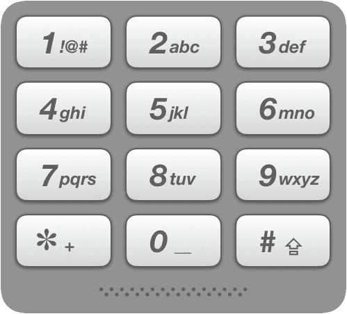

# [16.20. T9](https://leetcode.cn/problems/t9-lcci)

[中文文档](/lcci/16.20.T9/README.md)

## Description

<p>On old cell phones, users typed on a numeric keypad and the phone would provide a list of words that matched these numbers. Each digit mapped to a set of 0&nbsp;- 4 letters. Implement an algo&shy;rithm to return a list of matching words, given a sequence of digits. You are provided a list of valid words. The mapping is shown in the diagram below:</p>



<p><strong>Example 1:</strong></p>

<pre>


<strong>Input:</strong> num = &quot;8733&quot;, words = [&quot;tree&quot;, &quot;used&quot;]


<strong>Output:</strong> [&quot;tree&quot;, &quot;used&quot;]


</pre>

<p><strong>Example 2:</strong></p>

<pre>


<strong>Input:</strong> num = &quot;2&quot;, words = [&quot;a&quot;, &quot;b&quot;, &quot;c&quot;, &quot;d&quot;]


<strong>Output:</strong> [&quot;a&quot;, &quot;b&quot;, &quot;c&quot;]</pre>

<p>Note:</p>

<ul>
	<li><code>num.length &lt;= 1000</code></li>
	<li><code>words.length &lt;= 500</code></li>
	<li><code>words[i].length == num.length</code></li>
	<li><code>There are no number 0 and 1 in num</code>.</li>
</ul>

## Solutions

<!-- tabs:start -->

### **Python3**

```python


```

### **Java**

```java


```

### **...**

```


```

<!-- tabs:end -->
