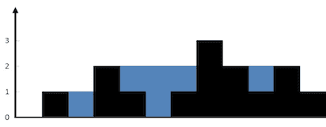

# [17.21. Volume of Histogram](https://leetcode.cn/problems/volume-of-histogram-lcci)

[中文文档](/lcci/17.21.Volume%20of%20Histogram/README.md)

## Description

<p>Imagine a histogram (bar graph). Design an algorithm to compute the volume of water it could hold if someone poured water across the top. You can assume that each histogram bar has width 1.</p>



<p><small>The above elevation map is represented by array [0,1,0,2,1,0,1,3,2,1,2,1]. In this case, 6 units of water (blue section) are being trapped. Thanks <strong>Marcos</strong> for contributing this image!</small></p>

<p><strong>Example:</strong></p>

<pre>

<strong>Input:</strong> [0,1,0,2,1,0,1,3,2,1,2,1]

<strong>Output:</strong> 6</pre>

## Solutions

<!-- tabs:start -->

### **Python3**

```python
class Solution:
    def trap(self, height: List[int]) -> int:
        n = len(height)
        if n < 3:
            return 0

        left_max = [height[0]] * n
        for i in range(1, n):
            left_max[i] = max(left_max[i - 1], height[i])

        right_max = [height[n - 1]] * n
        for i in range(n - 2, -1, -1):
            right_max[i] = max(right_max[i + 1], height[i])

        res = 0
        for i in range(n):
            res += min(left_max[i], right_max[i]) - height[i]
        return res
```

### **Java**

```java
class Solution {
    public int trap(int[] height) {
        int n;
        if ((n = height.length) < 3) return 0;

        int[] leftMax = new int[n];
        leftMax[0] = height[0];
        for (int i = 1; i < n; ++i) {
            leftMax[i] = Math.max(leftMax[i - 1], height[i]);
        }

        int[] rightMax = new int[n];
        rightMax[n - 1] = height[n - 1];
        for (int i = n - 2; i >= 0; --i) {
            rightMax[i] = Math.max(rightMax[i + 1], height[i]);
        }

        int res = 0;
        for (int i = 0; i < n; ++i) {
            res += Math.min(leftMax[i], rightMax[i]) - height[i];
        }
        return res;
    }
}
```

### **...**

```

```

<!-- tabs:end -->
