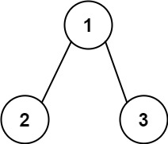

# [面试题 34. 二叉树中和为某一值的路径](https://leetcode-cn.com/problems/er-cha-shu-zhong-he-wei-mou-yi-zhi-de-lu-jing-lcof/)

## 题目描述

<!-- 这里写题目描述 -->

给你二叉树的根节点 `root` 和一个整数目标和 `targetSum`，找出所有 **从根节点到叶子节点** 路径总和等于给定目标和的路径。

**叶子节点** 是指没有子节点的节点。

**示例 1:**


```
输入：root = [5,4,8,11,null,13,4,7,2,null,null,5,1], targetSum = 22
输出：[[5,4,11,2],[5,8,4,5]]
```

**示例 2:**



```
输入：root = [1,2,3], targetSum = 5
输出：[]
```

**示例 3:**

```
输入：root = [1,2], targetSum = 0
输出：[]
```

**提示：**

-  树中节点总数在范围 `[0, 5000]` 内
-  `-1000 <= Node.val <= 1000`
-  `-1000 <= targetSum <= 1000`

注意：本题与主站 113 题相同：https://leetcode-cn.com/problems/path-sum-ii/

## 解法

<!-- 这里可写通用的实现逻辑 -->

先序遍历+路径记录。

<!-- tabs:start -->

### **Python3**

<!-- 这里可写当前语言的特殊实现逻辑 -->

```python
# Definition for a binary tree node.
# class TreeNode:
#     def __init__(self, x):
#         self.val = x
#         self.left = None
#         self.right = None

class Solution:
    def pathSum(self, root: TreeNode, sum: int) -> List[List[int]]:
        def dfs(root, sum):
            if root is None:
                return
            path.append(root.val)
            if root.val == sum and root.left is None and root.right is None:
                res.append(path.copy())
            dfs(root.left, sum - root.val)
            dfs(root.right, sum - root.val)
            path.pop()
        if not root:
            return []
        res = []
        path = []
        dfs(root, sum)
        return res
```

### **Java**

<!-- 这里可写当前语言的特殊实现逻辑 -->

```java
/**
 * Definition for a binary tree node.
 * public class TreeNode {
 *     int val;
 *     TreeNode left;
 *     TreeNode right;
 *     TreeNode(int x) { val = x; }
 * }
 */
class Solution {
    private List<List<Integer>> res;
    private List<Integer> path;

    public List<List<Integer>> pathSum(TreeNode root, int sum) {
        if (root == null) return Collections.emptyList();
        res = new ArrayList<>();
        path = new ArrayList<>();
        dfs(root, sum);
        return res;
    }

    private void dfs(TreeNode root, int sum) {
        if (root == null) {
            return;
        }
        path.add(root.val);
        if (root.val == sum && root.left == null && root.right == null) {
            res.add(new ArrayList<>(path));
        }
        dfs(root.left, sum - root.val);
        dfs(root.right, sum - root.val);
        path.remove(path.size() - 1);
    }
}
```

### **JavaScript**

```js
/**
 * Definition for a binary tree node.
 * function TreeNode(val) {
 *     this.val = val;
 *     this.left = this.right = null;
 * }
 */
/**
 * @param {TreeNode} root
 * @param {number} sum
 * @return {number[][]}
 */
var pathSum = function (root, sum) {
    if (!root) return [];
    let res = [];
    function dfs(node, sum, arr) {
        if (!node) return;
        arr = [...arr, node.val];
        if (node.val === sum && !node.left && !node.right) {
            res.push(arr);
            return;
        }
        dfs(node.left, sum - node.val, arr);
        dfs(node.right, sum - node.val, arr);
    }
    dfs(root, sum, []);
    return res;
};
```

### **Go**

```go
var res [][]int
func pathSum(root *TreeNode, sum int) [][]int {
    res = [][]int{}
    if root == nil {
        return res
    }
    helper(root, sum, []int{})
    return res
}

func helper(node *TreeNode, target int, ans []int) {
    if node == nil {
        return
    }
    ans = append(ans,node.Val)
    target -= node.Val
    if target == 0 && node.Left == nil && node.Right == nil {
        tmp := make([]int,len(ans))
        copy(tmp,ans)
        res = append(res,tmp)
    } else {
        helper(node.Left, target, ans)
        helper(node.Right, target, ans)
    }
}
```

### **C++**

```cpp
class Solution {
public:
    vector<vector<int>> pathSum(TreeNode* root, int target) {
        vector<vector<int>> ans;
        vector<int> path;
        dfs(root, ans, path, target);
        return ans;
    }

    void dfs(TreeNode* root, vector<vector<int>>& ans, vector<int>& path, int target) {
        if (root == NULL) {
            return;
        }
        target -= root->val;
        path.push_back(root->val);
        if (root->left == NULL && root->right == NULL) {
            if (target == 0) {
                ans.push_back(vector<int>(path));
            }
        }
        dfs(root->left, ans, path, target);
        dfs(root->right, ans, path, target);
        path.pop_back();
    }
};
```

### **TypeScript**

```ts
/**
 * Definition for a binary tree node.
 * class TreeNode {
 *     val: number
 *     left: TreeNode | null
 *     right: TreeNode | null
 *     constructor(val?: number, left?: TreeNode | null, right?: TreeNode | null) {
 *         this.val = (val===undefined ? 0 : val)
 *         this.left = (left===undefined ? null : left)
 *         this.right = (right===undefined ? null : right)
 *     }
 * }
 */

function pathSum(root: TreeNode | null, target: number): number[][] {
    const res: number[][] = [];
    if (root == null) {
        return res;
    }
    const paths: number[] = [];
    const dfs = ({ val, right, left }: TreeNode, target: number) => {
        paths.push(val);
        target -= val;
        if (left == null && right == null) {
            if (target === 0) {
                res.push([...paths]);
            }
            paths.pop();
            return;
        }
        left && dfs(left, target);
        right && dfs(right, target);
        paths.pop();
    };
    dfs(root, target);
    return res;
}
```

### **Rust**

```rust
// Definition for a binary tree node.
// #[derive(Debug, PartialEq, Eq)]
// pub struct TreeNode {
//   pub val: i32,
//   pub left: Option<Rc<RefCell<TreeNode>>>,
//   pub right: Option<Rc<RefCell<TreeNode>>>,
// }
//
// impl TreeNode {
//   #[inline]
//   pub fn new(val: i32) -> Self {
//     TreeNode {
//       val,
//       left: None,
//       right: None
//     }
//   }
// }
use std::cell::RefCell;
use std::rc::Rc;

impl Solution {
    fn dfs(
        root: &Option<Rc<RefCell<TreeNode>>>,
        mut target: i32,
        paths: &mut Vec<i32>,
    ) -> Vec<Vec<i32>> {
        let node = root.as_ref().unwrap().borrow();
        paths.push(node.val);
        target -= node.val;
        let mut res = vec![];
        // 确定叶结点身份
        if node.left.is_none() && node.right.is_none() {
            if target == 0 {
                res.push(paths.clone());
            }
            paths.pop();
            return res;
        }
        if node.left.is_some() {
            let res_l = Solution::dfs(&node.left, target, paths);
            if !res_l.is_empty() {
                res = [res, res_l].concat();
            }
        }
        if node.right.is_some() {
            let res_r = Solution::dfs(&node.right, target, paths);
            if !res_r.is_empty() {
                res = [res, res_r].concat();
            }
        }
        paths.pop();
        res
    }
    pub fn path_sum(root: Option<Rc<RefCell<TreeNode>>>, target: i32) -> Vec<Vec<i32>> {
        if root.is_none() {
            return vec![];
        }
        Solution::dfs(&root, target, &mut vec![])
    }
}
```

### **...**

```

```

<!-- tabs:end -->
