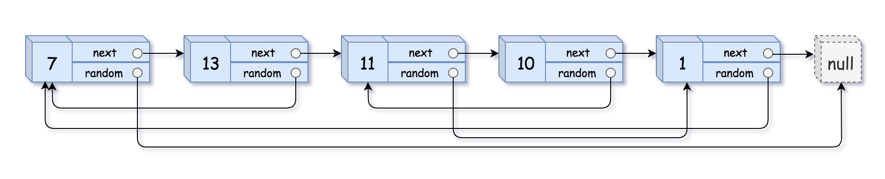

# [面试题 35. 复杂链表的复制](https://leetcode-cn.com/problems/fu-za-lian-biao-de-fu-zhi-lcof/)

## 题目描述

<!-- 这里写题目描述 -->

请实现 `copyRandomList` 函数，复制一个复杂链表。在复杂链表中，每个节点除了有一个 `next` 指针指向下一个节点，还有一个 `random` 指针指向链表中的任意节点或者 `null`。

**示例 1：**



```
输入：head = [[7,null],[13,0],[11,4],[10,2],[1,0]]
输出：[[7,null],[13,0],[11,4],[10,2],[1,0]]
```

**示例 2：**


```
输入：head = [[1,1],[2,1]]
输出：[[1,1],[2,1]]
```

**示例 3：**


```
输入：head = [[3,null],[3,0],[3,null]]
输出：[[3,null],[3,0],[3,null]]
```

**示例 4：**

```
输入：head = []
输出：[]
解释：给定的链表为空（空指针），因此返回 null。
```

**提示：**

- `-10000 <= Node.val <= 10000`
- `Node.random`  为空（null）或指向链表中的节点。
- 节点数目不超过 1000 。

## 解法

<!-- 这里可写通用的实现逻辑 -->

首先，遍历链表，完成对每个旧节点的复制。

```bash
A -> B -> C -> D -> null

=>

A -> A1 -> B -> B1 -> C -> C1 -> D -> D1 -> null
```

接着设置新节点的 ramdom 指针。

然后遍历链表，修改旧节点和新节点的指向，将旧节点指向下一个旧节点，而新节点指向下一个新节点。

最后返回第一个新节点即可。

<!-- tabs:start -->

### **Python3**

<!-- 这里可写当前语言的特殊实现逻辑 -->

```python
"""
# Definition for a Node.
class Node:
    def __init__(self, x: int, next: 'Node' = None, random: 'Node' = None):
        self.val = int(x)
        self.next = next
        self.random = random
"""

class Solution:
    def copyRandomList(self, head: 'Node') -> 'Node':
        if head is None:
            return None

        cur = head
        while cur:
            node = Node(cur.val, cur.next)
            cur.next = node
            cur = node.next
        
        cur = head
        while cur:
            cur.next.random = None if cur.random is None else cur.random.next
            cur = cur.next.next
        
        copy = head.next
        cur = head
        while cur:
            next = cur.next
            cur.next = next.next
            next.next = None if next.next is None else next.next.next
            cur = cur.next
        return copy
```

### **Java**

<!-- 这里可写当前语言的特殊实现逻辑 -->

```java
/*
// Definition for a Node.
class Node {
    int val;
    Node next;
    Node random;

    public Node(int val) {
        this.val = val;
        this.next = null;
        this.random = null;
    }
}
*/

class Solution {
    public Node copyRandomList(Node head) {
        if (head == null) {
            return null;
        }

        Node cur = head;
        while (cur != null) {
            Node node = new Node(cur.val);
            node.next = cur.next;
            cur.next = node;
            cur = node.next;
        }

        cur = head;
        while (cur != null) {
            cur.next.random = cur.random == null ? null : cur.random.next;
            cur = cur.next.next;
        }

        Node copy = head.next;
        cur = head;
        while (cur != null) {
            Node next = cur.next;
            cur.next = next.next;
            next.next = next.next == null ? null : next.next.next;
            cur = cur.next;
        }
        return copy;
    }
}
```

### **C++**

```cpp
/*
// Definition for a Node.
class Node {
public:
    int val;
    Node* next;
    Node* random;
    
    Node(int _val) {
        val = _val;
        next = NULL;
        random = NULL;
    }
};
*/

class Solution {
public:
    Node* copyRandomList(Node* head) {
        if (!head) {
            return nullptr;
        }
        Node* cur = head;
        while (cur) {
            Node* node = new Node(cur->val);
            node->next = cur->next;
            cur->next = node;
            cur = node->next;
        }

        cur = head;
        while (cur) {
            cur->next->random = cur->random ? cur->random->next : nullptr;
            cur = cur->next->next;
        }

        Node* copy = head->next;
        cur = head;
        while (cur) {
            Node* next = cur->next;
            cur->next = next->next;
            next->next = next->next ? next->next->next : nullptr;
            cur = cur->next;
        }
        return copy;
    }
};
```

### **C#**

```cs
/*
// Definition for a Node.
public class Node {
    public int val;
    public Node next;
    public Node random;
    
    public Node(int _val) {
        val = _val;
        next = null;
        random = null;
    }
}
*/

public class Solution {
    public Node CopyRandomList(Node head) {
        if (head == null) {
            return null;
        }
        
        Node cur = head;
        while (cur != null) {
            Node node = new Node(cur.val);
            node.next = cur.next;
            cur.next = node;
            cur = node.next;
        }

        cur = head;
        while (cur != null) {
            cur.next.random = cur.random == null ? null : cur.random.next;
            cur = cur.next.next;
        }

        Node copy = head.next;
        cur = head;
        while (cur != null) {
            Node next = cur.next;
            cur.next = next.next;
            next.next = next.next == null ? null : next.next.next;
            cur = cur.next;
        }
        return copy;
    }
}
```

### **JavaScript**

```js
/**
 * // Definition for a Node.
 * function Node(val, next, random) {
 *    this.val = val;
 *    this.next = next;
 *    this.random = random;
 * };
 */

/**
 * @param {Node} head
 * @return {Node}
 */
var copyRandomList = function(head) {
    if (head == null) {
        return null;
    }
    let cur = head;
    while (cur != null) {
        let node = new Node(cur.val, cur.next);
        cur.next = node;
        cur = node.next;
    }

    cur = head;
    while (cur != null) {
        cur.next.random = cur.random == null ? null : cur.random.next;
        cur = cur.next.next;
    }

    let copy = head.next;
    cur = head;
    while (cur != null) {
        let next = cur.next;
        cur.next = next.next;
        next.next = next.next == null ? null : next.next.next;
        cur = cur.next;
    }
    return copy;
};
```

### **Go**

```go
/**
 * Definition for a Node.
 * type Node struct {
 *     Val int
 *     Next *Node
 *     Random *Node
 * }
 */

func copyRandomList(head *Node) *Node {
    if head == nil {
        return nil
    }

    cur := head
    for cur != nil {
        node := &Node{
            Val: cur.Val,
            Next: cur.Next,
            Random: nil,
        }
        cur.Next = node
        cur = node.Next
    }

    cur = head
    for cur != nil {
        if cur.Random == nil {
            cur.Next.Random = nil
        } else {
            cur.Next.Random = cur.Random.Next
        }
        cur = cur.Next.Next
    }

    copy := head.Next
    cur = head
    for cur != nil {
        next := cur.Next
        cur.Next = next.Next
        if (next.Next == nil) {
            next.Next = nil
        } else {
            next.Next = next.Next.Next
        }
        cur = cur.Next
    }
    return copy
}
```

### **...**

```

```

<!-- tabs:end -->
