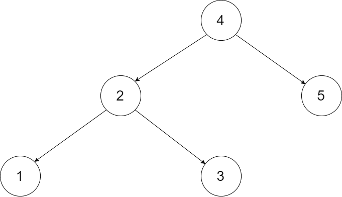
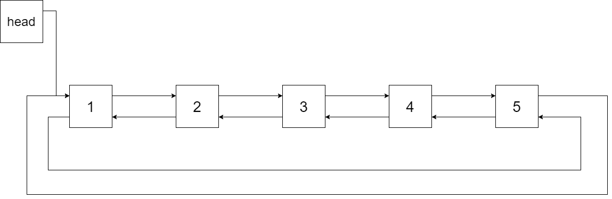

# [面试题 36. 二叉搜索树与双向链表](https://leetcode-cn.com/problems/er-cha-sou-suo-shu-yu-shuang-xiang-lian-biao-lcof/)

## 题目描述

<!-- 这里写题目描述 -->

输入一棵二叉搜索树，将该二叉搜索树转换成一个排序的循环双向链表。要求不能创建任何新的节点，只能调整树中节点指针的指向。

为了让您更好地理解问题，以下面的二叉搜索树为例：



我们希望将这个二叉搜索树转化为双向循环链表。链表中的每个节点都有一个前驱和后继指针。对于双向循环链表，第一个节点的前驱是最后一个节点，最后一个节点的后继是第一个节点。

下图展示了上面的二叉搜索树转化成的链表。“head” 表示指向链表中有最小元素的节点。



特别地，我们希望可以就地完成转换操作。当转化完成以后，树中节点的左指针需要指向前驱，树中节点的右指针需要指向后继。还需要返回链表中的第一个节点的指针。

**注意**：本题与主站 426 题相同：https://leetcode-cn.com/problems/convert-binary-search-tree-to-sorted-doubly-linked-list/

**注意**：此题对比原题有改动。

## 解法

<!-- 这里可写通用的实现逻辑 -->

二叉搜索树中序遍历得到有序序列；根结点指向左子树最后一个结点，根结点也指向右子树第一个结点。

利用虚拟头结点递归遍历求解。

<!-- tabs:start -->

### **Python3**

<!-- 这里可写当前语言的特殊实现逻辑 -->

```python
"""
# Definition for a Node.
class Node:
    def __init__(self, val, left=None, right=None):
        self.val = val
        self.left = left
        self.right = right
"""


class Solution:
    def treeToDoublyList(self, root: 'Node') -> 'Node':
        def dfs(cur):
            if not cur:
                return
            dfs(cur.left)
            cur.left = self.lastNode
            if self.lastNode:
                self.lastNode.right = cur
            self.lastNode = cur
            dfs(cur.right)

        if not root:
            return root
        self.lastNode = head = Node(-1)
        dfs(root)
        head = head.right
        head.left = self.lastNode
        self.lastNode.right = head
        return head

```

### **Java**

<!-- 这里可写当前语言的特殊实现逻辑 -->

```java
/*
// Definition for a Node.
class Node {
    public int val;
    public Node left;
    public Node right;

    public Node() {}

    public Node(int _val) {
        val = _val;
    }

    public Node(int _val,Node _left,Node _right) {
        val = _val;
        left = _left;
        right = _right;
    }
};
*/
class Solution {
    private Node lastNode;
    public Node treeToDoublyList(Node root) {
        if (root == null) {
            return root;
        }
        lastNode = new Node(-1);
        Node head = lastNode;
        dfs(root);
        head = head.right;
        head.left = lastNode;
        lastNode.right = head;
        return head;
    }

    private void dfs(Node cur) {
        if (cur == null) {
            return;
        }
        dfs(cur.left);
        cur.left = lastNode;
        if (lastNode != null) {
            lastNode.right = cur;
        }
        lastNode = cur;
        dfs(cur.right);
    }
}
```

### **JavaScript**

```js
/**
 * // Definition for a Node.
 * function Node(val, left, right) {
 *      this.val = val;
 *      this.left = left;
 *      this.right = right;
 *  };
 */
/**
 * @param {Node} root
 * @return {Node}
 */
var treeToDoublyList = function (root) {
  if (!root) return null;
  function dfs(node) {
    if (!node) return null;
    dfs(node.left);
    arr.push(node);
    dfs(node.right);
  }
  let arr = [];
  dfs(root);
  let len = arr.length;
  let res = arr[0];
  for (let i = 0; i < len; i++) {
    if (i + 1 < len) {
      arr[i].right = arr[i + 1];
    } else {
      arr[i].right = arr[0];
    }
    if (i - 1 >= 0) {
      arr[i].left = arr[i - 1];
    } else {
      arr[i].left = arr[len - 1];
    }
  }
  return res;
};
```

### **...**

```

```

<!-- tabs:end -->
