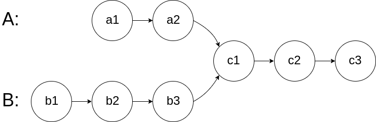
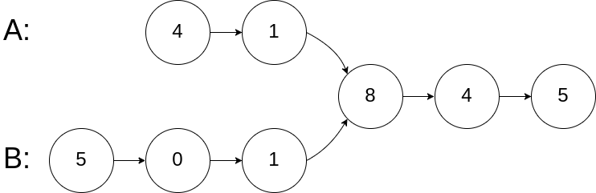
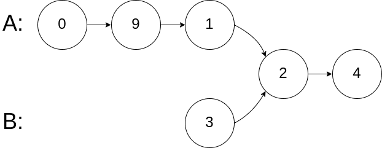
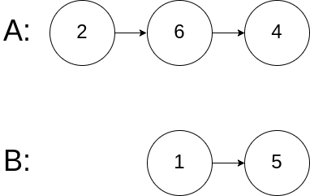

# [面试题 52. 两个链表的第一个公共节点](https://leetcode-cn.com/problems/liang-ge-lian-biao-de-di-yi-ge-gong-gong-jie-dian-lcof/)

## 题目描述

输入两个链表，找出它们的第一个公共节点。

如下面的两个链表：



在节点 c1 开始相交。

**示例 1：**



```
输入：intersectVal = 8, listA = [4,1,8,4,5], listB = [5,0,1,8,4,5], skipA = 2, skipB = 3
输出：Reference of the node with value = 8
输入解释：相交节点的值为 8 （注意，如果两个列表相交则不能为 0）。从各自的表头开始算起，链表 A 为 [4,1,8,4,5]，链表 B 为 [5,0,1,8,4,5]。在 A 中，相交节点前有 2 个节点；在 B 中，相交节点前有 3 个节点。
```

**示例  2：**



```
输入：intersectVal = 2, listA = [0,9,1,2,4], listB = [3,2,4], skipA = 3, skipB = 1
输出：Reference of the node with value = 2
输入解释：相交节点的值为 2 （注意，如果两个列表相交则不能为 0）。从各自的表头开始算起，链表 A 为 [0,9,1,2,4]，链表 B 为 [3,2,4]。在 A 中，相交节点前有 3 个节点；在 B 中，相交节点前有 1 个节点。
```

**示例  3：**



```
输入：intersectVal = 0, listA = [2,6,4], listB = [1,5], skipA = 3, skipB = 2
输出：null
输入解释：从各自的表头开始算起，链表 A 为 [2,6,4]，链表 B 为 [1,5]。由于这两个链表不相交，所以 intersectVal 必须为 0，而 skipA 和 skipB 可以是任意值。
解释：这两个链表不相交，因此返回 null。
```

**注意：**

- 如果两个链表没有交点，返回 `null`。
- 在返回结果后，两个链表仍须保持原有的结构。
- 可假定整个链表结构中没有循环。
- 程序尽量满足 O(n) 时间复杂度，且仅用 O(1) 内存。

## 解法

使用两个指针 `cur1`, `cur2` 分别指向两个链表 `headA`, `headB`。

同时遍历链表，当 `cur1` 到达链表 `headA` 的末尾时，重新定位到链表 `headB` 的头节点；当 `cur2` 到达链表 `headB` 的末尾时，重新定位到链表 `headA` 的头节点。

若两指针相遇，所指向的结点就是第一个公共节点。若没相遇，说明两链表无公共节点，此时两个指针都指向 `null`。

<!-- tabs:start -->

### **Python3**

```python
# Definition for singly-linked list.
# class ListNode:
#     def __init__(self, x):
#         self.val = x
#         self.next = None

class Solution:
    def getIntersectionNode(self, headA: ListNode, headB: ListNode) -> ListNode:
        cur1, cur2 = headA, headB
        while cur1 != cur2:
            cur1 = headB if cur1 is None else cur1.next
            cur2 = headA if cur2 is None else cur2.next
        return cur1
```

### **Java**

```java
/**
 * Definition for singly-linked list.
 * public class ListNode {
 *     int val;
 *     ListNode next;
 *     ListNode(int x) {
 *         val = x;
 *         next = null;
 *     }
 * }
 */
public class Solution {
    public ListNode getIntersectionNode(ListNode headA, ListNode headB) {
        ListNode cur1 = headA, cur2 = headB;
        while (cur1 != cur2) {
            cur1 = cur1 == null ? headB : cur1.next;
            cur2 = cur2 == null ? headA : cur2.next;
        }
        return cur1;
    }
}
```

### **JavaScript**

```js
/**
 * Definition for singly-linked list.
 * function ListNode(val) {
 *     this.val = val;
 *     this.next = null;
 * }
 */

/**
 * @param {ListNode} headA
 * @param {ListNode} headB
 * @return {ListNode}
 */
var getIntersectionNode = function (headA, headB) {
    let cur1 = headA;
    let cur2 = headB;
    while (cur1 != cur2) {
        cur1 = cur1 ? cur1.next : headB;
        cur2 = cur2 ? cur2.next : headA;
    }
    return cur1;
};
```

### **C++**

```cpp
/**
 * Definition for singly-linked list.
 * struct ListNode {
 *     int val;
 *     ListNode *next;
 *     ListNode(int x) : val(x), next(NULL) {}
 * };
 */
class Solution {
public:
    ListNode *getIntersectionNode(ListNode *headA, ListNode *headB) {
        ListNode* cur1 = headA;
        ListNode* cur2 = headB;
        while (cur1 != cur2) {
            cur1 = cur1 ? cur1->next : headB;
            cur2 = cur2 ? cur2->next : headA;
        }
        return cur1;
    }
};
```

### **Go**

```go
/**
 * Definition for singly-linked list.
 * type ListNode struct {
 *     Val int
 *     Next *ListNode
 * }
 */
func getIntersectionNode(headA, headB *ListNode) *ListNode {
    cur1, cur2 := headA, headB
    for cur1 != cur2 {
        if cur1 == nil {
            cur1 = headB
        } else {
            cur1 = cur1.Next
        }
        if cur2 == nil {
            cur2 = headA
        } else {
            cur2 = cur2.Next
        }
    }
    return cur1
}
```

### **C#**

```cs
/**
 * Definition for singly-linked list.
 * public class ListNode {
 *     public int val;
 *     public ListNode next;
 *     public ListNode(int x) { val = x; }
 * }
 */
public class Solution {
    public ListNode GetIntersectionNode(ListNode headA, ListNode headB) {
        ListNode cur1 = headA, cur2 = headB;
        while (cur1 != cur2)
        {
            cur1 = cur1 == null ? headB : cur1.next;
            cur2 = cur2 == null ? headA : cur2.next;
        }
        return cur1;
    }
}
```

### **...**

```

```

<!-- tabs:end -->
