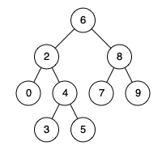

# [面试题 68 - I. 二叉搜索树的最近公共祖先](https://leetcode-cn.com/problems/er-cha-sou-suo-shu-de-zui-jin-gong-gong-zu-xian-lcof/)

## 题目描述

<!-- 这里写题目描述 -->

给定一个二叉搜索树, 找到该树中两个指定节点的最近公共祖先。

[百度百科](https://baike.baidu.com/item/%E6%9C%80%E8%BF%91%E5%85%AC%E5%85%B1%E7%A5%96%E5%85%88/8918834?fr=aladdin)中最近公共祖先的定义为：“对于有根树 T 的两个结点 p、q，最近公共祖先表示为一个结点 x，满足 x 是 p、q 的祖先且 x 的深度尽可能大（**一个节点也可以是它自己的祖先**）。”

例如，给定如下二叉搜索树:  root = `[6,2,8,0,4,7,9,null,null,3,5]`



**示例 1:**

```
输入: root = [6,2,8,0,4,7,9,null,null,3,5], p = 2, q = 8
输出: 6
解释: 节点 2 和节点 8 的最近公共祖先是 6。
```

**示例 2:**

```
输入: root = [6,2,8,0,4,7,9,null,null,3,5], p = 2, q = 4
输出: 2
解释: 节点 2 和节点 4 的最近公共祖先是 2, 因为根据定义最近公共祖先节点可以为节点本身。
```

**说明:**

- 所有节点的值都是唯一的。
- p、q 为不同节点且均存在于给定的二叉搜索树中。

## 解法

<!-- 这里可写通用的实现逻辑 -->

从上到下搜索，找到第一个值位于 `[p, q]` 之间的结点即可。既可以用迭代实现，也可以用递归实现。

<!-- tabs:start -->

### **Python3**

<!-- 这里可写当前语言的特殊实现逻辑 -->

#### 迭代法

```python
# Definition for a binary tree node.
# class TreeNode:
#     def __init__(self, x):
#         self.val = x
#         self.left = None
#         self.right = None

class Solution:
    def lowestCommonAncestor(self, root: TreeNode, p: TreeNode, q: TreeNode) -> TreeNode:
        if p == q:
            return p
        while root:
            if root.val < p.val and root.val < q.val:
                root = root.right
            elif root.val > p.val and root.val > q.val:
                root = root.left
            else:
                return root
```

#### 递归法

```python
# Definition for a binary tree node.
# class TreeNode:
#     def __init__(self, x):
#         self.val = x
#         self.left = None
#         self.right = None

class Solution:
    def lowestCommonAncestor(self, root: 'TreeNode', p: 'TreeNode', q: 'TreeNode') -> 'TreeNode':
        if root.val < p.val and root.val < q.val:
            return self.lowestCommonAncestor(root.right, p, q)
        if root.val > p.val and root.val > q.val:
            return self.lowestCommonAncestor(root.left, p, q)
        return root
```

### **Java**

<!-- 这里可写当前语言的特殊实现逻辑 -->

```java
/**
 * Definition for a binary tree node.
 * public class TreeNode {
 *     int val;
 *     TreeNode left;
 *     TreeNode right;
 *     TreeNode(int x) { val = x; }
 * }
 */
class Solution {
    public TreeNode lowestCommonAncestor(TreeNode root, TreeNode p, TreeNode q) {
        if (p == q) {
            return p;
        }
        while (root != null) {
            if (root.val < p.val && root.val < q.val) {
                root = root.right;
            } else if (root.val > p.val && root.val > q.val) {
                root = root.left;
            } else {
                return root;
            }
        }
        return null;
    }
}
```

### **JavaScript**

```js
/**
 * Definition for a binary tree node.
 * function TreeNode(val) {
 *     this.val = val;
 *     this.left = this.right = null;
 * }
 */
/**
 * @param {TreeNode} root
 * @param {TreeNode} p
 * @param {TreeNode} q
 * @return {TreeNode}
 */
var lowestCommonAncestor = function (root, p, q) {
    // 递归
    if (!root) return null;
    if (root.val < p.val && root.val < q.val) {
        return lowestCommonAncestor(root.right, p, q);
    } else if (root.val > p.val && root.val > q.val) {
        return lowestCommonAncestor(root.left, p, q);
    }
    return root;
};
```

### **...**

```

```

<!-- tabs:end -->
