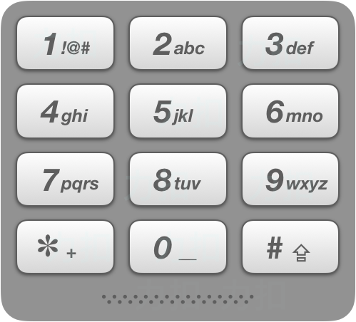

# [17. Letter Combinations of a Phone Number](https://leetcode.com/problems/letter-combinations-of-a-phone-number)

[中文文档](/solution/0000-0099/0017.Letter%20Combinations%20of%20a%20Phone%20Number/README.md)

## Description

<p>Given a string containing digits from <code>2-9</code> inclusive, return all possible letter combinations that the number could represent.</p>

<p>A mapping of digit to letters (just like on the telephone buttons) is given below. Note that 1 does not map to any letters.</p>



<p><strong>Example:</strong></p>

<pre>

<strong>Input: </strong>&quot;23&quot;

<strong>Output:</strong> [&quot;ad&quot;, &quot;ae&quot;, &quot;af&quot;, &quot;bd&quot;, &quot;be&quot;, &quot;bf&quot;, &quot;cd&quot;, &quot;ce&quot;, &quot;cf&quot;].

</pre>

<p><strong>Note:</strong></p>

<p>Although the above answer is in lexicographical order, your answer could be in any order you want.</p>

## Solutions

<!-- tabs:start -->

### **Python3**

```python
class Solution:
    def letterCombinations(self, digits: str) -> List[str]:
        n = len(digits)
        if n == 0:
            return []
        chars = ['abc', 'def', 'ghi', 'jkl', 'mno', 'pqrs', 'tuv', 'wxyz']
        strs = [chars[int(d) - 2] for d in digits]
        res = []
        for s in strs:
            if not res:
                res = list(s)
            else:
                cache = []
                for item in res:
                    for letter in s:
                        cache.append(item + letter)
                res = cache
        return res
```

### **Java**

```java
class Solution {
    public List<String> letterCombinations(String digits) {
        int n;
        if ((n = digits.length()) == 0) return Collections.emptyList();
        List<String> chars = Arrays.asList("abc", "def", "ghi", "jkl", "mno", "pqrs", "tuv", "wxyz");

        List<String> strs = new ArrayList<>();
        for (char c : digits.toCharArray()) {
            strs.add(chars.get(c - '0' - 2));
        }
        List<String> res = new ArrayList<>();
        for (String str : strs) {
            if (res.size() == 0) {
                for (char c : str.toCharArray()) {
                    res.add(String.valueOf(c));
                }
            } else {
                List<String> cache = new ArrayList<>();
                for (String item : res) {
                    for (char c : str.toCharArray()) {
                        cache.add(item + String.valueOf(c));
                    }
                }
                res = cache;
            }
        }
        return res;
    }
}
```

### **...**

```

```

<!-- tabs:end -->
