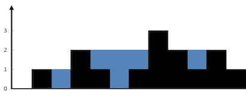

# [42. Trapping Rain Water](https://leetcode.com/problems/trapping-rain-water)

[中文文档](/solution/0000-0099/0042.Trapping%20Rain%20Water/README.md)

## Description
<p>Given <em>n</em> non-negative integers representing an elevation map where the width of each bar is 1, compute how much water it is able to trap after raining.</p>




<small>The above elevation map is represented by array [0,1,0,2,1,0,1,3,2,1,2,1]. In this case, 6 units of rain water (blue section) are being trapped. <strong>Thanks Marcos</strong> for contributing this image!</small></p>


<p><strong>Example:</strong></p>


<pre>

<strong>Input:</strong> [0,1,0,2,1,0,1,3,2,1,2,1]

<strong>Output:</strong> 6</pre>


## Solutions


<!-- tabs:start -->

### **Python3**

```python

```

### **Java**

```java

```

### **...**
```

```

<!-- tabs:end -->