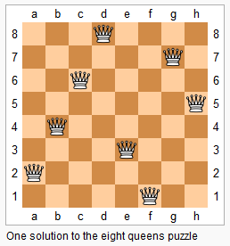

# [51. N-Queens](https://leetcode.com/problems/n-queens)

[中文文档](/solution/0000-0099/0051.N-Queens/README.md)

## Description

<p>The <em>n</em>-queens puzzle is the problem of placing <em>n</em> queens on an <em>n</em>&times;<em>n</em> chessboard such that no two queens attack each other.</p>



<p>Given an integer <em>n</em>, return all distinct solutions to the <em>n</em>-queens puzzle.</p>

<p>Each solution contains a distinct board configuration of the <em>n</em>-queens&#39; placement, where <code>&#39;Q&#39;</code> and <code>&#39;.&#39;</code> both indicate a queen and an empty space respectively.</p>

<p><strong>Example:</strong></p>

<pre>

<strong>Input:</strong> 4

<strong>Output:</strong> [

 [&quot;.Q..&quot;,  // Solution 1

  &quot;...Q&quot;,

  &quot;Q...&quot;,

  &quot;..Q.&quot;],


 [&quot;..Q.&quot;,  // Solution 2

  &quot;Q...&quot;,

  &quot;...Q&quot;,

  &quot;.Q..&quot;]

]

<strong>Explanation:</strong> There exist two distinct solutions to the 4-queens puzzle as shown above.

</pre>

## Solutions

<!-- tabs:start -->

### **Python3**

```python

```

### **Java**

```java

```

### **...**

```

```

<!-- tabs:end -->
