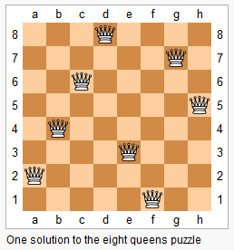

# [52. N-Queens II](https://leetcode.com/problems/n-queens-ii)

[中文文档](/solution/0000-0099/0052.N-Queens%20II/README.md)

## Description

<p>The <em>n</em>-queens puzzle is the problem of placing <em>n</em> queens on an <em>n</em>&times;<em>n</em> chessboard such that no two queens attack each other.</p>



<p>Given an integer&nbsp;<em>n</em>, return the number of&nbsp;distinct solutions to the&nbsp;<em>n</em>-queens puzzle.</p>

<p><strong>Example:</strong></p>

<pre>

<strong>Input:</strong> 4

<strong>Output:</strong> 2

<strong>Explanation:</strong> There are two distinct solutions to the 4-queens puzzle as shown below.

[

&nbsp;[&quot;.Q..&quot;, &nbsp;// Solution 1

&nbsp; &quot;...Q&quot;,

&nbsp; &quot;Q...&quot;,

&nbsp; &quot;..Q.&quot;],


&nbsp;[&quot;..Q.&quot;, &nbsp;// Solution 2

&nbsp; &quot;Q...&quot;,

&nbsp; &quot;...Q&quot;,

&nbsp; &quot;.Q..&quot;]

]

</pre>

## Solutions

<!-- tabs:start -->

### **Python3**

```python

```

### **Java**

```java

```

### **...**

```

```

<!-- tabs:end -->
