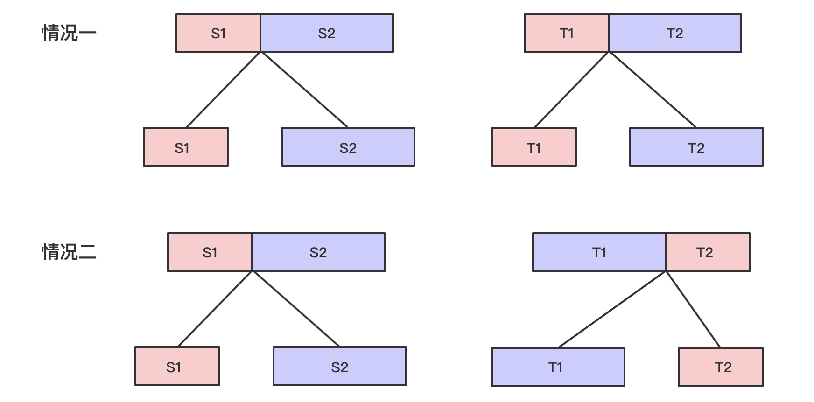

# [87. 扰乱字符串](https://leetcode.cn/problems/scramble-string)

[English Version](/solution/0000-0099/0087.Scramble%20String/README_EN.md)

## 题目描述

<!-- 这里写题目描述 -->

使用下面描述的算法可以扰乱字符串 <code>s</code> 得到字符串 <code>t</code> ：

<ol>
	<li>如果字符串的长度为 1 ，算法停止</li>
	<li>如果字符串的长度 > 1 ，执行下述步骤：
	<ul>
		<li>在一个随机下标处将字符串分割成两个非空的子字符串。即，如果已知字符串 <code>s</code> ，则可以将其分成两个子字符串 <code>x</code> 和 <code>y</code> ，且满足 <code>s = x + y</code> 。</li>
		<li><strong>随机</strong> 决定是要「交换两个子字符串」还是要「保持这两个子字符串的顺序不变」。即，在执行这一步骤之后，<code>s</code> 可能是 <code>s = x + y</code> 或者 <code>s = y + x</code> 。</li>
		<li>在 <code>x</code> 和 <code>y</code> 这两个子字符串上继续从步骤 1 开始递归执行此算法。</li>
	</ul>
	</li>
</ol>

<p>给你两个 <strong>长度相等</strong> 的字符串 <code>s1</code><em> </em>和 <code>s2</code>，判断 <code>s2</code><em> </em>是否是 <code>s1</code><em> </em>的扰乱字符串。如果是，返回 <code>true</code> ；否则，返回 <code>false</code> 。</p>

<p> </p>

<p><strong>示例 1：</strong></p>

<pre>
<strong>输入：</strong>s1 = "great", s2 = "rgeat"
<strong>输出：</strong>true
<strong>解释：</strong>s1 上可能发生的一种情形是：
"great" --> "gr/eat" // 在一个随机下标处分割得到两个子字符串
"gr/eat" --> "gr/eat" // 随机决定：「保持这两个子字符串的顺序不变」
"gr/eat" --> "g/r / e/at" // 在子字符串上递归执行此算法。两个子字符串分别在随机下标处进行一轮分割
"g/r / e/at" --> "r/g / e/at" // 随机决定：第一组「交换两个子字符串」，第二组「保持这两个子字符串的顺序不变」
"r/g / e/at" --> "r/g / e/ a/t" // 继续递归执行此算法，将 "at" 分割得到 "a/t"
"r/g / e/ a/t" --> "r/g / e/ a/t" // 随机决定：「保持这两个子字符串的顺序不变」
算法终止，结果字符串和 s2 相同，都是 "rgeat"
这是一种能够扰乱 s1 得到 s2 的情形，可以认为 s2 是 s1 的扰乱字符串，返回 true
</pre>

<p><strong>示例 2：</strong></p>

<pre>
<strong>输入：</strong>s1 = "abcde", s2 = "caebd"
<strong>输出：</strong>false
</pre>

<p><strong>示例 3：</strong></p>

<pre>
<strong>输入：</strong>s1 = "a", s2 = "a"
<strong>输出：</strong>true
</pre>

<p> </p>

<p><strong>提示：</strong></p>

<ul>
	<li><code>s1.length == s2.length</code></li>
	<li><code>1 <= s1.length <= 30</code></li>
	<li><code>s1</code> 和 <code>s2</code> 由小写英文字母组成</li>
</ul>

## 解法

<!-- 这里可写通用的实现逻辑 -->

动态规划法。

假设 `dp[i][j][len]` 表示从字符串 S 中 i 开始长度为 len 的字符串是否能变换为从字符串 T 中 j 开始长度为 len 的字符串。题目可转变为求 `dp[0][0][n]`。

在 `len` 为 1 的情况下，只需要判断 `S[i]` 是否等于 `T[j]`。所以可以对 dp 进行初始化：`dp[i][j][1] = S[i] == T[j]`，其中，`i,j ∈ [0, n)`。

在 `len` 大于 1 的情况下，枚举 S 的长度 `i ∈ [1, len-1]`，`dp[i1][i2][i]` 表示 S1 能变成 T1，`dp[i1 + i][i2 + i][len - i]` 表示 S2 能变成 T2；或者 S1 能变成 T2，S2 能变成 T1。



<!-- tabs:start -->

### **Python3**

<!-- 这里可写当前语言的特殊实现逻辑 -->

```python
class Solution:
    def isScramble(self, s1: str, s2: str) -> bool:
        n = len(s1)
        dp = [[[False] * (n + 1) for _ in range(n)] for _ in range(n)]
        for i in range(n):
            for j in range(n):
                dp[i][j][1] = s1[i] == s2[j]
        # 枚举长度区间[2, n]
        for l in range(2, n + 1):
            # 枚举s1的起始位置
            for i1 in range(n - l + 1):
                # 枚举s2的起始位置
                for i2 in range(n - l + 1):
                    # 枚举分割的位置
                    for i in range(1, l):
                        if dp[i1][i2][i] and dp[i1 + i][i2 + i][l - i]:
                            dp[i1][i2][l] = True
                            break
                        if dp[i1][i2 + l - i][i] and dp[i1 + i][i2][l - i]:
                            dp[i1][i2][l] = True
                            break
        return dp[0][0][n]
```

### **Java**

<!-- 这里可写当前语言的特殊实现逻辑 -->

```java
class Solution {
    public boolean isScramble(String s1, String s2) {
        // 题目已说明 s1.length == s2.length，无须再判断长度是否相等
        int n = s1.length();
        boolean[][][] dp = new boolean[n][n][n + 1];
        for (int i = 0; i < n; ++i) {
            for (int j = 0; j < n; ++j) {
                // 长度为1时，两字符必须相等
                dp[i][j][1] = s1.charAt(i) == s2.charAt(j);
            }
        }
        // 枚举长度区间[2, n]
        for (int len = 2; len <= n; ++len) {
            // 枚举s1的起始位置
            for (int i1 = 0; i1 <= n - len; ++i1) {
                // 枚举s2的起始位置
                for (int i2 = 0; i2 <= n - len; ++i2) {
                    // 枚举分割的位置
                    for (int i = 1; i < len; ++i) {
                        if (dp[i1][i2][i] && dp[i1 + i][i2 + i][len - i]) {
                            dp[i1][i2][len] = true;
                            break;
                        }
                        if (dp[i1][i2 + len - i][i] && dp[i1 + i][i2][len - i]) {
                            dp[i1][i2][len] = true;
                            break;
                        }
                    }
                }
            }
        }
        return dp[0][0][n];
    }
}
```

### **Go**

```go
func isScramble(s1 string, s2 string) bool {
	n := len(s1)
	dp := make([][][]bool, n+1)
	for i := range dp {
		dp[i] = make([][]bool, n)
		for j := range dp[i] {
			dp[i][j] = make([]bool, n+1)
		}
	}
	for i := 0; i < n; i++ {
		for j := 0; j < n; j++ {
			dp[i][j][1] = s1[i] == s2[j]
		}
	}
	for l := 2; l < n+1; l++ {
		for i1 := 0; i1 < n-l+1; i1++ {
			for i2 := 0; i2 < n-l+1; i2++ {
				for i := 1; i < l; i++ {
					if dp[i1][i2][i] && dp[i1+i][i2+i][l-i] {
						dp[i1][i2][l] = true
						break
					}
					if dp[i1][i2+l-i][i] && dp[i1+i][i2][l-i] {
						dp[i1][i2][l] = true
						break
					}
				}
			}
		}
	}
	return dp[0][0][n]
}
```

### **...**

```

```

<!-- tabs:end -->
