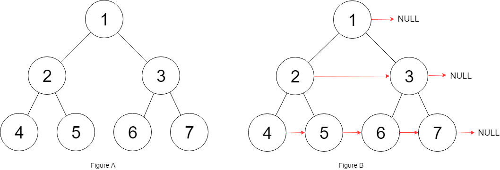

# [116. Populating Next Right Pointers in Each Node](https://leetcode.com/problems/populating-next-right-pointers-in-each-node)

[中文文档](/solution/0100-0199/0116.Populating%20Next%20Right%20Pointers%20in%20Each%20Node/README.md)

## Description

<p>You are given a <strong>perfect binary tree</strong>&nbsp;where&nbsp;all leaves are on the same level, and every parent has two children. The binary tree has the following definition:</p>

<pre>
struct Node {
  int val;
  Node *left;
  Node *right;
  Node *next;
}
</pre>

<p>Populate each next pointer to point to its next right node. If there is no next right node, the next pointer should be set to <code>NULL</code>.</p>

<p>Initially, all next pointers are set to <code>NULL</code>.</p>

<p>&nbsp;</p>

<p><strong>Follow up:</strong></p>

<ul>
	<li>You may only use constant extra space.</li>
	<li>Recursive approach is fine, you may assume implicit stack space does not count as extra space for this problem.</li>
</ul>

<p>&nbsp;</p>
<p><strong>Example 1:</strong></p>



<pre>
<strong>Input:</strong> root = [1,2,3,4,5,6,7]
<strong>Output:</strong> [1,#,2,3,#,4,5,6,7,#]
<strong>Explanation: </strong>Given the above perfect binary tree (Figure A), your function should populate each next pointer to point to its next right node, just like in Figure B. The serialized output is in level order as connected by the next pointers, with &#39;#&#39; signifying the end of each level.
</pre>

<p>&nbsp;</p>
<p><strong>Constraints:</strong></p>

<ul>
	<li>The number of nodes in the given tree is less than <code>4096</code>.</li>
	<li><code>-1000 &lt;= node.val &lt;= 1000</code></li>
</ul>

## Solutions

<!-- tabs:start -->

### **Python3**

```python

```

### **Java**

```java

```

### **...**

```

```

<!-- tabs:end -->
