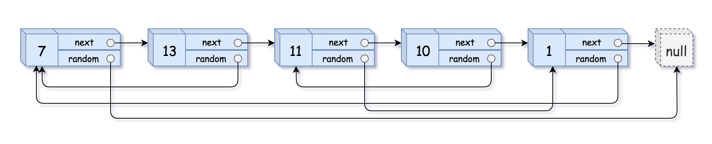

# [138. Copy List with Random Pointer](https://leetcode.com/problems/copy-list-with-random-pointer)

[中文文档](/solution/0100-0199/0138.Copy%20List%20with%20Random%20Pointer/README.md)

## Description

<p>A linked list is given such that each node contains an additional random pointer which could point to any node in the list or null.</p>

<p>Return a <a href="https://en.wikipedia.org/wiki/Object_copying#Deep_copy" target="_blank"><strong>deep copy</strong></a> of the list.</p>

<p>The Linked List is represented in the input/output as a list of <code>n</code> nodes. Each node is represented as a pair of <code>[val, random_index]</code> where:</p>

<ul>
	<li><code>val</code>: an integer representing <code>Node.val</code></li>
	<li><code>random_index</code>: the index of the node (range from <code>0</code> to <code>n-1</code>) where random pointer points to, or <code>null</code> if it does not point to any node.</li>
</ul>

<p>&nbsp;</p>
<p><strong>Example 1:</strong></p>



<pre>
<strong>Input:</strong> head = [[7,null],[13,0],[11,4],[10,2],[1,0]]
<strong>Output:</strong> [[7,null],[13,0],[11,4],[10,2],[1,0]]
</pre>

<p><strong>Example 2:</strong></p>


<pre>
<strong>Input:</strong> head = [[1,1],[2,1]]
<strong>Output:</strong> [[1,1],[2,1]]
</pre>

<p><strong>Example 3:</strong></p>


<pre>
<strong>Input:</strong> head = [[3,null],[3,0],[3,null]]
<strong>Output:</strong> [[3,null],[3,0],[3,null]]
</pre>

<p><strong>Example 4:</strong></p>

<pre>
<strong>Input:</strong> head = []
<strong>Output:</strong> []
<strong>Explanation:</strong> Given linked list is empty (null pointer), so return null.
</pre>

<p>&nbsp;</p>
<p><strong>Constraints:</strong></p>

<ul>
	<li><code>-10000 &lt;= Node.val &lt;= 10000</code></li>
	<li><code>Node.random</code> is null or pointing to a node in the linked list.</li>
	<li>Number of Nodes will not exceed 1000.</li>
</ul>

## Solutions

<!-- tabs:start -->

### **Python3**

```python

```

### **Java**

```java

```

### **...**

```

```

<!-- tabs:end -->
