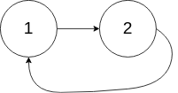
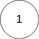

# [141. 环形链表](https://leetcode-cn.com/problems/linked-list-cycle)

[English Version](/solution/0100-0199/0141.Linked%20List%20Cycle/README_EN.md)

## 题目描述

<!-- 这里写题目描述 -->
<p>给定一个链表，判断链表中是否有环。</p>

<p>为了表示给定链表中的环，我们使用整数 <code>pos</code> 来表示链表尾连接到链表中的位置（索引从 0 开始）。 如果 <code>pos</code> 是 <code>-1</code>，则在该链表中没有环。</p>

<p>&nbsp;</p>

<p><strong>示例 1：</strong></p>

<pre><strong>输入：</strong>head = [3,2,0,-4], pos = 1
<strong>输出：</strong>true
<strong>解释：</strong>链表中有一个环，其尾部连接到第二个节点。
</pre>


<p><strong>示例&nbsp;2：</strong></p>

<pre><strong>输入：</strong>head = [1,2], pos = 0
<strong>输出：</strong>true
<strong>解释：</strong>链表中有一个环，其尾部连接到第一个节点。
</pre>



<p><strong>示例 3：</strong></p>

<pre><strong>输入：</strong>head = [1], pos = -1
<strong>输出：</strong>false
<strong>解释：</strong>链表中没有环。
</pre>



<p>&nbsp;</p>

<p><strong>进阶：</strong></p>

<p>你能用 <em>O(1)</em>（即，常量）内存解决此问题吗？</p>

## 解法

<!-- 这里可写通用的实现逻辑 -->

定义快慢指针 `slow`、`fast`，初始指向 `head`。

快指针每次走两步，慢指针每次走一步，不断循环。当相遇时，说明链表存在环。如果循环结束依然没有相遇，说明链表不存在环。

<!-- tabs:start -->

### **Python3**

<!-- 这里可写当前语言的特殊实现逻辑 -->

```python
# Definition for singly-linked list.
# class ListNode:
#     def __init__(self, x):
#         self.val = x
#         self.next = None

class Solution:
    def hasCycle(self, head: ListNode) -> bool:
        slow = fast = head
        while fast and fast.next:
            slow, fast = slow.next, fast.next.next
            if slow == fast:
                return True
        return False
```

### **Java**

<!-- 这里可写当前语言的特殊实现逻辑 -->

```java
/**
 * Definition for singly-linked list.
 * class ListNode {
 *     int val;
 *     ListNode next;
 *     ListNode(int x) {
 *         val = x;
 *         next = null;
 *     }
 * }
 */
public class Solution {
    public boolean hasCycle(ListNode head) {
        ListNode slow = head;
        ListNode fast = head;
        while (fast != null && fast.next != null) {
            slow = slow.next;
            fast = fast.next.next;
            if (slow == fast) {
                return true;
            }
        }
        return false;
    }
}
```

### **...**

```

```

<!-- tabs:end -->
