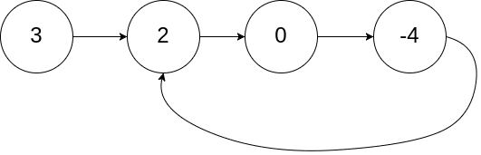
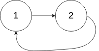

# [141. Linked List Cycle](https://leetcode.com/problems/linked-list-cycle)

[中文文档](/solution/0100-0199/0141.Linked%20List%20Cycle/README.md)

## Description
<p>Given a linked list, determine if it has a cycle in it.</p>


<p>To represent a cycle in the given linked list, we use an integer <code>pos</code> which represents the position (0-indexed)&nbsp;in the linked list where tail connects to. If <code>pos</code> is <code>-1</code>, then there is no cycle in the linked list.</p>


<p>&nbsp;</p>


<div>

<p><strong>Example 1:</strong></p>


<pre>

<strong>Input: </strong>head = <span id="example-input-1-1">[3,2,0,-4]</span>, pos = <span id="example-input-1-2">1</span>

<strong>Output: </strong><span id="example-output-1">true

<strong>Explanation:</strong> There is a cycle in the linked list, where tail connects to the second node.</span>

</pre>

</div>


<div>




<p><strong>Example 2:</strong></p>


<pre>

<strong>Input: </strong>head = <span id="example-input-1-1">[1,2]</span>, pos = <span id="example-input-1-2">0</span>

<strong>Output: </strong><span id="example-output-1">true

<strong>Explanation:</strong> There is a cycle in the linked list, where tail connects to the first node.</span>

</pre>

</div>


<div>




<p><strong>Example 3:</strong></p>


<pre>

<strong>Input: </strong>head = <span id="example-input-1-1">[1]</span>, pos = <span id="example-input-1-2">-1</span>

<strong>Output: </strong><span id="example-output-1">false

<strong>Explanation:</strong> There is no cycle in the linked list.</span>

</pre>

</div>


<p>&nbsp;</p>


<p><strong>Follow up:</strong></p>


<p>Can you solve it using <em>O(1)</em> (i.e. constant) memory?</p>


## Solutions


<!-- tabs:start -->

### **Python3**

```python
# Definition for singly-linked list.
# class ListNode:
#     def __init__(self, x):
#         self.val = x
#         self.next = None

class Solution:
    def hasCycle(self, head: ListNode) -> bool:
        slow = fast = head
        while fast and fast.next:
            slow, fast = slow.next, fast.next.next
            if slow == fast:
                return True
        return False
```

### **Java**

```java
/**
 * Definition for singly-linked list.
 * class ListNode {
 *     int val;
 *     ListNode next;
 *     ListNode(int x) {
 *         val = x;
 *         next = null;
 *     }
 * }
 */
public class Solution {
    public boolean hasCycle(ListNode head) {
        ListNode slow = head;
        ListNode fast = head;
        while (fast != null && fast.next != null) {
            slow = slow.next;
            fast = fast.next.next;
            if (slow == fast) {
                return true;
            }
        }
        return false;
    }
}
```

### **...**
```

```

<!-- tabs:end -->