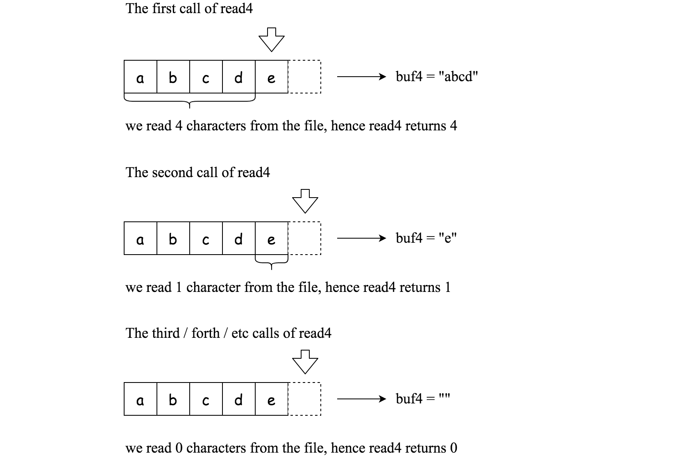

# [157. Read N Characters Given Read4](https://leetcode.com/problems/read-n-characters-given-read4)

[中文文档](/solution/0100-0199/0157.Read%20N%20Characters%20Given%20Read4/README.md)

## Description

<p>Given a file and assume that you can only read the file using a given method&nbsp;<code>read4</code>, implement a method to read <em>n</em> characters.</p>

<p>&nbsp;</p>

<p><b>Method read4: </b></p>

<p>The API&nbsp;<code>read4</code> reads 4 consecutive characters from the file, then writes those characters into the buffer array <code>buf</code>.</p>

<p>The return value is the number of actual characters read.</p>

<p>Note that&nbsp;<code>read4()</code> has its own file pointer, much like <code>FILE *fp</code> in C.</p>

<p><b>Definition of read4:</b></p>

<pre>
    Parameter:  char[] buf4
    Returns:    int

Note: buf4[] is destination not source, the results from read4 will be copied to buf4[]
</pre>

<p>Below is a high level example of how <code>read4</code> works:</p>



<pre>
<code>File file(&quot;</code>abcde<code>&quot;); // File is &quot;</code>abcde<code>&quot;, initially file pointer (fp) points to &#39;a&#39;
char[] buf4 = new char[4]; // Create buffer with enough space to store characters
read4(buf4); // read4 returns 4. Now buf = &quot;abcd&quot;, fp points to &#39;e&#39;
read4(buf4); // read4 returns 1. Now buf = &quot;e&quot;, fp points to end of file
read4(buf4); // read4 returns 0. Now buf = &quot;&quot;, fp points to end of file</code>
</pre>

<p>&nbsp;</p>

<p><strong>Method read:</strong></p>

<p>By using the <code>read4</code> method, implement the method&nbsp;<code>read</code> that reads <i>n</i> characters from the file and store it in the&nbsp;buffer array&nbsp;<code>buf</code>. Consider that you <strong>cannot</strong> manipulate the file directly.</p>

<p>The return value is the number of actual characters read.</p>

<p><b>Definition of read: </b></p>

<pre>
    Parameters:	char[] buf, int n
    Returns:	int

Note: buf[] is destination not source, you will need to write the results to buf[]
</pre>

<p>&nbsp;</p>

<p><strong>Example 1:</strong></p>

<pre>
<strong>Input: </strong>file = &quot;abc&quot;, n = 4
<strong>Output: </strong>3
<strong>Explanation:</strong>&nbsp;After calling your read method, buf should contain &quot;abc&quot;. We read a total of 3 characters from the file, so return 3. Note that &quot;abc&quot; is the file&#39;s content, not buf. buf is the destination buffer that you will have to write the results to.
</pre>

<p><strong>Example 2:</strong></p>

<pre>
<strong>Input: </strong>file = &quot;abcde&quot;, n = 5
<strong>Output: </strong>5
<strong>Explanation: </strong>After calling your read method, buf should contain &quot;abcde&quot;. We read a total of 5 characters from the file, so return 5.
</pre>

<p><strong>Example 3:</strong></p>

<pre>
<strong>Input: </strong>file = &quot;abcdABCD1234&quot;, n = 12
<strong>Output: </strong>12
<strong>Explanation: </strong>After calling your read method, buf should contain &quot;abcdABCD1234&quot;. We read a total of 12 characters from the file, so return 12.
</pre>

<p><strong>Example 4:</strong></p>

<pre>
<strong>Input: </strong>file = &quot;leetcode&quot;, n = 5
<strong>Output: </strong>5
<strong>Explanation: </strong>After calling your read method, buf should contain &quot;leetc&quot;. We read a total of 5 characters from the file, so return 5.
</pre>

<p>&nbsp;</p>

<p><strong>Note:</strong></p>

<ul>
	<li>Consider that you <strong>cannot</strong> manipulate the file directly, the file is only accesible for <code>read4</code> but&nbsp;<strong>not</strong> for <code>read</code>.</li>
	<li>The <code>read</code> function will only be called once for each test case.</li>
	<li>You may assume the destination buffer array,&nbsp;<code>buf</code>,&nbsp;is guaranteed to have enough&nbsp;space for storing&nbsp;<em>n</em>&nbsp;characters.</li>
</ul>

## Solutions

<!-- tabs:start -->

### **Python3**

```python

```

### **Java**

```java

```

### **...**

```

```

<!-- tabs:end -->
