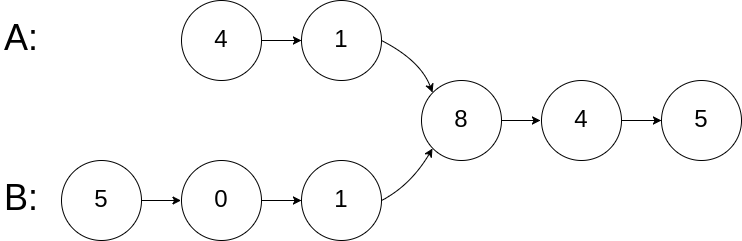
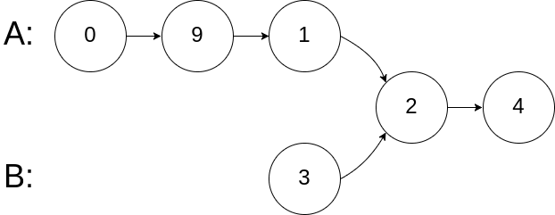
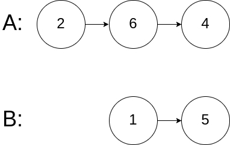

# [160. 相交链表](https://leetcode-cn.com/problems/intersection-of-two-linked-lists)

[English Version](/solution/0100-0199/0160.Intersection%20of%20Two%20Linked%20Lists/README_EN.md)

## 题目描述

<!-- 这里写题目描述 -->
<p>编写一个程序，找到两个单链表相交的起始节点。</p>

<p>如下面的两个链表<strong>：</strong></p>


<p>在节点 c1 开始相交。</p>

<p>&nbsp;</p>

<p><strong>示例 1：</strong></p>



<pre><strong>输入：</strong>intersectVal = 8, listA = [4,1,8,4,5], listB = [5,0,1,8,4,5], skipA = 2, skipB = 3
<strong>输出：</strong>Reference of the node with value = 8
<strong>输入解释：</strong>相交节点的值为 8 （注意，如果两个列表相交则不能为 0）。从各自的表头开始算起，链表 A 为 [4,1,8,4,5]，链表 B 为 [5,0,1,8,4,5]。在 A 中，相交节点前有 2 个节点；在 B 中，相交节点前有 3 个节点。
</pre>

<p>&nbsp;</p>

<p><strong>示例&nbsp;2：</strong></p>



<pre><strong>输入：</strong>intersectVal&nbsp;= 2, listA = [0,9,1,2,4], listB = [3,2,4], skipA = 3, skipB = 1
<strong>输出：</strong>Reference of the node with value = 2
<strong>输入解释：</strong>相交节点的值为 2 （注意，如果两个列表相交则不能为 0）。从各自的表头开始算起，链表 A 为 [0,9,1,2,4]，链表 B 为 [3,2,4]。在 A 中，相交节点前有 3 个节点；在 B 中，相交节点前有 1 个节点。
</pre>

<p>&nbsp;</p>

<p><strong>示例&nbsp;3：</strong></p>



<pre><strong>输入：</strong>intersectVal = 0, listA = [2,6,4], listB = [1,5], skipA = 3, skipB = 2
<strong>输出：</strong>null
<strong>输入解释：</strong>从各自的表头开始算起，链表 A 为 [2,6,4]，链表 B 为 [1,5]。由于这两个链表不相交，所以 intersectVal 必须为 0，而 skipA 和 skipB 可以是任意值。
<strong>解释：</strong>这两个链表不相交，因此返回 null。
</pre>

<p>&nbsp;</p>

<p><strong>注意：</strong></p>

<ul>
	<li>如果两个链表没有交点，返回 <code>null</code>.</li>
	<li>在返回结果后，两个链表仍须保持原有的结构。</li>
	<li>可假定整个链表结构中没有循环。</li>
	<li>程序尽量满足 O(<em>n</em>) 时间复杂度，且仅用 O(<em>1</em>) 内存。</li>
</ul>

## 解法

<!-- 这里可写通用的实现逻辑 -->

<!-- tabs:start -->

### **Python3**

<!-- 这里可写当前语言的特殊实现逻辑 -->

```python

```

### **Java**

<!-- 这里可写当前语言的特殊实现逻辑 -->

```java

```

### **...**

```

```

<!-- tabs:end -->
