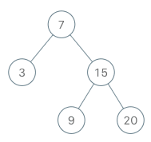

# [173. 二叉搜索树迭代器](https://leetcode-cn.com/problems/binary-search-tree-iterator)

[English Version](/solution/0100-0199/0173.Binary%20Search%20Tree%20Iterator/README_EN.md)

## 题目描述
<!-- 这里写题目描述 -->
<p>实现一个二叉搜索树迭代器。你将使用二叉搜索树的根节点初始化迭代器。</p>

<p>调用 <code>next()</code> 将返回二叉搜索树中的下一个最小的数。</p>

<p>&nbsp;</p>

<p><strong>示例：</strong></p>



<pre>BSTIterator iterator = new BSTIterator(root);
iterator.next();    // 返回 3
iterator.next();    // 返回 7
iterator.hasNext(); // 返回 true
iterator.next();    // 返回 9
iterator.hasNext(); // 返回 true
iterator.next();    // 返回 15
iterator.hasNext(); // 返回 true
iterator.next();    // 返回 20
iterator.hasNext(); // 返回 false</pre>

<p>&nbsp;</p>

<p><strong>提示：</strong></p>

<ul>
	<li><code>next()</code>&nbsp;和&nbsp;<code>hasNext()</code>&nbsp;操作的时间复杂度是&nbsp;O(1)，并使用&nbsp;O(<em>h</em>) 内存，其中&nbsp;<em>h&nbsp;</em>是树的高度。</li>
	<li>你可以假设&nbsp;<code>next()</code>&nbsp;调用总是有效的，也就是说，当调用 <code>next()</code>&nbsp;时，BST 中至少存在一个下一个最小的数。</li>
</ul>


## 解法
<!-- 这里可写通用的实现逻辑 -->


<!-- tabs:start -->

### **Python3**
<!-- 这里可写当前语言的特殊实现逻辑 -->

```python

```

### **Java**
<!-- 这里可写当前语言的特殊实现逻辑 -->

```java

```

### **...**
```

```

<!-- tabs:end -->