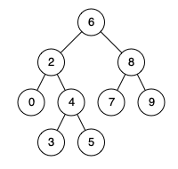

# [235. Lowest Common Ancestor of a Binary Search Tree](https://leetcode.com/problems/lowest-common-ancestor-of-a-binary-search-tree)

[中文文档](/solution/0200-0299/0235.Lowest%20Common%20Ancestor%20of%20a%20Binary%20Search%20Tree/README.md)

## Description

<p>Given a binary search tree (BST), find the lowest common ancestor (LCA) of two given nodes in the BST.</p>

<p>According to the <a href="https://en.wikipedia.org/wiki/Lowest_common_ancestor" target="_blank">definition of LCA on Wikipedia</a>: &ldquo;The lowest common ancestor is defined between two nodes p and q&nbsp;as the lowest node in T that has both p and q&nbsp;as descendants (where we allow <b>a node to be a descendant of itself</b>).&rdquo;</p>

<p>Given binary search tree:&nbsp; root =&nbsp;[6,2,8,0,4,7,9,null,null,3,5]</p>



<p><strong>Example 1:</strong></p>

<pre>

<strong>Input:</strong> root = [6,2,8,0,4,7,9,null,null,3,5], p = 2, q = 8

<strong>Output:</strong> 6

<strong>Explanation: </strong>The LCA of nodes <code>2</code> and <code>8</code> is <code>6</code>.

</pre>

<p><strong>Example 2:</strong></p>

<pre>

<strong>Input:</strong> root = [6,2,8,0,4,7,9,null,null,3,5], p = 2, q = 4

<strong>Output:</strong> 2

<strong>Explanation: </strong>The LCA of nodes <code>2</code> and <code>4</code> is <code>2</code>, since a node can be a descendant of itself according to the LCA definition.

</pre>

<p>&nbsp;</p>

<p><strong>Note:</strong></p>

<ul>
	<li>All of the nodes&#39; values will be unique.</li>
	<li>p and q are different and both values will&nbsp;exist in the BST.</li>
</ul>

## Solutions

<!-- tabs:start -->

### **Python3**

Iterative:

```python
# Definition for a binary tree node.
# class TreeNode:
#     def __init__(self, x):
#         self.val = x
#         self.left = None
#         self.right = None

class Solution:
    def lowestCommonAncestor(self, root: 'TreeNode', p: 'TreeNode', q: 'TreeNode') -> 'TreeNode':
        if p == q:
            return p
        while root:
            if root.val < p.val and root.val < q.val:
                root = root.right
            elif root.val > p.val and root.val > q.val:
                root = root.left
            else:
                return root
```

Recursive:

```python
# Definition for a binary tree node.
# class TreeNode:
#     def __init__(self, x):
#         self.val = x
#         self.left = None
#         self.right = None

class Solution:
    def lowestCommonAncestor(self, root: 'TreeNode', p: 'TreeNode', q: 'TreeNode') -> 'TreeNode':
        if root is None:
            return None
        if root.val < p.val and root.val < q.val:
            return self.lowestCommonAncestor(root.right, p, q)
        if root.val > p.val and root.val > q.val:
            return self.lowestCommonAncestor(root.left, p, q)
        return root
```

### **Java**

Iterative:

```java
/**
 * Definition for a binary tree node.
 * public class TreeNode {
 *     int val;
 *     TreeNode left;
 *     TreeNode right;
 *     TreeNode(int x) { val = x; }
 * }
 */

class Solution {
    public TreeNode lowestCommonAncestor(TreeNode root, TreeNode p, TreeNode q) {
        if (p == q) {
            return p;
        }
        while (root != null) {
            if (root.val < p.val && root.val < q.val) {
                root = root.right;
            } else if (root.val > p.val && root.val > q.val) {
                root = root.left;
            } else {
                return root;
            }
        }
        return null;
    }
}
```

Recursive:

```java
/**
 * Definition for a binary tree node.
 * public class TreeNode {
 *     int val;
 *     TreeNode left;
 *     TreeNode right;
 *     TreeNode(int x) { val = x; }
 * }
 */

class Solution {
    public TreeNode lowestCommonAncestor(TreeNode root, TreeNode p, TreeNode q) {
        if (root == null) return null;
        if (root.val < p.val && root.val < q.val) return lowestCommonAncestor(root.right, p, q);
        if (root.val > p.val && root.val > q.val) return lowestCommonAncestor(root.left, p, q);
        return root;
    }
}
```

### **...**

```

```

<!-- tabs:end -->
