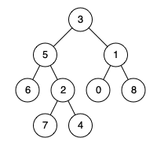

# [236. Lowest Common Ancestor of a Binary Tree](https://leetcode.com/problems/lowest-common-ancestor-of-a-binary-tree)

[中文文档](/solution/0200-0299/0236.Lowest%20Common%20Ancestor%20of%20a%20Binary%20Tree/README.md)

## Description
<p>Given a binary tree, find the lowest common ancestor (LCA) of two given nodes in the tree.</p>


<p>According to the <a href="https://en.wikipedia.org/wiki/Lowest_common_ancestor" target="_blank">definition of LCA on Wikipedia</a>: &ldquo;The lowest common ancestor is defined between two nodes p&nbsp;and q&nbsp;as the lowest node in T that has both p&nbsp;and q&nbsp;as descendants (where we allow <b>a node to be a descendant of itself</b>).&rdquo;</p>


<p>Given the following binary tree:&nbsp; root =&nbsp;[3,5,1,6,2,0,8,null,null,7,4]</p>



<p><strong>Example 1:</strong></p>


<pre>

<strong>Input:</strong> root = [3,5,1,6,2,0,8,null,null,7,4], p = 5, q = 1

<strong>Output:</strong> 3

<strong>Explanation: </strong>The LCA of nodes <code>5</code> and <code>1</code> is <code>3.</code>

</pre>


<p><strong>Example 2:</strong></p>


<pre>

<strong>Input:</strong> root = [3,5,1,6,2,0,8,null,null,7,4], p = 5, q = 4

<strong>Output:</strong> 5

<strong>Explanation: </strong>The LCA of nodes <code>5</code> and <code>4</code> is <code>5</code>, since a node can be a descendant of itself according to the LCA definition.

</pre>


<p>&nbsp;</p>


<p><strong>Note:</strong></p>


<ul>
	<li>All of the nodes&#39; values will be unique.</li>
	<li>p and q are different and both values will&nbsp;exist in the binary tree.</li>
</ul>


## Solutions


<!-- tabs:start -->

### **Python3**

```python
# Definition for a binary tree node.
# class TreeNode:
#     def __init__(self, x):
#         self.val = x
#         self.left = None
#         self.right = None

class Solution:
    def lowestCommonAncestor(self, root: 'TreeNode', p: 'TreeNode', q: 'TreeNode') -> 'TreeNode':
        if root is None or root == p or root == q:
            return root
        left = self.lowestCommonAncestor(root.left, p, q)
        right = self.lowestCommonAncestor(root.right, p, q)
        return right if left is None else (left if right is None else root)
```

### **Java**

```java
/**
 * Definition for a binary tree node.
 * public class TreeNode {
 *     int val;
 *     TreeNode left;
 *     TreeNode right;
 *     TreeNode(int x) { val = x; }
 * }
 */
class Solution {
    public TreeNode lowestCommonAncestor(TreeNode root, TreeNode p, TreeNode q) {
        if (root == null || root == p || root == q) {
            return root;
        }
        TreeNode left = lowestCommonAncestor(root.left, p, q);
        TreeNode right = lowestCommonAncestor(root.right, p, q);
        return left == null ? right : (right == null ? left : root); 
    }
}
```

### **...**
```

```

<!-- tabs:end -->