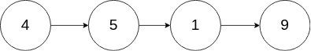

# [237. Delete Node in a Linked List](https://leetcode.com/problems/delete-node-in-a-linked-list)

[中文文档](/solution/0200-0299/0237.Delete%20Node%20in%20a%20Linked%20List/README.md)

## Description

<p>Write a function to delete a node (except the tail) in a singly linked list, given only access to that node.</p>

<p>Given linked list --&nbsp;head =&nbsp;[4,5,1,9], which looks like following:</p>



<p>&nbsp;</p>

<p><strong>Example 1:</strong></p>

<pre>

<strong>Input:</strong> head = [4,5,1,9], node = 5

<strong>Output:</strong> [4,1,9]

<strong>Explanation: </strong>You are given the second node with value 5, the linked list should become 4 -&gt; 1 -&gt; 9 after calling your function.

</pre>

<p><strong>Example 2:</strong></p>

<pre>

<strong>Input:</strong> head = [4,5,1,9], node = 1

<strong>Output:</strong> [4,5,9]

<strong>Explanation: </strong>You are given the third node with value 1, the linked list should become 4 -&gt; 5 -&gt; 9 after calling your function.

</pre>

<p>&nbsp;</p>

<p><strong>Note:</strong></p>

<ul>
	<li>The linked list will have at least two elements.</li>
	<li>All of the nodes&#39; values will be unique.</li>
	<li>The given node&nbsp;will not be the tail and it will always be a valid node of the linked list.</li>
	<li>Do not return anything from your function.</li>
</ul>

## Solutions

<!-- tabs:start -->

### **Python3**

```python
# Definition for singly-linked list.
# class ListNode:
#     def __init__(self, x):
#         self.val = x
#         self.next = None

class Solution:
    def deleteNode(self, node):
        """
        :type node: ListNode
        :rtype: void Do not return anything, modify node in-place instead.
        """
        node.val = node.next.val
        node.next = node.next.next
```

### **Java**

```java
/**
 * Definition for singly-linked list.
 * public class ListNode {
 *     int val;
 *     ListNode next;
 *     ListNode(int x) { val = x; }
 * }
 */
class Solution {
    public void deleteNode(ListNode node) {
        node.val = node.next.val;
        node.next = node.next.next;
    }
}
```

### **JavaScript**

```javascript
/**
 * Definition for singly-linked list.
 * function ListNode(val) {
 *     this.val = val;
 *     this.next = null;
 * }
 */
/**
 * @param {ListNode} node
 * @return {void} Do not return anything, modify node in-place instead.
 */
var deleteNode = function (node) {
  node.val = node.next.val;
  node.next = node.next.next;
};
```

### **Go**

```go
/**
 * Definition for singly-linked list.
 * type ListNode struct {
 *     Val int
 *     Next *ListNode
 * }
 */
func deleteNode(node *ListNode) {
    node.Val = node.Next.Val
    node.Next = node.Next.Next
}
```

<!-- tabs:end -->
