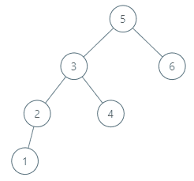

# [285. 二叉搜索树中的顺序后继](https://leetcode-cn.com/problems/inorder-successor-in-bst)

[English Version](/solution/0200-0299/0285.Inorder%20Successor%20in%20BST/README_EN.md)

## 题目描述

<!-- 这里写题目描述 -->
<p>给你一个二叉搜索树和其中的某一个结点，请你找出该结点在树中顺序后继的节点。</p>

<p>结点 <code>p</code> 的后继是值比 <code>p.val</code> 大的结点中键值最小的结点。</p>

<p> </p>

<p><strong>示例 1:</strong></p>


<pre><strong>输入: </strong>root = [2,1,3], p = 1
<strong>输出: </strong>2
<strong>解析: </strong>这里 1 的顺序后继是 2。请注意 p 和返回值都应是 TreeNode 类型。
</pre>

<p><strong>示例 2:</strong></p>



<pre><strong>输入: </strong>root = [5,3,6,2,4,null,null,1], p = 6
<strong>输出: </strong>null
<strong>解析: </strong>因为给出的结点没有顺序后继，所以答案就返回 <code>null 了。</code>
</pre>

<p> </p>

<p><strong>注意:</strong></p>

<ol>
	<li>假如给出的结点在该树中没有顺序后继的话，请返回 <code>null</code></li>
	<li>我们保证树中每个结点的值是唯一的</li>
</ol>

## 解法

<!-- 这里可写通用的实现逻辑 -->

<!-- tabs:start -->

### **Python3**

<!-- 这里可写当前语言的特殊实现逻辑 -->

```python

```

### **Java**

<!-- 这里可写当前语言的特殊实现逻辑 -->

```java

```

### **...**

```

```

<!-- tabs:end -->
