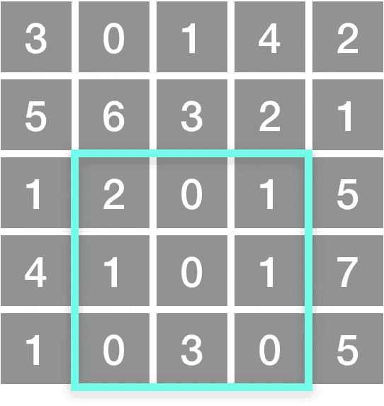

# [304. Range Sum Query 2D - Immutable](https://leetcode.com/problems/range-sum-query-2d-immutable)

[中文文档](/solution/0300-0399/0304.Range%20Sum%20Query%202D%20-%20Immutable/README.md)

## Description

<p>Given a 2D matrix <i>matrix</i>, find the sum of the elements inside the rectangle defined by its upper left corner (<i>row</i>1, <i>col</i>1) and lower right corner (<i>row</i>2, <i>col</i>2).</p>

<p>



<small>The above rectangle (with the red border) is defined by (row1, col1) = <b>(2, 1)</b> and (row2, col2) = <b>(4, 3)</b>, which contains sum = <b>8</b>.</small>

</p>

<p><b>Example:</b><br>

<pre>

Given matrix = [

  [3, 0, 1, 4, 2],

  [5, 6, 3, 2, 1],

  [1, 2, 0, 1, 5],

  [4, 1, 0, 1, 7],

  [1, 0, 3, 0, 5]

]


sumRegion(2, 1, 4, 3) -> 8

sumRegion(1, 1, 2, 2) -> 11

sumRegion(1, 2, 2, 4) -> 12

</pre>

</p>

<p><b>Note:</b><br>

<ol>

<li>You may assume that the matrix does not change.</li>

<li>There are many calls to <i>sumRegion</i> function.</li>

<li>You may assume that <i>row</i>1 &le; <i>row</i>2 and <i>col</i>1 &le; <i>col</i>2.</li>

</ol>

</p>

## Solutions

<!-- tabs:start -->

### **Python3**

```python
class NumMatrix:

    def __init__(self, matrix: List[List[int]]):
        m = len(matrix)
        if m > 0:
            n = len(matrix[0])
            self.sums = [[0] * (n + 1) for _ in range(m + 1)]
            for i in range(m):
                for j in range(n):
                    self.sums[i + 1][j + 1] = self.sums[i][j + 1] + \
                        self.sums[i + 1][j] - self.sums[i][j] + matrix[i][j]

    def sumRegion(self, row1: int, col1: int, row2: int, col2: int) -> int:
        return self.sums[row2 + 1][col2 + 1] - self.sums[row2 + 1][col1] - self.sums[row1][col2 + 1] + self.sums[row1][col1]


# Your NumMatrix object will be instantiated and called as such:
# obj = NumMatrix(matrix)
# param_1 = obj.sumRegion(row1,col1,row2,col2)
```

### **Java**

```java
class NumMatrix {
    private int[][] sums;

    public NumMatrix(int[][] matrix) {
        int m = matrix.length;
        if (m > 0) {
            int n = matrix[0].length;
            sums = new int[m + 1][n + 1];
            for (int i = 0; i < m; ++i) {
                for (int j = 0; j < n; ++j) {
                    sums[i + 1][j + 1] = sums[i][j + 1] + sums[i + 1][j] - sums[i][j] + matrix[i][j];
                }
            }
        }
    }

    public int sumRegion(int row1, int col1, int row2, int col2) {
        return sums[row2 + 1][col2 + 1] - sums[row2 + 1][col1] - sums[row1][col2 + 1] + sums[row1][col1];
    }
}

/**
 * Your NumMatrix object will be instantiated and called as such:
 * NumMatrix obj = new NumMatrix(matrix);
 * int param_1 = obj.sumRegion(row1,col1,row2,col2);
 */
```

### **...**

```

```

<!-- tabs:end -->
