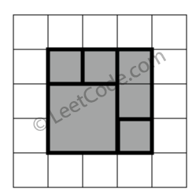
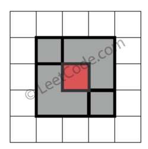

# [391. Perfect Rectangle](https://leetcode.com/problems/perfect-rectangle)

[中文文档](/solution/0300-0399/0391.Perfect%20Rectangle/README.md)

## Description

<p>Given N axis-aligned rectangles where N &gt; 0, determine if they all together form an exact cover of a rectangular region.</p>

<p>Each rectangle is represented as a bottom-left point and a top-right point. For example, a unit square is represented as [1,1,2,2]. (coordinate of bottom-left point is (1, 1) and top-right point is (2, 2)).</p>



<p><b>Example 1:</b></p>

<pre>

rectangles = [

  [1,1,3,3],

  [3,1,4,2],

  [3,2,4,4],

  [1,3,2,4],

  [2,3,3,4]

]


Return true. All 5 rectangles together form an exact cover of a rectangular region.

</pre>

<p>&nbsp;</p>

<div style="clear:both">&nbsp;</div>


<p><b>Example 2:</b></p>

<pre>

rectangles = [

  [1,1,2,3],

  [1,3,2,4],

  [3,1,4,2],

  [3,2,4,4]

]


Return false. Because there is a gap between the two rectangular regions.

</pre>

<p>&nbsp;</p>

<div style="clear:both">&nbsp;</div>


<p><b>Example 3:</b></p>

<pre>

rectangles = [

  [1,1,3,3],

  [3,1,4,2],

  [1,3,2,4],

  [3,2,4,4]

]


Return false. Because there is a gap in the top center.

</pre>

<p>&nbsp;</p>

<div style="clear:both">&nbsp;</div>



<p><b>Example 4:</b></p>

<pre>

rectangles = [

  [1,1,3,3],

  [3,1,4,2],

  [1,3,2,4],

  [2,2,4,4]

]


Return false. Because two of the rectangles overlap with each other.

</pre>

<p>&nbsp;</p>

## Solutions

<!-- tabs:start -->

### **Python3**

```python

```

### **Java**

```java

```

### **...**

```

```

<!-- tabs:end -->
