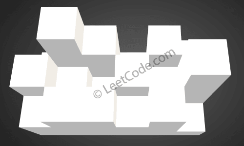
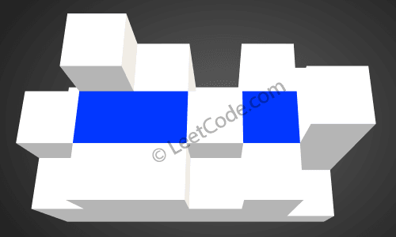

# [407. 接雨水 II](https://leetcode-cn.com/problems/trapping-rain-water-ii)

[English Version](/solution/0400-0499/0407.Trapping%20Rain%20Water%20II/README_EN.md)

## 题目描述

<!-- 这里写题目描述 -->
<p>给你一个 <code>m x n</code>&nbsp;的矩阵，其中的值均为正整数，代表二维高度图每个单元的高度，请计算图中形状最多能接多少体积的雨水。</p>

<p>&nbsp;</p>

<p><strong>示例：</strong></p>

<pre>给出如下 3x6 的高度图:
[
  [1,4,3,1,3,2],
  [3,2,1,3,2,4],
  [2,3,3,2,3,1]
]

返回 4 。
</pre>



<p>如上图所示，这是下雨前的高度图<code>[[1,4,3,1,3,2],[3,2,1,3,2,4],[2,3,3,2,3,1]]</code> 的状态。</p>

<p>&nbsp;</p>



<p>下雨后，雨水将会被存储在这些方块中。总的接雨水量是4。</p>

<p>&nbsp;</p>

<p><strong>提示：</strong></p>

<ul>
	<li><code>1 &lt;= m, n &lt;= 110</code></li>
	<li><code>0 &lt;= heightMap[i][j] &lt;= 20000</code></li>
</ul>

## 解法

<!-- 这里可写通用的实现逻辑 -->

<!-- tabs:start -->

### **Python3**

<!-- 这里可写当前语言的特殊实现逻辑 -->

```python

```

### **Java**

<!-- 这里可写当前语言的特殊实现逻辑 -->

```java

```

### **...**

```

```

<!-- tabs:end -->
