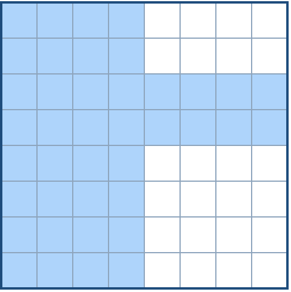
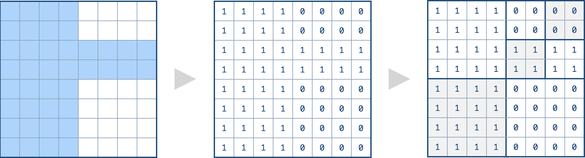
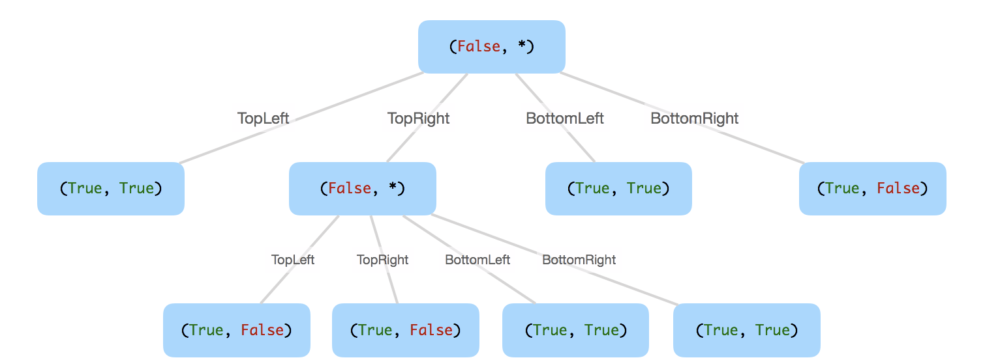

# [427. 建立四叉树](https://leetcode-cn.com/problems/construct-quad-tree)

[English Version](/solution/0400-0499/0427.Construct%20Quad%20Tree/README_EN.md)

## 题目描述
<!-- 这里写题目描述 -->
<p>我们想要使用一棵四叉树来储存一个&nbsp;<code>N x N</code> 的布尔值网络。网络中每一格的值只会是真或假。树的根结点代表整个网络。对于每个结点, 它将被分等成四个孩子结点<strong>直到这个区域内的值都是相同的.</strong></p>

<p>每个结点还有另外两个布尔变量:&nbsp;<code>isLeaf</code> 和&nbsp;<code>val</code>。<code>isLeaf</code> 当这个节点是一个叶子结点时为真。<code>val</code>&nbsp;变量储存叶子结点所代表的区域的值。</p>

<p>你的任务是使用一个四叉树表示给定的网络。下面的例子将有助于你理解这个问题：</p>

<p>给定下面这个<code>8 x 8</code>&nbsp;网络，我们将这样建立一个对应的四叉树：</p>



<p>由上文的定义，它能被这样分割：</p>



<p>&nbsp;</p>

<p>对应的四叉树应该像下面这样，每个结点由一对&nbsp;<code>(isLeaf, val)</code>&nbsp;所代表.</p>

<p>对于非叶子结点，<code>val</code>&nbsp;可以是任意的，所以使用&nbsp;<code>*</code>&nbsp;代替。</p>



<p><strong>提示：</strong></p>

<ol>
	<li><code>N</code>&nbsp;将小于&nbsp;<code>1000</code>&nbsp;且确保是 2 的整次幂。</li>
	<li>如果你想了解更多关于四叉树的知识，你可以参考这个&nbsp;<a href="https://en.wikipedia.org/wiki/Quadtree">wiki</a>&nbsp;页面。</li>
</ol>


## 解法
<!-- 这里可写通用的实现逻辑 -->


<!-- tabs:start -->

### **Python3**
<!-- 这里可写当前语言的特殊实现逻辑 -->

```python

```

### **Java**
<!-- 这里可写当前语言的特殊实现逻辑 -->

```java

```

### **...**
```

```

<!-- tabs:end -->