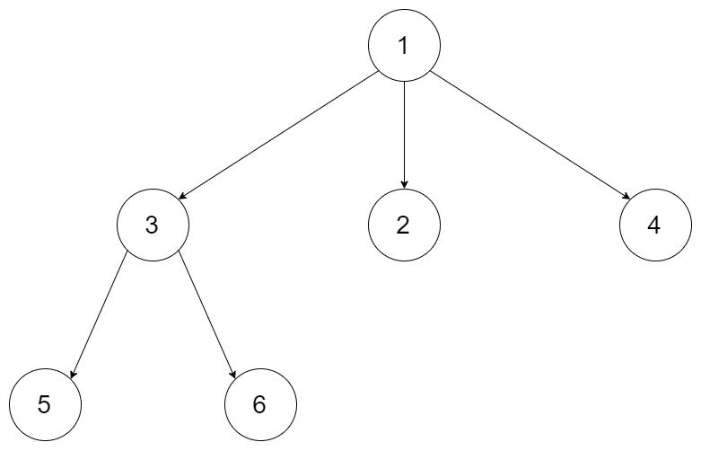
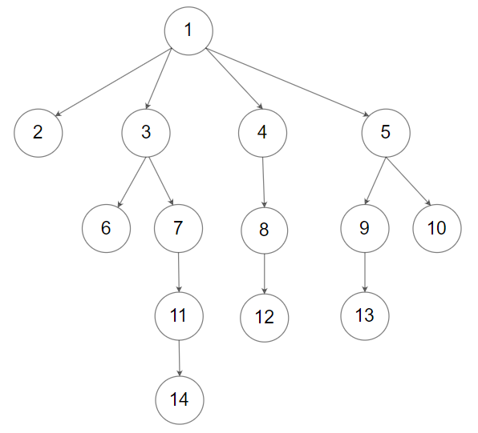

# [429. N-ary Tree Level Order Traversal](https://leetcode.com/problems/n-ary-tree-level-order-traversal)

[中文文档](/solution/0400-0499/0429.N-ary%20Tree%20Level%20Order%20Traversal/README.md)

## Description

<p>Given an n-ary tree, return the <i>level order</i> traversal of its nodes&#39; values.</p>

<p><em>Nary-Tree input serialization&nbsp;is represented in their level order traversal, each group of children is separated by the null value (See examples).</em></p>

<p>&nbsp;</p>
<p><strong>Example 1:</strong></p>



<pre>
<strong>Input:</strong> root = [1,null,3,2,4,null,5,6]
<strong>Output:</strong> [[1],[3,2,4],[5,6]]
</pre>

<p><strong>Example 2:</strong></p>



<pre>
<strong>Input:</strong> root = [1,null,2,3,4,5,null,null,6,7,null,8,null,9,10,null,null,11,null,12,null,13,null,null,14]
<strong>Output:</strong> [[1],[2,3,4,5],[6,7,8,9,10],[11,12,13],[14]]
</pre>

<p>&nbsp;</p>
<p><strong>Constraints:</strong></p>

<ul>
	<li>The height of the n-ary tree is less than or equal to <code>1000</code></li>
	<li>The total number of nodes is between <code>[0,&nbsp;10^4]</code></li>
</ul>

## Solutions

<!-- tabs:start -->

### **Python3**

```python

```

### **Java**

```java

```

### **...**

```

```

<!-- tabs:end -->
