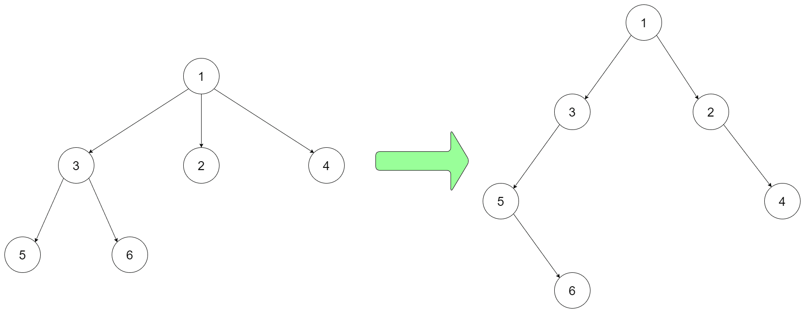

# [431. Encode N-ary Tree to Binary Tree](https://leetcode.com/problems/encode-n-ary-tree-to-binary-tree)

[中文文档](/solution/0400-0499/0431.Encode%20N-ary%20Tree%20to%20Binary%20Tree/README.md)

## Description

<p>Design an algorithm to encode an N-ary tree into a binary tree and decode the binary tree to get the original N-ary tree. An N-ary tree is a rooted tree in which each node has no more than N children. Similarly, a binary tree is a rooted tree in which each node has no more than 2 children. There is no restriction on how your encode/decode algorithm should work. You just need to ensure that an N-ary tree can be encoded to a binary tree and this binary tree can be decoded to the original N-nary tree structure.</p>

<p><em>Nary-Tree input serialization is represented in their level order traversal, each group of children is separated by the null value (See following example).</em></p>

<p>For example, you may encode the following <code>3-ary</code> tree to a binary tree in this way:</p>



<pre>
<strong>Input:</strong> root = [1,null,3,2,4,null,5,6]
</pre>

<p>Note that the above is just an example which <em>might or might not</em> work. You do not necessarily need to follow this format, so please be creative and come up with different approaches yourself.</p>

<ol>
</ol>

<p> </p>
<p><strong>Constraints:</strong></p>

<ul>
	<li>The height of the n-ary tree is less than or equal to <code>1000</code></li>
	<li>The total number of nodes is between <code>[0, 10^4]</code></li>
	<li>Do not use class member/global/static variables to store states. Your encode and decode algorithms should be stateless.</li>
</ul>

## Solutions

<!-- tabs:start -->

### **Python3**

```python

```

### **Java**

```java

```

### **...**

```

```

<!-- tabs:end -->
