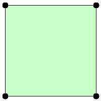
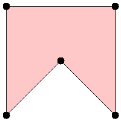

# [469. 凸多边形](https://leetcode-cn.com/problems/convex-polygon)

[English Version](/solution/0400-0499/0469.Convex%20Polygon/README_EN.md)

## 题目描述

<!-- 这里写题目描述 -->
<p>给定一个按顺序连接的多边形的顶点，判断该多边形是否为凸多边形。<a href="https://baike.baidu.com/item/凸多边形/">（凸多边形的定义）</a></p>

<p><strong>注：</strong></p>

<ol>
	<li>顶点个数至少为 3 个且不超过 10,000。</li>
	<li>坐标范围为 -10,000 到 10,000。</li>
	<li>你可以假定给定的点形成的多边形均为简单多边形<a href="https://baike.baidu.com/item/%E7%AE%80%E5%8D%95%E5%A4%9A%E8%BE%B9%E5%BD%A2">（简单多边形的定义）</a>。换句话说，保证每个顶点处恰好是两条边的汇合点，并且这些边 <strong>互不相交 </strong>。</li>
</ol>

<p> </p>

<p><strong>示例 1：</strong></p>

<pre>[[0,0],[0,1],[1,1],[1,0]]

输出： True

解释：</pre>



<p><strong>示例 2：</strong></p>

<pre>[[0,0],[0,10],[10,10],[10,0],[5,5]]

输出： False

解释：</pre>



## 解法

<!-- 这里可写通用的实现逻辑 -->

<!-- tabs:start -->

### **Python3**

<!-- 这里可写当前语言的特殊实现逻辑 -->

```python

```

### **Java**

<!-- 这里可写当前语言的特殊实现逻辑 -->

```java

```

### **...**

```

```

<!-- tabs:end -->
