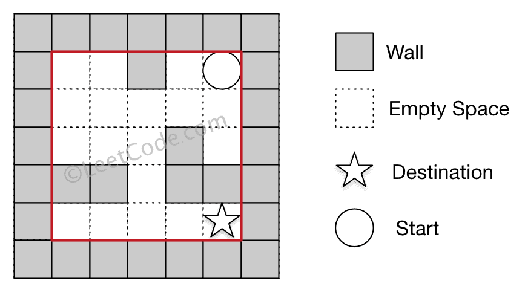
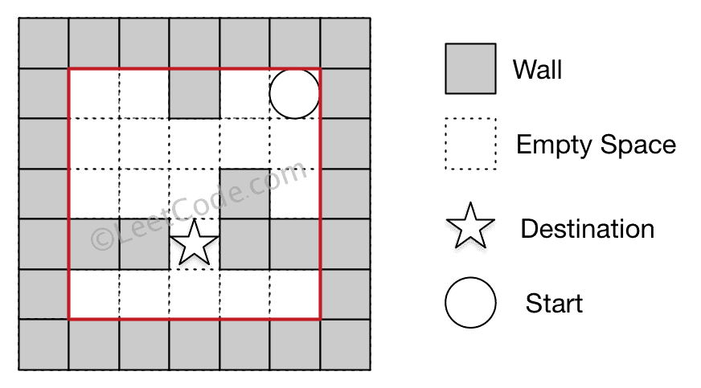

# [490. The Maze](https://leetcode.com/problems/the-maze)

[中文文档](/solution/0400-0499/0490.The%20Maze/README.md)

## Description

<p>There is a <b>ball</b> in a maze with empty spaces and walls. The ball can go through empty spaces by rolling <b>up</b>, <b>down</b>, <b>left</b> or <b>right</b>, but it won't stop rolling until hitting a wall. When the ball stops, it could choose the next direction.</p>

<p>Given the ball's <b>start position</b>, the <b>destination</b> and the <b>maze</b>, determine whether the ball could stop at the destination.</p>

<p>The maze is represented by a binary 2D array. 1 means the wall and 0 means the empty space. You may assume that the borders of the maze are all walls. The start and destination coordinates are represented by row and column indexes.</p>

<p> </p>

<p><b>Example 1:</b></p>

<pre>
<b>Input 1:</b> a maze represented by a 2D array

0 0 1 0 0
0 0 0 0 0
0 0 0 1 0
1 1 0 1 1
0 0 0 0 0

<b>Input 2:</b> start coordinate (rowStart, colStart) = (0, 4)
<b>Input 3:</b> destination coordinate (rowDest, colDest) = (4, 4)

<b>Output:</b> true

<b>Explanation:</b> One possible way is : left -> down -> left -> down -> right -> down -> right.
</pre>



<p><b>Example 2:</b></p>

<pre>
<b>Input 1:</b> a maze represented by a 2D array

0 0 1 0 0
0 0 0 0 0
0 0 0 1 0
1 1 0 1 1
0 0 0 0 0

<b>Input 2:</b> start coordinate (rowStart, colStart) = (0, 4)
<b>Input 3:</b> destination coordinate (rowDest, colDest) = (3, 2)

<b>Output:</b> false

<b>Explanation:</b> There is no way for the ball to stop at the destination.
</pre>



<p> </p>

<p><b>Note:</b></p>

<ol>
	<li>There is only one ball and one destination in the maze.</li>
	<li>Both the ball and the destination exist on an empty space, and they will not be at the same position initially.</li>
	<li>The given maze does not contain border (like the red rectangle in the example pictures), but you could assume the border of the maze are all walls.</li>
	<li>The maze contains at least 2 empty spaces, and both the width and height of the maze won't exceed 100.</li>
</ol>

## Solutions

<!-- tabs:start -->

### **Python3**

DFS.

```python
class Solution:
    def hasPath(self, maze: List[List[int]], start: List[int], destination: List[int]) -> bool:
        def dfs(maze, start, destination):
            if visited[start[0]][start[1]]:
                return False
            if start[0] == destination[0] and start[1] == destination[1]:
                return True
            visited[start[0]][start[1]] = True
            l, r, u, d = start[1] - 1, start[1] + 1, start[0] - 1, start[0] + 1
            while l >= 0 and maze[start[0]][l] == 0:
                l -= 1
            if dfs(maze, [start[0], l + 1], destination):
                return True
            while r < len(maze[0]) and maze[start[0]][r] == 0:
                r += 1
            if dfs(maze, [start[0], r - 1], destination):
                return True
            while u >= 0 and maze[u][start[1]] == 0:
                u -= 1
            if dfs(maze, [u + 1, start[1]], destination):
                return True
            while d < len(maze) and maze[d][start[1]] == 0:
                d += 1
            if dfs(maze, [d - 1, start[1]], destination):
                return True
            return False

        visited = [[False for _ in maze[0]] for _ in maze]
        return dfs(maze, start, destination)
```

### **Java**

```java
class Solution {
    private boolean[][] visited;

    public boolean hasPath(int[][] maze, int[] start, int[] destination) {
        int m = maze.length, n = maze[0].length;
        visited = new boolean[m][n];
        return dfs(maze, start, destination);
    }

    private boolean dfs(int[][] maze, int[] start, int[] destination) {
        if (visited[start[0]][start[1]]) return false;
        if (start[0] == destination[0] && start[1] == destination[1]) return true;
        visited[start[0]][start[1]] = true;

        int l = start[1] - 1, r = start[1] + 1, u = start[0] - 1, d = start[0] + 1;

        while (l >= 0 && maze[start[0]][l] == 0) --l;
        if (dfs(maze, new int[]{start[0], l + 1}, destination)) return true;

        while (r < maze[0].length && maze[start[0]][r] == 0) ++r;
        if (dfs(maze, new int[]{start[0], r - 1}, destination)) return true;

        while (u >= 0 && maze[u][start[1]] == 0) --u;
        if (dfs(maze, new int[]{u + 1, start[1]}, destination)) return true;

        while (d < maze.length && maze[d][start[1]] == 0) ++d;
        if (dfs(maze, new int[]{d - 1, start[1]}, destination)) return true;

        return false;
    }
}
```

### **...**

```

```

<!-- tabs:end -->
