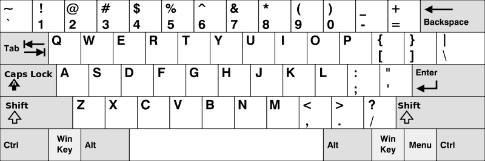

# [500. 键盘行](https://leetcode-cn.com/problems/keyboard-row)

[English Version](/solution/0500-0599/0500.Keyboard%20Row/README_EN.md)

## 题目描述
<!-- 这里写题目描述 -->
<p>给定一个单词列表，只返回可以使用在键盘同一行的字母打印出来的单词。键盘如下图所示。</p>


<p>&nbsp;</p>




<p>&nbsp;</p>


<p><strong>示例：</strong></p>


<pre><strong>输入:</strong> [&quot;Hello&quot;, &quot;Alaska&quot;, &quot;Dad&quot;, &quot;Peace&quot;]

<strong>输出:</strong> [&quot;Alaska&quot;, &quot;Dad&quot;]

</pre>


<p>&nbsp;</p>


<p><strong>注意：</strong></p>


<ol>
	<li>你可以重复使用键盘上同一字符。</li>
	<li>你可以假设输入的字符串将只包含字母。</li>
</ol>


## 解法
<!-- 这里可写通用的实现逻辑 -->


<!-- tabs:start -->

### **Python3**
<!-- 这里可写当前语言的特殊实现逻辑 -->

```python

```

### **Java**
<!-- 这里可写当前语言的特殊实现逻辑 -->

```java

```

### **...**
```

```

<!-- tabs:end -->