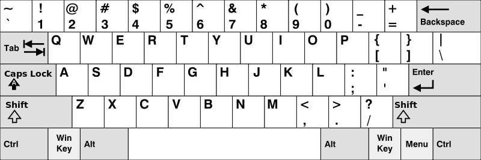

# [500. Keyboard Row](https://leetcode.com/problems/keyboard-row)

[中文文档](/solution/0500-0599/0500.Keyboard%20Row/README.md)

## Description

<p>Given a List of words, return the words that can be typed using letters of <b>alphabet</b> on only one row&#39;s of American keyboard like the image below.</p>

<p>&nbsp;</p>



&nbsp;

<p><b>Example:</b></p>

<pre>

<b>Input:</b> [&quot;Hello&quot;, &quot;Alaska&quot;, &quot;Dad&quot;, &quot;Peace&quot;]

<b>Output:</b> [&quot;Alaska&quot;, &quot;Dad&quot;]

</pre>

<p>&nbsp;</p>

<p><b>Note:</b></p>

<ol>
	<li>You may use one character in the keyboard more than once.</li>
	<li>You may assume the input string will only contain letters of alphabet.</li>
</ol>

## Solutions

<!-- tabs:start -->

### **Python3**

```python

```

### **Java**

```java

```

### **...**

```

```

<!-- tabs:end -->
