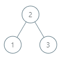
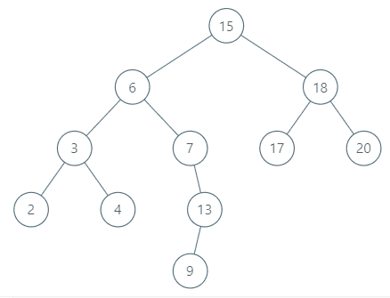

# [510. Inorder Successor in BST II](https://leetcode.com/problems/inorder-successor-in-bst-ii)

[中文文档](/solution/0500-0599/0510.Inorder%20Successor%20in%20BST%20II/README.md)

## Description

<p>Given a <code>node</code> in a binary search tree, find the in-order successor of that node in the BST.</p>

<p>If that node has no in-order successor, return <code>null</code>.</p>

<p>The successor of a <code>node</code> is the node with the smallest key greater than <code>node.val</code>.</p>

<p>You will have direct access to the node but not to the root of the tree. Each node will have a reference to its parent node. Below is the definition for <code>Node</code>:</p>

<pre>
class Node {
    public int val;
    public Node left;
    public Node right;
    public Node parent;
}
</pre>

<p> </p>

<p><strong>Follow up:</strong></p>

<p>Could you solve it without looking up any of the node's values?</p>

<p> </p>
<p><strong>Example 1:</strong></p>
<pre>



<strong>Input:</strong> tree = [2,1,3], node = 1
<strong>Output:</strong> 2
<strong>Explanation: </strong>1's in-order successor node is 2. Note that both the node and the return value is of Node type.

</pre>

<p><strong>Example 2:</strong></p>
<pre>


<strong>Input:</strong> tree = [5,3,6,2,4,null,null,1], node = 6
<strong>Output:</strong> null
<strong>Explanation: </strong>There is no in-order successor of the current node, so the answer is null.

</pre>

<p><strong>Example 3:</strong></p>
<pre>



<strong>Input:</strong> tree = [15,6,18,3,7,17,20,2,4,null,13,null,null,null,null,null,null,null,null,9], node = 15
<strong>Output:</strong> 17

</pre>

<p><strong>Example 4:</strong></p>
<pre>


<strong>Input:</strong> tree = [15,6,18,3,7,17,20,2,4,null,13,null,null,null,null,null,null,null,null,9], node = 13
<strong>Output:</strong> 15

</pre>

<p><strong>Example 5:</strong></p>

<pre>
<strong>Input:</strong> tree = [0], node = 0
<strong>Output:</strong> null
</pre>

<p> </p>
<p><strong>Constraints:</strong></p>

<ul>
	<li><code>-10^5 <= Node.val <= 10^5</code></li>
	<li><code>1 <= Number of Nodes <= 10^4</code></li>
	<li>All Nodes will have unique values.</li>
</ul>

## Solutions

<!-- tabs:start -->

### **Python3**

```python

```

### **Java**

```java

```

### **...**

```

```

<!-- tabs:end -->
