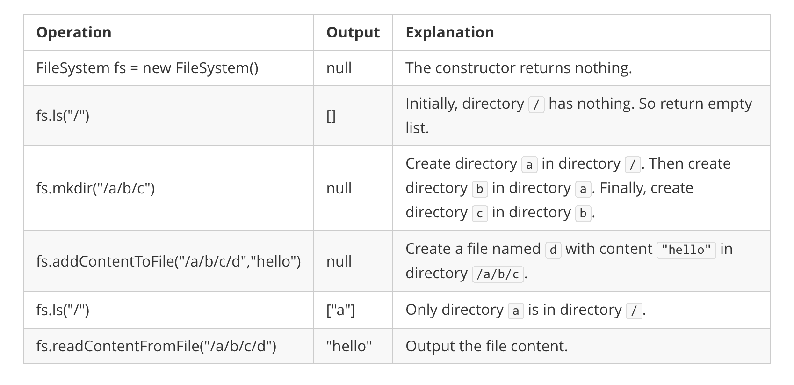

# [588. Design In-Memory File System](https://leetcode.com/problems/design-in-memory-file-system)

[中文文档](/solution/0500-0599/0588.Design%20In-Memory%20File%20System/README.md)

## Description

<p>Design an in-memory file system to simulate the following functions:</p>

<p><code>ls</code>: Given a path in string format. If it is a file path, return a list that only contains this file's name. If it is a directory path, return the list of file and directory names <b>in this directory</b>. Your output (file and directory names together) should in <b>lexicographic order</b>.</p>

<p><code>mkdir</code>: Given a <b>directory path</b> that does not exist, you should make a new directory according to the path. If the middle directories in the path don't exist either, you should create them as well. This function has void return type.</p>

<p><code>addContentToFile</code>: Given a <b>file path</b> and <b>file content</b> in string format. If the file doesn't exist, you need to create that file containing given content. If the file already exists, you need to <b>append</b> given content to original content. This function has void return type.</p>

<p><code>readContentFromFile</code>: Given a <b>file path</b>, return its <b>content</b> in string format.</p>

<p> </p>

<p><b>Example:</b></p>

<pre>
<b>Input:</b> 
["FileSystem","ls","mkdir","addContentToFile","ls","readContentFromFile"]
[[],["/"],["/a/b/c"],["/a/b/c/d","hello"],["/"],["/a/b/c/d"]]

<b>Output:</b>
[null,[],null,null,["a"],"hello"]

<b>Explanation:</b>
</pre>



<p> </p>

<p><strong>Note:</strong></p>

<ol>
	<li>You can assume all file or directory paths are absolute paths which begin with <code>/</code> and do not end with <code>/</code> except that the path is just <code>"/"</code>.</li>
	<li>You can assume that all operations will be passed valid parameters and users will not attempt to retrieve file content or list a directory or file that does not exist.</li>
	<li>You can assume that all directory names and file names only contain lower-case letters, and same names won't exist in the same directory.</li>
</ol>

## Solutions

<!-- tabs:start -->

### **Python3**

```python

```

### **Java**

```java

```

### **...**

```

```

<!-- tabs:end -->
