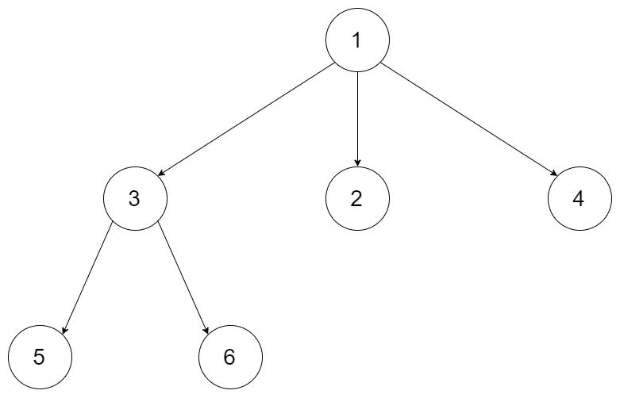

# [590. N 叉树的后序遍历](https://leetcode-cn.com/problems/n-ary-tree-postorder-traversal)

[English Version](/solution/0500-0599/0590.N-ary%20Tree%20Postorder%20Traversal/README_EN.md)

## 题目描述

<!-- 这里写题目描述 -->
<p>给定一个 N 叉树，返回其节点值的<em>后序遍历</em>。</p>

<p>例如，给定一个&nbsp;<code>3叉树</code>&nbsp;:</p>

<p>&nbsp;</p>



<p>&nbsp;</p>

<p>返回其后序遍历: <code>[5,6,3,2,4,1]</code>.</p>

<p>&nbsp;</p>

<p><strong>说明:</strong>&nbsp;递归法很简单，你可以使用迭代法完成此题吗?</p>

## 解法

<!-- 这里可写通用的实现逻辑 -->

<!-- tabs:start -->

### **Python3**

<!-- 这里可写当前语言的特殊实现逻辑 -->

```python

```

### **Java**

<!-- 这里可写当前语言的特殊实现逻辑 -->

```java

```

### **...**

```

```

<!-- tabs:end -->
