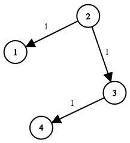

# [743. Network Delay Time](https://leetcode.com/problems/network-delay-time)

[中文文档](/solution/0700-0799/0743.Network%20Delay%20Time/README.md)

## Description
<p>There are <code>N</code> network nodes, labelled <code>1</code> to <code>N</code>.</p>


<p>Given <code>times</code>, a list of travel times as <b>directed</b> edges <code>times[i] = (u, v, w)</code>, where <code>u</code> is the source node, <code>v</code> is the target node, and <code>w</code> is the time it takes for a signal to travel from source to target.</p>


<p>Now, we send a signal from a certain node <code>K</code>. How long will it take for all nodes to receive the signal? If it is impossible, return <code>-1</code>.</p>


<p>&nbsp;</p>


<p><strong>Example 1:</strong></p>




<pre>

<strong>Input: </strong>times = <span id="example-input-1-1">[[2,1,1],[2,3,1],[3,4,1]]</span>, N = <span id="example-input-1-2">4</span>, K = <span id="example-input-1-3">2</span>

<strong>Output: </strong><span id="example-output-1">2</span>

</pre>


<p>&nbsp;</p>


<p><b>Note:</b></p>


<ol>
	<li><code>N</code> will be in the range <code>[1, 100]</code>.</li>
	<li><code>K</code> will be in the range <code>[1, N]</code>.</li>
	<li>The length of <code>times</code> will be in the range <code>[1, 6000]</code>.</li>
	<li>All edges <code>times[i] = (u, v, w)</code> will have <code>1 &lt;= u, v &lt;= N</code> and <code>0 &lt;= w &lt;= 100</code>.</li>
</ol>


## Solutions


<!-- tabs:start -->

### **Python3**

```python

```

### **Java**

```java

```

### **...**
```

```

<!-- tabs:end -->