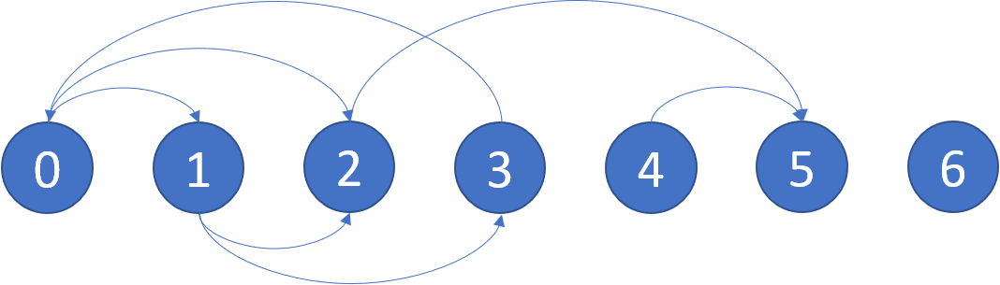

# [802. 找到最终的安全状态](https://leetcode-cn.com/problems/find-eventual-safe-states)

[English Version](/solution/0800-0899/0802.Find%20Eventual%20Safe%20States/README_EN.md)

## 题目描述

<!-- 这里写题目描述 -->
<p>在有向图中, 我们从某个节点和每个转向处开始, 沿着图的有向边走。 如果我们到达的节点是终点 (即它没有连出的有向边), 我们停止。</p>

<p>现在, 如果我们最后能走到终点，那么我们的起始节点是<em>最终安全</em>的。 更具体地说, 存在一个自然数 <code>K</code>,&nbsp; 无论选择从哪里开始行走, 我们走了不到 <code>K</code> 步后必能停止在一个终点。</p>

<p>哪些节点最终是安全的？ 结果返回一个有序的数组。</p>

<p>该有向图有 <code>N</code> 个节点，标签为 <code>0, 1, ..., N-1</code>, 其中 <code>N</code> 是&nbsp;<code>graph</code>&nbsp;的节点数.&nbsp; 图以以下的形式给出: <code>graph[i]</code> 是节点 <code>j</code> 的一个列表，满足 <code>(i, j)</code> 是图的一条有向边。</p>

<pre>
<strong>示例：</strong>
<strong>输入：</strong>graph = [[1,2],[2,3],[5],[0],[5],[],[]]
<strong>输出：</strong>[2,4,5,6]
这里是上图的示意图。

</pre>



<p><strong>提示：</strong></p>

<ul>
	<li><code>graph</code> 节点数不超过 <code>10000</code>.</li>
	<li>图的边数不会超过 <code>32000</code>.</li>
	<li>每个 <code>graph[i]</code> 被排序为不同的整数列表， 在区间 <code>[0, graph.length - 1]</code>&nbsp;中选取。</li>
</ul>

## 解法

<!-- 这里可写通用的实现逻辑 -->

<!-- tabs:start -->

### **Python3**

<!-- 这里可写当前语言的特殊实现逻辑 -->

```python

```

### **Java**

<!-- 这里可写当前语言的特殊实现逻辑 -->

```java

```

### **...**

```

```

<!-- tabs:end -->
