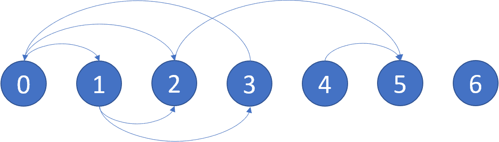

# [802. Find Eventual Safe States](https://leetcode.com/problems/find-eventual-safe-states)

[中文文档](/solution/0800-0899/0802.Find%20Eventual%20Safe%20States/README.md)

## Description
<p>In a directed graph, we start at some node and every turn, walk along a directed edge of the graph.&nbsp; If we reach a node that is terminal (that is, it has no outgoing directed edges), we stop.</p>


<p>Now, say our starting node is <em>eventually safe&nbsp;</em>if and only if we must eventually walk to a terminal node.&nbsp; More specifically, there exists a natural number <code>K</code> so that for any choice of where to walk, we must have stopped at a terminal node in less than <code>K</code> steps.</p>


<p>Which nodes are eventually safe?&nbsp; Return them as an array in sorted order.</p>


<p>The directed graph has <code>N</code> nodes with labels <code>0, 1, ..., N-1</code>, where <code>N</code> is the length of <code>graph</code>.&nbsp; The&nbsp;graph is given in the following form: <code>graph[i]</code> is a list of labels <code>j</code> such that <code>(i, j)</code> is a directed edge of the graph.</p>


<pre>

<strong>Example:</strong>

<strong>Input:</strong> graph = [[1,2],[2,3],[5],[0],[5],[],[]]

<strong>Output:</strong> [2,4,5,6]

Here is a diagram of the above graph.


</pre>





<p><strong>Note:</strong></p>


<ul>
	<li><code>graph</code> will have length at most <code>10000</code>.</li>
	<li>The number of edges in the graph will not exceed <code>32000</code>.</li>
	<li>Each <code>graph[i]</code> will be a sorted list of different integers, chosen within the range <code>[0, graph.length - 1]</code>.</li>
</ul>


## Solutions


<!-- tabs:start -->

### **Python3**

```python

```

### **Java**

```java

```

### **...**
```

```

<!-- tabs:end -->