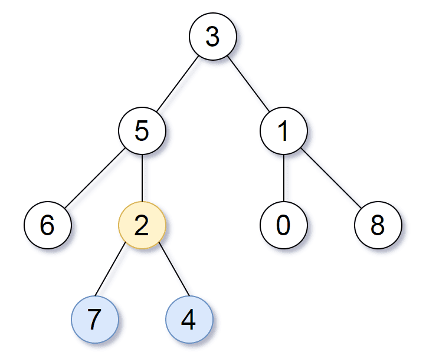

# [865. 具有所有最深结点的最小子树](https://leetcode-cn.com/problems/smallest-subtree-with-all-the-deepest-nodes)

[English Version](/solution/0800-0899/0865.Smallest%20Subtree%20with%20all%20the%20Deepest%20Nodes/README_EN.md)

## 题目描述

<!-- 这里写题目描述 -->
<p>给定一个根为&nbsp;<code>root</code>&nbsp;的二叉树，每个结点的<em>深度</em>是它到根的最短距离。</p>

<p>如果一个结点在<strong>整个树</strong>的任意结点之间具有最大的深度，则该结点是<em>最深的</em>。</p>

<p>一个结点的子树是该结点加上它的所有后代的集合。</p>

<p>返回能满足&ldquo;以该结点为根的子树中包含所有最深的结点&rdquo;这一条件的具有最大深度的结点。</p>

<p>&nbsp;</p>

<p><strong>示例：</strong></p>



<pre><strong>输入：</strong>[3,5,1,6,2,0,8,null,null,7,4]
<strong>输出：</strong>[2,7,4]
<strong>解释：</strong>

我们返回值为 2 的结点，在图中用黄色标记。
在图中用蓝色标记的是树的最深的结点。
输入 &quot;[3, 5, 1, 6, 2, 0, 8, null, null, 7, 4]&quot; 是对给定的树的序列化表述。
输出 &quot;[2, 7, 4]&quot; 是对根结点的值为 2 的子树的序列化表述。
输入和输出都具有 TreeNode 类型。
</pre>

<p>&nbsp;</p>

<p><strong>提示：</strong></p>

<ul>
	<li>树中结点的数量介于&nbsp;1 和&nbsp;500 之间。</li>
	<li>每个结点的值都是独一无二的。</li>
</ul>

## 解法

<!-- 这里可写通用的实现逻辑 -->

<!-- tabs:start -->

### **Python3**

<!-- 这里可写当前语言的特殊实现逻辑 -->

```python

```

### **Java**

<!-- 这里可写当前语言的特殊实现逻辑 -->

```java

```

### **...**

```

```

<!-- tabs:end -->
