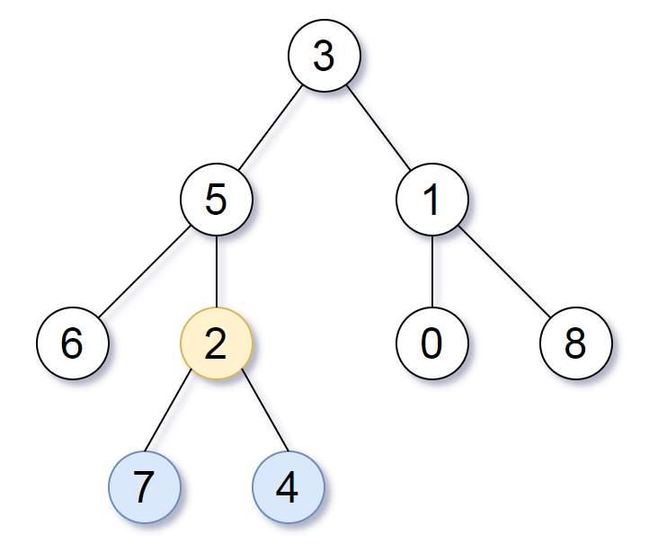

# [865. Smallest Subtree with all the Deepest Nodes](https://leetcode.com/problems/smallest-subtree-with-all-the-deepest-nodes)

[中文文档](/solution/0800-0899/0865.Smallest%20Subtree%20with%20all%20the%20Deepest%20Nodes/README.md)

## Description
<p>Given a binary tree rooted at <code>root</code>, the <em>depth</em> of each node is the shortest distance to the root.</p>


<p>A node is <em>deepest</em> if it has the largest depth possible among&nbsp;any node in the <u>entire tree</u>.</p>


<p>The subtree of a node is that node, plus the set of all descendants of that node.</p>


<p>Return the node with the largest depth such that it contains all the deepest nodes in its subtree.</p>


<p>&nbsp;</p>


<p><strong>Example 1:</strong></p>



<pre>

<strong>Input: </strong><span id="example-input-1-1">[3,5,1,6,2,0,8,null,null,7,4]</span>

<strong>Output: </strong><span id="example-output-1">[2,7,4]</span>

<strong>Explanation:

</strong>


We return the node with value 2, colored in yellow in the diagram.

The nodes colored in blue are the deepest nodes of the tree.

The input &quot;[3, 5, 1, 6, 2, 0, 8, null, null, 7, 4]&quot; is a serialization of the given tree.

The output &quot;[2, 7, 4]&quot; is a serialization of the subtree rooted at the node with value 2.

Both the input and output have TreeNode type.

</pre>


<p>&nbsp;</p>


<p><strong>Note:</strong></p>


<ul>
	<li>The number of nodes in the tree will be between 1 and 500.</li>
	<li>The values of each node are unique.</li>
</ul>


## Solutions


<!-- tabs:start -->

### **Python3**

```python

```

### **Java**

```java

```

### **...**
```

```

<!-- tabs:end -->