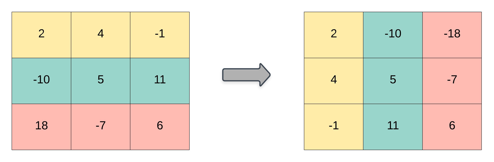

# [867. Transpose Matrix](https://leetcode.com/problems/transpose-matrix)

[中文文档](/solution/0800-0899/0867.Transpose%20Matrix/README.md)

## Description

<p>Given a&nbsp;matrix <code>A</code>, return the transpose of <code>A</code>.</p>

<p>The transpose of a matrix is the matrix flipped over it&#39;s main diagonal, switching the row and column indices of the matrix.</p>

<br>



<p>&nbsp;</p>

<div>

<p><strong>Example 1:</strong></p>

<pre>

<strong>Input: </strong><span id="example-input-1-1">[[1,2,3],[4,5,6],[7,8,9]]</span>

<strong>Output: </strong><span id="example-output-1">[[1,4,7],[2,5,8],[3,6,9]]</span>

</pre>

<div>

<p><strong>Example 2:</strong></p>

<pre>

<strong>Input: </strong><span id="example-input-2-1">[[1,2,3],[4,5,6]]</span>

<strong>Output: </strong><span id="example-output-2">[[1,4],[2,5],[3,6]]</span>

</pre>

<p>&nbsp;</p>

<p><span><strong>Note:</strong></span></p>

<ol>
	<li><code><span>1 &lt;= A.length&nbsp;&lt;= 1000</span></code></li>
	<li><code><span>1 &lt;= A[0].length&nbsp;&lt;= 1000</span></code></li>
</ol>

</div>

</div>

## Solutions

<!-- tabs:start -->

### **Python3**

```python
class Solution:
    def transpose(self, matrix: List[List[int]]) -> List[List[int]]:
        m, n = len(matrix), len(matrix[0])
        res = [[0] * m for _ in range(n)]
        for i in range(n):
            for j in range(m):
                res[i][j] = matrix[j][i]
        return res
```

### **Java**

```java
class Solution {
    public int[][] transpose(int[][] matrix) {
        int m = matrix.length, n = matrix[0].length;
        int[][] res = new int[n][m];
        for (int i = 0; i < n; ++i) {
            for (int j = 0; j < m; ++j) {
                res[i][j] = matrix[j][i];
            }
        }
        return res;
    }
}
```

### **JavaScript**

```js
/**
 * @param {number[][]} matrix
 * @return {number[][]}
 */
var transpose = function (matrix) {
  const m = matrix.length,
    n = matrix[0].length;
  let res = [];
  for (let i = 0; i < n; ++i) {
    res[i] = [];
    for (let j = 0; j < m; ++j) {
      res[i][j] = matrix[j][i];
    }
  }
  return res;
};
```

### **...**

```

```

<!-- tabs:end -->
