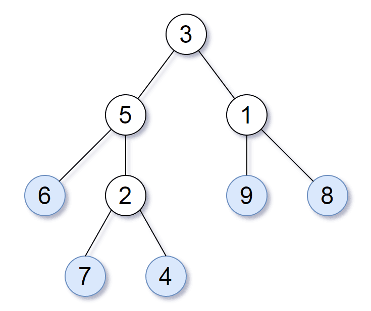

# [872. 叶子相似的树](https://leetcode-cn.com/problems/leaf-similar-trees)

[English Version](/solution/0800-0899/0872.Leaf-Similar%20Trees/README_EN.md)

## 题目描述

<!-- 这里写题目描述 -->
<p>请考虑一颗二叉树上所有的叶子，这些叶子的值按从左到右的顺序排列形成一个&nbsp;<em>叶值序列</em> 。</p>



<p>举个例子，如上图所示，给定一颗叶值序列为&nbsp;<code>(6, 7, 4, 9, 8)</code>&nbsp;的树。</p>

<p>如果有两颗二叉树的叶值序列是相同，那么我们就认为它们是&nbsp;<em>叶相似&nbsp;</em>的。</p>

<p>如果给定的两个头结点分别为&nbsp;<code>root1</code> 和&nbsp;<code>root2</code>&nbsp;的树是叶相似的，则返回&nbsp;<code>true</code>；否则返回 <code>false</code> 。</p>

<p>&nbsp;</p>

<p><strong>提示：</strong></p>

<ul>
	<li>给定的两颗树可能会有&nbsp;<code>1</code>&nbsp;到&nbsp;<code>100</code>&nbsp;个结点。</li>
</ul>

## 解法

<!-- 这里可写通用的实现逻辑 -->

深度优先搜索。

<!-- tabs:start -->

### **Python3**

<!-- 这里可写当前语言的特殊实现逻辑 -->

```python
# Definition for a binary tree node.
# class TreeNode:
#     def __init__(self, val=0, left=None, right=None):
#         self.val = val
#         self.left = left
#         self.right = right
class Solution:
    def leafSimilar(self, root1: TreeNode, root2: TreeNode) -> bool:
        def dfs(root, leaves):
            if root is None:
                return
            if root.left is None and root.right is None:
                leaves.append(root.val)
                return
            dfs(root.left, leaves)
            dfs(root.right, leaves)
        l1, l2 = [], []
        dfs(root1, l1)
        dfs(root2, l2)
        return l1 == l2
```

### **Java**

<!-- 这里可写当前语言的特殊实现逻辑 -->

```java
/**
 * Definition for a binary tree node.
 * public class TreeNode {
 *     int val;
 *     TreeNode left;
 *     TreeNode right;
 *     TreeNode() {}
 *     TreeNode(int val) { this.val = val; }
 *     TreeNode(int val, TreeNode left, TreeNode right) {
 *         this.val = val;
 *         this.left = left;
 *         this.right = right;
 *     }
 * }
 */
class Solution {
    public boolean leafSimilar(TreeNode root1, TreeNode root2) {
        List<Integer> l1 = new ArrayList<>();
        List<Integer> l2 = new ArrayList<>();
        dfs(root1, l1);
        dfs(root2, l2);
        return l1.equals(l2);
    }

    private void dfs(TreeNode root, List<Integer> leaves) {
        if (root == null) return;
        if (root.left == null && root.right == null) {
            leaves.add(root.val);
            return;
        }
        dfs(root.left, leaves);
        dfs(root.right, leaves);
    }
}
```

### **...**

```

```

<!-- tabs:end -->
