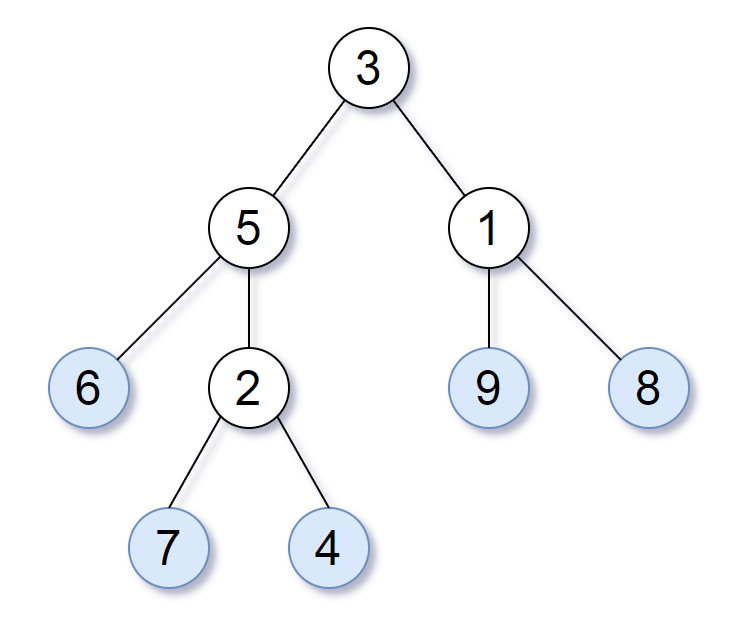

# [872. Leaf-Similar Trees](https://leetcode.com/problems/leaf-similar-trees)

[中文文档](/solution/0800-0899/0872.Leaf-Similar%20Trees/README.md)

## Description

<p>Consider all the leaves of a binary tree.&nbsp; From&nbsp;left to right order, the values of those&nbsp;leaves form a <em>leaf value sequence.</em></p>



<p>For example, in the given tree above, the leaf value sequence is <code>(6, 7, 4, 9, 8)</code>.</p>

<p>Two binary trees are considered <em>leaf-similar</em>&nbsp;if their leaf value sequence is the same.</p>

<p>Return <code>true</code> if and only if the two given trees with head nodes <code>root1</code> and <code>root2</code> are leaf-similar.</p>

<p>&nbsp;</p>

<p><strong>Note:</strong></p>

<ul>
	<li>Both of the given trees will have between <code>1</code> and <code>100</code> nodes.</li>
</ul>

## Solutions

<!-- tabs:start -->

### **Python3**

```python
# Definition for a binary tree node.
# class TreeNode:
#     def __init__(self, val=0, left=None, right=None):
#         self.val = val
#         self.left = left
#         self.right = right
class Solution:
    def leafSimilar(self, root1: TreeNode, root2: TreeNode) -> bool:
        def dfs(root, leaves):
            if root is None:
                return
            if root.left is None and root.right is None:
                leaves.append(root.val)
                return
            dfs(root.left, leaves)
            dfs(root.right, leaves)
        l1, l2 = [], []
        dfs(root1, l1)
        dfs(root2, l2)
        return l1 == l2
```

### **Java**

```java
/**
 * Definition for a binary tree node.
 * public class TreeNode {
 *     int val;
 *     TreeNode left;
 *     TreeNode right;
 *     TreeNode() {}
 *     TreeNode(int val) { this.val = val; }
 *     TreeNode(int val, TreeNode left, TreeNode right) {
 *         this.val = val;
 *         this.left = left;
 *         this.right = right;
 *     }
 * }
 */
class Solution {
    public boolean leafSimilar(TreeNode root1, TreeNode root2) {
        List<Integer> l1 = new ArrayList<>();
        List<Integer> l2 = new ArrayList<>();
        dfs(root1, l1);
        dfs(root2, l2);
        return l1.equals(l2);
    }

    private void dfs(TreeNode root, List<Integer> leaves) {
        if (root == null) return;
        if (root.left == null && root.right == null) {
            leaves.add(root.val);
            return;
        }
        dfs(root.left, leaves);
        dfs(root.right, leaves);
    }
}
```

### **...**

```

```

<!-- tabs:end -->
